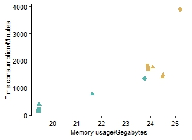

```{r setup, include = FALSE}
knitr::opts_chunk$set(
  collapse  =  T, echo = T, comment = "#>", message = F, warning = F,
	fig.align  =  "center", fig.width  =  5, fig.height = 3, dpi = 150)
```

If you use this script, please cited 如果你使用本代码，请引用：

 Yunyun Gao, Hao Luo, Yong-Xin Liu,et al, Benchmarking metagenomics tools for purging host contamination. 

# Scatter plot



Example-Figure1a-FunctionAnnotation


# Create a sample data frame

```{r}
data <- read.table("data.txt", header = TRUE)

```
# R Package Loading

```{r install, echo = TRUE}
library(ggplot2)
library(car)
library(dunn.test)
library(stats)
```

# Select subset of data

```{r parameter}
#data2 <- subset(data, Step=="HostRemove")
data2 <- subset(data, Step=="FunctionAnnotation")
#data2 <- subset(data, Step=="SpeciesAnnotation")
#data2 <- subset(data, Step=="Assembly")
#data2 <- subset(data, Step=="Binning")
#data2 <- subset(data, Step=="BinRefinement")
#data2 <- subset(data, Step=="RemoveRedundant")
#data2 <- subset(data, Step=="MAGAnnotation")
#data2 <- subset(data, Step=="MAGEvaluation")
```


# Set the levels of the "Type" factor in the desired order
```{r readdata}
data2$Type <- factor(data2$Type, levels = c( "Raw","Remove"))

```

# Create the barplot

```{r}

ggplot(data2, aes(x = RSS, y = Time, color = Type, shape = GenomeProportion)) +
  geom_point(size = 2) +  # Adjust the size parameter as needed
  labs(x = "Memory usage/Gegabytes", y = "Time consumption/Minutes", color = "Software") +
  theme_minimal() +
  theme_classic() +
  theme(
    axis.text = element_text(size = 8, color = 'black'),
    axis.title = element_text(size = 8),
    plot.title = element_text(size = 8, face = "bold", hjust = 0.5, vjust = 0.5),
    legend.title = element_text(size = 8, color = "black"),
    legend.text = element_text(size = 8, color = "black"),
    legend.position = c(2,2),
    axis.line = element_line(size = 0.25, color = "black")
  ) +
  scale_color_manual(values = c("#d8b365", "#5ab4ac"))
```

# Check Time, Normality test
```{r}
shapiro_test <- by(data2$Time, data2$Type, shapiro.test)
# Extract p-values from each group's test results
p_values <- sapply(shapiro_test, function(x) x$p.value)
# Check if each group conforms to normal distribution
normal_data <- p_values > 0.05
# If all groups conform to normal distribution
if (all(normal_data)) {
  summary_stats <- aggregate(Time ~ Type, data = data2, FUN = function(x) c(mean = mean(x), se = sd(x)/sqrt(length(x))))
  print(summary_stats)
} else {
  summary_stats <- aggregate(Time ~ Type, data = data2, FUN = function(x) c(median = median(x), p25 = quantile(x, 0.25), p75 = quantile(x, 0.75)))
  print(summary_stats)
}
# Homogeneity of variance test
levene_test_result <- leveneTest(Time ~ Type, data = data2)
p_value_levene <- levene_test_result$`Pr(>F)`[1]
if (all(normal_data)) {
  if (p_value_levene > 0.05) {
    t_test_result <- t.test(Time ~ Type, data = data2, paired = TRUE)
    print(t_test_result)
  } else {
    wilcox_result <- wilcox.test(Time ~ Type, data = data2, paired = TRUE)
    print(wilcox_result)
  }
} else {
  wilcox_result <- wilcox.test(Time ~ Type, data = data2, paired = TRUE)
  print(wilcox_result)
}
```
# Check RSS, Normality test

```{r}
shapiro_test <- by(data2$RSS, data2$Type, shapiro.test)
# Extract p-values from each group's test results
p_values <- sapply(shapiro_test, function(x) x$p.value)
# Check if each group conforms to normal distribution
normal_data <- p_values > 0.05
if (all(normal_data)) {
  summary_stats <- aggregate(RSS ~ Type, data = data2, FUN = function(x) c(mean = mean(x), se = sd(x)/sqrt(length(x))))
  print(summary_stats)
} else {
  summary_stats <- aggregate(RSS ~ Type, data = data2, FUN = function(x) c(median = median(x), p25 = quantile(x, 0.25), p75 = quantile(x, 0.75)))
  print(summary_stats)
}
# Homogeneity of variance test
levene_test_result <- leveneTest(RSS ~ Type, data = data2)
p_value_levene <- levene_test_result$`Pr(>F)`[1]

if (all(normal_data)) {
  if (p_value_levene > 0.05) {
    t_test_result <- t.test(RSS ~ Type, data = data2, paired = TRUE)
    print(t_test_result)
  } else {
    wilcox_result <- wilcox.test(RSS ~ Type, data = data2, paired = TRUE)
    print(wilcox_result)
  }
} else {
  wilcox_result <- wilcox.test(RSS ~ Type, data = data2, paired = TRUE)
  print(wilcox_result)
}

```

If you use this script, please cited 如果你使用本代码，请引用：

 Yunyun Gao, Hao Luo, Yong-Xin Liu,et al, Benchmarking metagenomics tools for purging host contamination. 

Copyright 2016-2023 Yunyun Gao(高云云), Yong-Xin Liu(刘永鑫) <liuyongxin@caas.cn>, Agricultural Genomics Institute at Shenzhen, Chinese Academy of Agricultural Sciences
