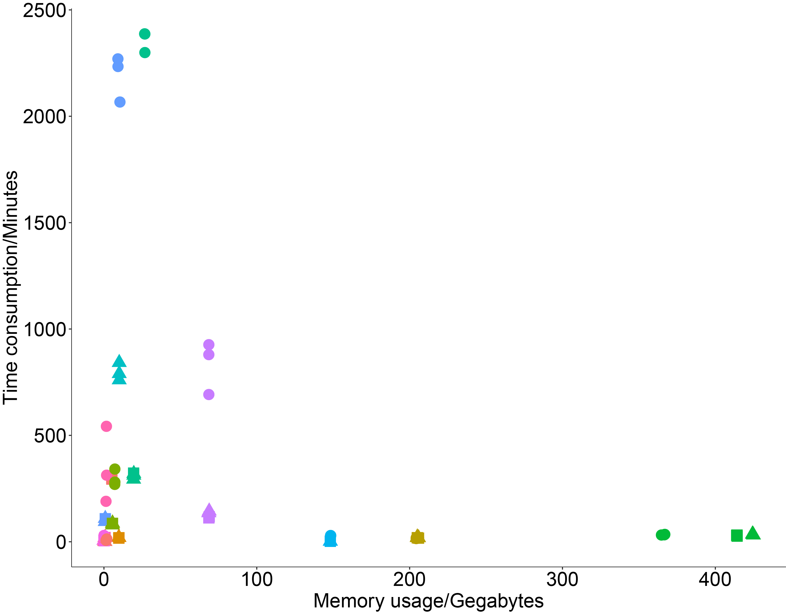
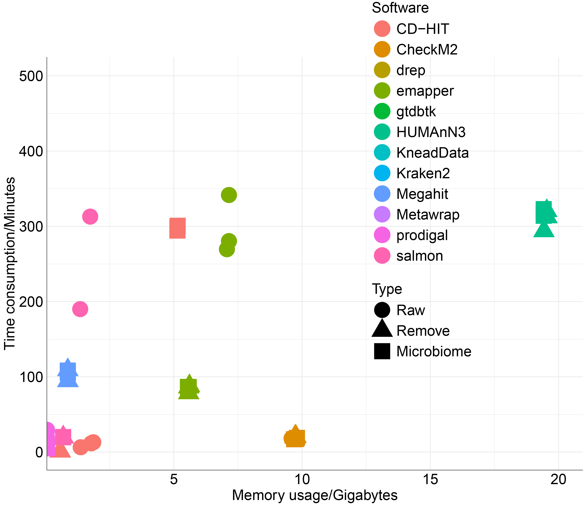

```{r setup, include = FALSE}
knitr::opts_chunk$set(
  collapse  =  T, echo = T, comment = "#>", message = F, warning = F,
	fig.align  =  "center", fig.width  =  5, fig.height = 3, dpi = 150)
```

If you use this script, please cited 如果你使用本代码，请引用：

Yunyun Gao, Hao Luo, Hujie Lyu, Haifei Yang, Salsabeel Yousuf, Shi Huang, Yong-Xin Liu, Benchmarking metagenomics tools for removing host contamination. 

# Scatter plot



Example-Figure1a-1



Example-Figure1a-2
# Create the barplot

```{r}
library(ggplot2)
library(car)
library(dunn.test)
data <- read.table("data.txt", header = TRUE)

data2 <- subset(data, Software=="HUMAnN3")
#data2 <- subset(data, Step=="FunctionAnnotation")
#data2 <- subset(data, Step=="SpeciesAnnotation")
#data2 <- subset(data, Step=="Assembly")
#data2 <- subset(data, Step=="Binning")
#data2 <- subset(data, Step=="BinRefinement")
#data2 <- subset(data, Step=="RemoveRedundant")
#data2 <- subset(data, Step=="MAGAnnotation")
#data2 <- subset(data, Step=="MAGEvaluation")
data2 <- subset(data)
data2$Type <- factor(data2$Type, levels = c( "Raw","Remove","Microbiome"))
ggplot(data2, aes(x = RSS, y = Time, color = Software, shape = Type)) +
  geom_point(size = 5) +  # Adjust the size parameter as needed
  labs(x = "Memory usage/Gegabytes", y = "Time consumption/Minutes", color = "Software") +
  theme_minimal() +
  theme_classic() +
  theme(
    axis.text = element_text(size = 20, color = 'black'),
    axis.title = element_text(size = 20),
    plot.title = element_text(size = 20, face = "bold", hjust = 0.5, vjust = 0.5),
    legend.title = element_text(size = 20, color = "black"),
    legend.text = element_text(size = 20, color = "black"),
    legend.position = c(0.7,0.7),
    axis.line = element_line(size = 0.25, color = "black")
  ) 

ggplot(data2, aes(x = RSS, y = Time, color = Software, shape = Type)) +
  geom_point(size = 10) +  # Adjust the size parameter as needed
  labs(x = "Memory usage/Gigabytes", y = "Time consumption/Minutes", color = "Software") +
  coord_cartesian(xlim = c(1, 20), ylim = c(1, 500)) +  # Set axis limits
  theme_minimal() +
  theme(
    axis.text = element_text(size = 20, color = 'black'),
    axis.title = element_text(size = 20),
    plot.title = element_text(size = 20, face = "bold", hjust = 0.5, vjust = 0.5),
    legend.title = element_text(size = 20, color = "black"),
    legend.text = element_text(size = 20, color = "black"),
    legend.position = c(0.7,0.7),
    axis.line = element_line(size = 0.25, color = "black")
  )

```


If you use this script, please cited 如果你使用本代码，请引用：

Yunyun Gao, Hao Luo, Hujie Lyu, Haifei Yang, Salsabeel Yousuf, Shi Huang, Yong-Xin Liu, Benchmarking metagenomics tools for removing host contamination.  

Copyright 2016-2023 Yunyun Gao(高云云), Yong-Xin Liu(刘永鑫) <liuyongxin@caas.cn>, Agricultural Genomics Institute at Shenzhen, Chinese Academy of Agricultural Sciences
