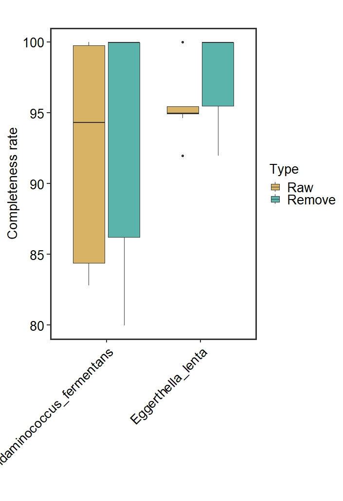

```{r setup, include = FALSE}
knitr::opts_chunk$set(
  collapse  =  T, echo = T, comment = "#>", message = F, warning = F,
	fig.align  =  "center", fig.width  =  5, fig.height = 3, dpi = 150)
```

If you use this script, please cited 如果你使用本代码，请引用：

 Yunyun Gao, Hao Luo, Yong-Xin Liu,et al, Benchmarking metagenomics tools for purging host contamination. 

# Barplot




Example-Figure1b-completeness


# Create a sample data frame

```{r}
data <- read.table("data.txt", header = TRUE)
```
# R Package Loading

```{r install, echo = TRUE}
library(ggplot2)
library(car)
```

# 1) Plot Completeness

```{r parameter}

data$Type <- as.factor(data$Type)
data$Species <- as.factor(data$Species)

data$Type <- factor(data$Type, levels = c("Raw", "Remove"))
data$Species <- factor(data$Species, levels = c("Acidaminococcus_fermentans", "Eggerthella_lenta"))

ggplot(data, aes(x = Species, y = Completeness, fill = Type)) +
  geom_boxplot() +
  labs(x = "", y = "Completeness rate", title = "", color = "black", fill = "Type") +
  theme_minimal() +
  theme_test(base_size = 20) +
  theme(
    panel.border = element_rect(size = 2, fill = 'transparent'),
    axis.text = element_text(color = 'black', size = 20),
    axis.text.x = element_text(angle = 45, hjust = 1),  # Rotate x-axis labels for better visibility
    plot.title = element_text(size = 24, face = "bold", hjust = 0.5, vjust = 0.5),
    legend.title = element_text(size = 20, color = "black"),
    legend.text = element_text(size = 20, color = "black")
  )  +
  scale_fill_manual(values = c( "#d8b365", "#5ab4ac"))
```

# 2) Plot Contamination

```{r}
ggplot(data, aes(x = Species, y = Contamination, fill = Type )) +
  geom_boxplot() +
  labs(x = "", y = "Contamination rate", title = "", color = "black", fill = "Type") +
  theme_minimal() +
  theme_test(base_size = 20) +
  theme(
    panel.border = element_rect(size = 2, fill = 'transparent'),
    axis.text = element_text(color = 'black', size = 20),
    axis.text.x = element_text(angle = 45, hjust = 1),  # Rotate x-axis labels for better visibility
    plot.title = element_text(size = 24, face = "bold", hjust = 0.5, vjust = 0.5),
    legend.title = element_text(size = 20, color = "black"),
    legend.text = element_text(size = 20, color = "black")
  )  +
  scale_fill_manual(values = c( "#d8b365", "#5ab4ac"))
```

# 3) Check Completeness of all MAGS, Normality test
```{r}
shapiro_test <- by(data$Completeness, data$Type, shapiro.test)

# Extract p-values from each group's test results
p_values <- sapply(shapiro_test, function(x) x$p.value)

# Check if each group conforms to normal distribution
normal_data <- p_values > 0.05

if (all(normal_data)) {
  summary_stats <- aggregate(Completeness ~ Type, data = data, FUN = function(x) c(mean = mean(x), se = sd(x)/sqrt(length(x))))
  print(summary_stats)
} else {
  summary_stats <- aggregate(Completeness ~ Type, data = data, FUN = function(x) c(median = median(x), p25 = quantile(x, 0.25), p75 = quantile(x, 0.75)))
  print(summary_stats)
}

# Homogeneity of variance test
levene_test_result <- leveneTest(Completeness ~ Type, data = data)
p_value_levene <- levene_test_result$`Pr(>F)`[1]


if (all(normal_data)) {
  if (p_value_levene > 0.05) {
    t_test_result <- t.test(Completeness ~ Type, data = data, paired = TRUE)
    print(t_test_result)
  } else {
    wilcox_result <- wilcox.test(Completeness ~ Type, data = data, paired = TRUE)
    print(wilcox_result)
  }
} else {
  wilcox_result <- wilcox.test(Completeness ~ Type, data = data, paired = TRUE)
  print(wilcox_result)
}
```

# 4) Check Contamination of all MAGS, Normality test

```{r}
shapiro_test <- by(data$Contamination, data$Type, shapiro.test)

# Extract p-values from each group's test results
p_values <- sapply(shapiro_test, function(x) x$p.value)

# Check if each group conforms to normal distribution
normal_data <- p_values > 0.05

if (all(normal_data)) {
  summary_stats <- aggregate(Contamination ~ Type, data = data, FUN = function(x) c(mean = mean(x), se = sd(x)/sqrt(length(x))))
  print(summary_stats)
} else {
  summary_stats <- aggregate(Contamination ~ Type, data = data, FUN = function(x) c(median = median(x), p25 = quantile(x, 0.25), p75 = quantile(x, 0.75)))
  print(summary_stats)
}

# Homogeneity of variance test
levene_test_result <- leveneTest(Contamination ~ Type, data = data)
p_value_levene <- levene_test_result$`Pr(>F)`[1]


if (all(normal_data)) {
  if (p_value_levene > 0.05) {
    t_test_result <- t.test(Contamination ~ Type, data = data, paired = TRUE)
    print(t_test_result)
  } else {
    wilcox_result <- wilcox.test(Contamination ~ Type, data = data, paired = TRUE)
    print(wilcox_result)
  }
} else {
  wilcox_result <- wilcox.test(Contamination ~ Type, data = data, paired = TRUE)
  print(wilcox_result)
}

```

# 5) Check data of Acidaminococcus_fermentans, Normality test
```{r}

data2 <- subset(data, Species == "Acidaminococcus_fermentans")
# 1) Check Completeness, Normality test
shapiro_test <- by(data2$Completeness, data2$Host, shapiro.test)

# Extract p-values from each group's test results
p_values <- sapply(shapiro_test, function(x) x$p.value)

# Check if each group conforms to normal distribution
normal_data <- p_values > 0.05

if (all(normal_data)) {
  summary_stats <- aggregate(Completeness ~ Type, data = data2, FUN = function(x) c(mean = mean(x), se = sd(x)/sqrt(length(x))))
  print(summary_stats)
} else {
  summary_stats <- aggregate(Completeness ~ Type, data = data2, FUN = function(x) c(median = median(x), p25 = quantile(x, 0.25), p75 = quantile(x, 0.75)))
  print(summary_stats)
}

# Homogeneity of variance test
levene_test_result <- leveneTest(Completeness ~ Type, data = data2)
p_value_levene <- levene_test_result$`Pr(>F)`[1]

if (all(normal_data)) {
  if (p_value_levene > 0.05) {
    t_test_result <- t.test(Completeness ~ Type, data = data2, paired = TRUE)
    print(t_test_result)
  } else {
    wilcox_result <- wilcox.test(Completeness ~ Type, data = data2, paired = TRUE)
    print(wilcox_result)
  }
} else {
  wilcox_result <- wilcox.test(Completeness ~ Type, data = data2, paired = TRUE)
  print(wilcox_result)
}

# 2) Check Contamination, Normality test
shapiro_test <- by(data2$Contamination, data2$Type, shapiro.test)

# Extract p-values from each group's test results
p_values <- sapply(shapiro_test, function(x) x$p.value)

# Check if each group conforms to normal distribution
normal_data <- p_values > 0.05

if (all(normal_data)) {
  summary_stats <- aggregate(Contamination ~ Type, data = data2, FUN = function(x) c(mean = mean(x), se = sd(x)/sqrt(length(x))))
  print(summary_stats)
} else {
  summary_stats <- aggregate(Contamination ~ Type, data = data2, FUN = function(x) c(median = median(x), p25 = quantile(x, 0.25), p75 = quantile(x, 0.75)))
  print(summary_stats)
}

# Homogeneity of variance test
levene_test_result <- leveneTest(Contamination ~ Type, data = data2)
p_value_levene <- levene_test_result$`Pr(>F)`[1]


if (all(normal_data)) {
  if (p_value_levene > 0.05) {
    t_test_result <- t.test(Contamination ~ Type, data = data2, paired = TRUE)
    print(t_test_result)
  } else {
    wilcox_result <- wilcox.test(Contamination ~ Type, data = data2, paired = TRUE)
    print(wilcox_result)
  }
} else {
  wilcox_result <- wilcox.test(Contamination ~ Type, data = data2, paired = TRUE)
  print(wilcox_result)
}

```
# 6) Check data of Eggerthella_lenta, Normality test
```{R}
data2 <- subset(data, Species == "Eggerthella_lenta" )

# 1) Check Completeness, Normality test
shapiro_test <- by(data2$Completeness, data2$HostGenomeProportion, shapiro.test)

# Extract p-values from each group's test results
p_values <- sapply(shapiro_test, function(x) x$p.value)

# Check if each group conforms to normal distribution
normal_data <- p_values > 0.05

if (all(normal_data)) {
  summary_stats <- aggregate(Completeness ~ HostGenomeProportion, data = data2, FUN = function(x) c(mean = mean(x), se = sd(x)/sqrt(length(x))))
  print(summary_stats)
} else {
  summary_stats <- aggregate(Completeness ~ HostGenomeProportion, data = data2, FUN = function(x) c(median = median(x), p25 = quantile(x, 0.25), p75 = quantile(x, 0.75)))
  print(summary_stats)
}

# Homogeneity of variance test
levene_test_result <- leveneTest(Completeness ~ HostGenomeProportion, data = data2)
p_value_levene <- levene_test_result$`Pr(>F)`[1]

if (all(normal_data)) {
  anova_result <- aov(Completeness ~ HostGenomeProportion, data = data2)
  print(summary(anova_result))
} else {
  kruskal_result <- kruskal.test(Completeness ~ HostGenomeProportion, data = data2)
  print(kruskal_result)
  if (kruskal_result$p.value < 0.05) {
    # Perform Bonferroni-Dunn post-hoc test
    posthoc_bonferroni <- posthoc.kruskal.dunn.test(data2$Completeness, data2$HostGenomeProportion, p.adjust.method = "bonferroni")
    print(posthoc_bonferroni)
  } else {
    print("Kruskal-Wallis test is not significant. No post-hoc test needed.")
  }
  }

# 2) Check Contamination, Normality test
shapiro_test <- by(data2$Contamination, data2$HostGenomeProportion, shapiro.test)

# Extract p-values from each group's test results
p_values <- sapply(shapiro_test, function(x) x$p.value)

# Check if each group conforms to normal distribution
normal_data <- p_values > 0.05

if (all(normal_data)) {
  summary_stats <- aggregate(Contamination ~ HostGenomeProportion, data = data2, FUN = function(x) c(mean = mean(x), se = sd(x)/sqrt(length(x))))
  print(summary_stats)
} else {
  summary_stats <- aggregate(Contamination ~ HostGenomeProportion, data = data2, FUN = function(x) c(median = median(x), p25 = quantile(x, 0.25), p75 = quantile(x, 0.75)))
  print(summary_stats)
}

# Homogeneity of variance test
levene_test_result <- leveneTest(Contamination ~ HostGenomeProportion, data = data2)
p_value_levene <- levene_test_result$`Pr(>F)`[1]

if (all(normal_data)) {
  anova_result <- aov(Contamination ~ HostGenomeProportion, data = data2)
  print(summary(anova_result))
} else {
  kruskal_result <- kruskal.test(Contamination ~ HostGenomeProportion, data = data2)
  print(kruskal_result)
  if (kruskal_result$p.value < 0.05) {
    # Perform Bonferroni-Dunn post-hoc test
    posthoc_bonferroni <- posthoc.kruskal.dunn.test(data2$Contamination, data2$HostGenomeProportion, p.adjust.method = "bonferroni")
    print(posthoc_bonferroni)
  } else {
    print("Kruskal-Wallis test is not significant. No post-hoc test needed.")
  }
}
```

If you use this script, please cited 如果你使用本代码，请引用：

 Yunyun Gao, Hao Luo, Yong-Xin Liu,et al, Benchmarking metagenomics tools for purging host contamination. 

Copyright 2016-2023 Yunyun Gao(高云云), Yong-Xin Liu(刘永鑫) <liuyongxin@caas.cn>, Agricultural Genomics Institute at Shenzhen, Chinese Academy of Agricultural Sciences
