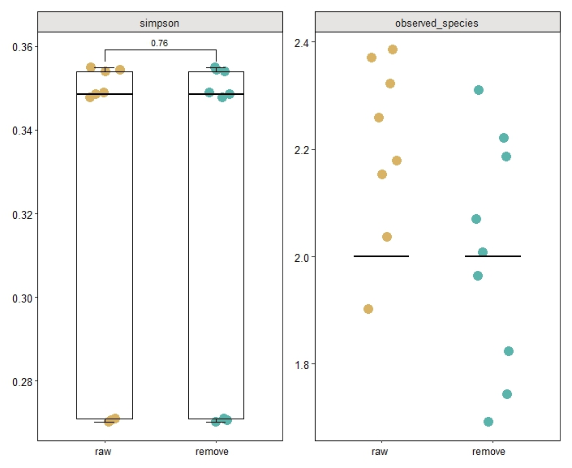

```{r setup, include = FALSE}
knitr::opts_chunk$set(
  collapse  =  T, echo = T, comment = "#>", message = F, warning = F,
	fig.align  =  "center", fig.width  =  5, fig.height = 3, dpi = 150)
```

If you use this script, please cited 如果你使用本代码，请引用：

 Yunyun Gao, Hao Luo, Yong-Xin Liu,et al, Benchmarking metagenomics tools for purging host contamination. 

# Barplot




Example-Figure1c-diversity


# R Package Loading

```{r install, echo = TRUE}

library(reshape2)
library(vegan)
library(ggplot2)
library(ggpubr)
library(patchwork)
library(ape)
library(tidyr)
library(MMUPHin) ## 用于微生物组数据meta分析的软件包
# if (!require("BiocManager", quietly = TRUE))
#     install.packages("BiocManager")
# 
# BiocManager::install("MMUPHin")
library(magrittr)
library(dplyr)
library(scales)
library(multcompView)
library(ggsignif)
library(amplicon)
library(ggrepel)
library(rdacca.hp)
library(psych)
library(reshape2)
library(cowplot)
library(patchwork)

```

# 1) Calculate alpha diversity

```{r parameter}
otutable <- read.table("taxonomy.tsv",header=T,sep='\t',stringsAsFactors = F)
otutable <- separate(otutable, ID, c("Kingdom","Phylum","Class","Order","Family","Genus","Species","Taxonomy"),sep="\\|",extra = "drop", fill = "right")
otutable <- otutable[-which(is.na(otutable$Taxonomy)),]

otutable = data.frame(otutable,stringsAsFactors = F) 
otutable[,9:ncol(otutable)] = as.data.frame(lapply(otutable[,9:ncol(otutable)],as.numeric))
metadata = read.table(paste("metadata.txt",sep=""), header=T, row.names=1, sep="\t", comment.char="")

i = 7
level = cbind(otutable[,i],otutable[,9:ncol(otutable)])
level = melt(level,id.vars= colnames(level)[1],
             measure.vars = colnames(level[,2:ncol(level)]),
             variable.name = "sample",value.name = "relative_abundance")
level = dcast(level, otutable[, i] ~ sample, fun.aggregate = sum)
level = t(level)
colnames(level) = level[1,]
level = level[-1,]
level = data.frame(level,stringsAsFactors = F) 
colnames(level) = gsub('\\.','',colnames(level))
level1 = apply(level,2,as.numeric)
rownames(level1)=rownames(level)
level=level1
level_diversity = data.frame(Sample_ID = colnames(otutable[9:ncol(otutable)]),
                             observed_species=specnumber(level),
                             # chao1 = estimateR(t(otutable[,-c(1:7)]))[2,],
                             shannon=vegan::diversity(level, index="shannon"),
                             simpson=vegan::diversity(level, index="simpson"),
                             invsimpson=vegan::diversity(level, index="invsimpson"),
                             Pielou_evenness=vegan::diversity(level,
                                                              index="shannon")/log(specnumber(level)))
```

# 2) Plot

```{r}
mytheme = theme_bw() + theme(text = element_text(family = "sans", size = 8))+
  theme(legend.position="none",
        legend.text = element_text(size=10),
        legend.title = element_blank(), 
        panel.background = element_blank(),
        panel.grid = element_blank(),
        axis.text.y = element_text(size=10, colour="black", family = "sans", angle = 0), 
        axis.text.x = element_text(size=10, colour="black", family = "sans", angle = 0, hjust = 0),
        axis.title= element_text(size=10, family = "sans"),
        strip.text.x = element_text(size=10, angle = 0),
        strip.text.y = element_text(size=10, angle = 0),
        plot.title = element_text(size=10, angle = 0),
        strip.background.x = element_rect(fill = "#E5E4E2", colour = "black", size = 0.2))+
  theme(axis.text.x=element_text(angle=0,vjust=1, hjust=0.6))+
  theme(axis.line = element_line(size = 0.1, colour = "black"))
# Source and edited from package amplicon
alpha_boxplot2 <- function(alpha_div, metadata, index = "shannon", groupID = "group", outlier = FALSE){
  p_list = c("ggplot2", "dplyr", "multcompView")
  for (p in p_list) {
    if (!requireNamespace(p)) {
      install.packages(p)
    }
    suppressPackageStartupMessages(library(p, character.only = TRUE, 
                                           quietly = TRUE, warn.conflicts = FALSE))
  }
  idx = rownames(metadata) %in% rownames(alpha_div)
  metadata = metadata[idx, , drop = F]
  alpha_div = alpha_div
  idx = rownames(metadata) %in% rownames(alpha_div)
  metadata = metadata[idx, , drop = F]
  alpha_div = alpha_div[rownames(metadata), ]
  sampFile = as.data.frame(metadata[, groupID], row.names = row.names(metadata))
  df = cbind(alpha_div[rownames(sampFile), index], sampFile)
  colnames(df) = c(index, "group")
  max = max(df[, c(index)])
  min = min(df[, index])
  x = df[, c("group", index)]
  y = x %>% group_by(group) %>% summarise_(Max = paste("max(", index, ")", sep = ""))
  y = as.data.frame(y)
  rownames(y) = y$group
  df$y = y[as.character(df$group), ]$Max + (max - min) * 0.05
  levels(as.factor(df$group))
  df = df %>%
    mutate(group = ordered(df$group,levels=c("raw", "remove")))
  df$class = index
  compaired = list(c("raw", "remove"))
  wt = wilcox.test(df[[index]] ~ df$group, alternative=c("two.sided"))
  FDR = p.adjust(wt$p.value, method = "BH")
  p1 = ggplot(df, aes(x = group, y = .data[[index]])) +
    geom_jitter(aes(color=group),position = position_jitter(0.15), size = 4, alpha = 1) +
    geom_boxplot(position=position_dodge(width =0.4),width=0.5, size = 0.4,
                 fill = "transparent", 
                 outlier.shape = NA,
                 linetype = "dashed", color = "black") +
    stat_boxplot(aes(ymin=..lower..,ymax=..upper..,
                     fill=group
    ),
    color="black",
    fill = "transparent",position=position_dodge(width =0.4),width=0.5, size = 0.4,outlier.shape = NA)+
    stat_boxplot(geom = "errorbar",aes(ymin=..ymax..),
                 width=0.18,color="black",size = 0.4)+
    stat_boxplot(geom = "errorbar",aes(ymax=..ymin..),
                 width=0.18,color="black",size = 0.4)+
    labs(x = NULL, y = NULL, color = groupID) + 
    #scale_y_continuous(labels = label_number(accuracy = 0.1)) +
    #scale_y_continuous(limits = c(0.3, 0.6), breaks = seq(0.3, 0.6, by = 0.1))+
    scale_fill_manual(values = c("#d8b365", "#5ab4ac"))+
    scale_color_manual(values = c("#d8b365", "#5ab4ac"))+
    geom_signif(comparisons = compaired,
                step_increase = 0.3,
                map_signif_level = F,
                test = wilcox.test,
                color = "black",
                size = 0.2,
                textsize = 3
    )+
    mytheme+
    facet_grid(.~class)
  p1
}

alpha_div <- level_diversity
metadata2 <- as.data.frame(metadata)

p1 <- alpha_boxplot2(alpha_div, metadata2, index = "shannon", groupID = "Group")
p2 <- alpha_boxplot2(alpha_div, metadata2, index = "invsimpson", groupID = "Group")
p3 <- alpha_boxplot2(alpha_div, metadata2, index = "Pielou_evenness", groupID = "Group")
p4 <- alpha_boxplot2(alpha_div, metadata2, index = "simpson", groupID = "Group")
p5 <- alpha_boxplot2(alpha_div, metadata2, index = "observed_species", groupID = "Group")
p_all_alpha = p1 + p3
p_all_alpha
#p_all_alpha2 = p4 + p5
#p_all_alpha2
ggsave(paste("./group_alpha_diversity",".pdf", sep=""), p_all_alpha, width=105 * 1.5, height=65 * 1.5, unit='mm')

```
If you use this script, please cited 如果你使用本代码，请引用：

 Yunyun Gao, Hao Luo, Yong-Xin Liu,et al, Benchmarking metagenomics tools for purging host contamination. 

Copyright 2016-2023 Yunyun Gao(高云云), Yong-Xin Liu(刘永鑫) <liuyongxin@caas.cn>, Agricultural Genomics Institute at Shenzhen, Chinese Academy of Agricultural Sciences
