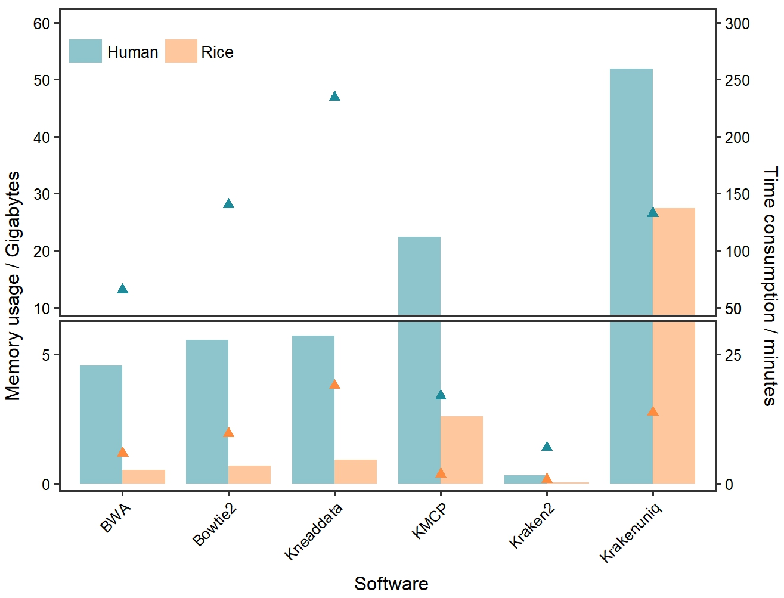

```{r setup, include = FALSE}
knitr::opts_chunk$set(
  collapse  =  T, echo = T, comment = "#>", message = F, warning = F,
	fig.align  =  "center", fig.width  =  5, fig.height = 3, dpi = 150)
```

If you use this script, please cited 如果你使用本代码，请引用：

 Yunyun Gao, Hao Luo, Yong-Xin Liu,et al, Benchmarking metagenomics tools for purging host contamination. 

# Barplot



Example-Figure1a-Barplot


# Read your data

```{r}
data <- read.table("data.txt", head = TRUE, sep = "\t")

```
# R Package Loading

```{r install, echo = TRUE}
library(ggplot2)
library(tidyverse)
library(ggbreak)
library(dunn.test)
library(car)
```

# Select subset of data

```{r parameter}
# Select the relevant columns for data1
data1 <- data[, c("Software", "Taxa", "Rss")]
data2 <- data[, c("Software", "Taxa", "Time")]
```


# Reorder factor levels for the Software column
```{r readdata}
data1$Software <- factor(data1$Software, levels = c( "BWA","Bowtie2","Kneaddata", "KMCP", "Kraken2", "Krakenuniq"))

```

# Create the barplot

```{r}
ggplot(data1) +
  geom_col(aes(x = Software, y = Rss, fill = Taxa), position = 'dodge', width = 0.8) +
  scale_fill_manual(values = c('Rice' = '#fec79e', 'Human' = '#8ec4cb')) +
  labs(x = "Software", y = "Memory usage / Gigabytes") +
  theme_minimal() +
  theme_test(base_size = 24) +
  theme(
    legend.position = 'none',
    panel.border = element_rect(size = 2, fill = 'transparent'),
    axis.text = element_text(color = 'black'),
    axis.text.x = element_text(angle = 45, hjust = 1)  # Rotate x-axis labels for better visibility
  ) +
  geom_rect(aes(xmin = 0.5, xmax = 0.8, ymin = 53, ymax = 57), fill = '#8ec4cb', color = '#8ec4cb') +
  geom_rect(aes(xmin = 1.4, xmax = 1.7, ymin = 53, ymax = 57), fill = '#fec79e', color = '#fec79e') +
  annotate(geom = 'text', x = 1.9, y = 55, label = 'Rice', size = 7) +
  annotate(geom = 'text', x = 1.1, y = 55, label = 'Human', size = 7) +
  scale_y_continuous(
    breaks = c(seq(0, 10, 10), seq(5, 10, 5), seq(20, 60, 10)),
    limits = c(0, 60),
    expand = c(0, 0),
    sec.axis = sec_axis(~ .*5, name = 'Time consumption / minutes', breaks = c(seq(0, 50, 25), seq(50, 300, 50)))
  ) +
  geom_point(data = data2, aes(x = factor(Software), y = Time * 0.2, color = Taxa, group = Taxa), shape=17, size = 5, na.rm = TRUE) +
  scale_color_manual(values = c('#1e8b9b', '#ff8c3e')) +
  scale_y_break(c(6,11), space = 0, scales = 1.8)

```

# 1) Check Time of all taxa, Normality test
```{r}
shapiro_test <- by(data$Time, data$Taxa, shapiro.test)

# Extract p-values from each group's test results
p_values <- sapply(shapiro_test, function(x) x$p.value)

# Check if each group conforms to normal distribution
normal_data <- p_values > 0.05

if (all(normal_data)) {
  summary_stats <- aggregate(Time ~ Taxa, data = data, FUN = function(x) c(mean = mean(x), se = sd(x)/sqrt(length(x))))
  print(summary_stats)
} else {
  summary_stats <- aggregate(Time ~ Taxa, data = data, FUN = function(x) c(median = median(x), p25 = quantile(x, 0.25), p75 = quantile(x, 0.75)))
  print(summary_stats)
}

levene_test_result <- leveneTest(Time ~ Taxa, data = data)
p_value_levene <- levene_test_result$`Pr(>F)`[1]

if (all(normal_data)) {
  if (p_value_levene > 0.05) {
    t_test_result <- t.test(Time ~ Taxa, data = data, paired = TRUE)
    print(t_test_result)
  } else {
    wilcox_result <- wilcox.test(Time ~ Taxa, data = data, paired = TRUE)
    print(wilcox_result)
  }
} else {
  wilcox_result <- wilcox.test(Time ~ Taxa, data = data, paired = TRUE)
  print(wilcox_result)
}

```
# 2) Check RSS of all taxa, Normality test

```{r}
shapiro_test <- by(data$Rss, data$Taxa, shapiro.test)

# Extract p-values from each group's test results
p_values <- sapply(shapiro_test, function(x) x$p.value)

# Check if each group conforms to normal distribution
normal_data <- p_values > 0.05

if (all(normal_data)) {
  summary_stats <- aggregate(Rss ~ Taxa, data = data, FUN = function(x) c(mean = mean(x), se = sd(x)/sqrt(length(x))))
  print(summary_stats)
} else {
  summary_stats <- aggregate(Rss ~ Taxa, data = data, FUN = function(x) c(median = median(x), p25 = quantile(x, 0.25), p75 = quantile(x, 0.75)))
  print(summary_stats)
}

levene_test_result <- leveneTest(Rss ~ Taxa, data = data)
p_value_levene <- levene_test_result$`Pr(>F)`[1]

if (all(normal_data)) {
  if (p_value_levene > 0.05) {
    t_test_result <- t.test(Rss ~ Taxa, data = data, paired = TRUE)
    print(t_test_result)
  } else {
    wilcox_result <- wilcox.test(Rss ~ Taxa, data = data, paired = TRUE)
    print(wilcox_result)
  }
} else {
  wilcox_result <- wilcox.test(Rss ~ Taxa, data = data, paired = TRUE)
  print(wilcox_result)
}

```


If you use this script, please cited 如果你使用本代码，请引用：

 Yunyun Gao, Hao Luo, Yong-Xin Liu,et al, Benchmarking metagenomics tools for purging host contamination. 

Copyright 2016-2023 Yunyun Gao(高云云), Yong-Xin Liu(刘永鑫) <liuyongxin@caas.cn>, Agricultural Genomics Institute at Shenzhen, Chinese Academy of Agricultural Sciences
