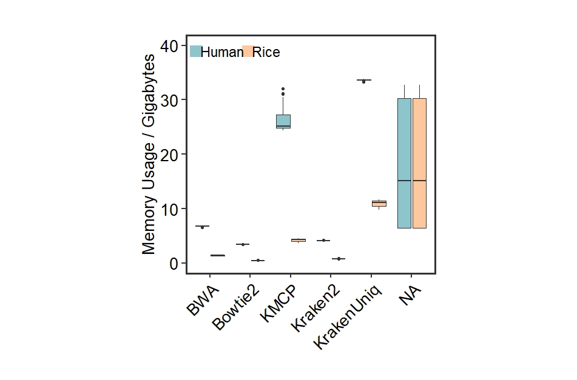

```{r setup, include = FALSE}
knitr::opts_chunk$set(
  collapse  =  T, echo = T, comment = "#>", message = F, warning = F,
	fig.align  =  "center", fig.width  =  5, fig.height = 3, dpi = 150)
```

If you use this script, please cited 如果你使用本代码，请引用：

 Yunyun Gao, Hao Luo, Yong-Xin Liu,et al, Benchmarking metagenomics tools for purging host contamination. 

# Barplot



Example-Figure2c-Gigabyte


# Create a sample data frame
```{r}
data <- read.table("data.txt", header = TRUE)
```

# R Package Loading
```{r install, echo = TRUE}
library(ggplot2)
library(dunn.test)
library(car)
```

# Set the levels of the "Type" factor in the desired order
```{r readdata}
data$Software <- as.factor(data$Software)
data$Hosttype <- as.factor(data$Hosttype)
data$Software <- factor(data$Software, levels = c("BWA", "Bowtie2", "KneadData", "KMCP", "Kraken2", "KrakenUniq"))
data$Hosttype <- factor(data$Hosttype, levels = c("Human", "Rice"))
```

# Create the barplot

```{r}
ggplot(data, aes(x = Software, y = Gigabytes, fill = Hosttype)) +
  geom_boxplot() +
  labs(x = "", y = "Memory Usage / Gigabytes", title = "", color = "black", fill = "Group") +
  theme_minimal() +
  theme_test(base_size = 20) +
  theme(
    legend.position = 'none',
    panel.border = element_rect(size = 2, fill = 'transparent'),
    axis.text = element_text(color = 'black', size = 20),
    axis.text.x = element_text(angle = 45, hjust = 1),  # Rotate x-axis labels for better visibility
    plot.title = element_text(size = 24, face = "bold", hjust = 0.5, vjust = 0.5),
    legend.title = element_text(size = 20, color = "black"),
    legend.text = element_text(size = 20, color = "black")
  ) + 
  geom_rect(aes(xmin = 1.8, xmax = 2.1, ymin = 38, ymax = 40), fill = '#fec79e', color = '#fec79e') +
  geom_rect(aes(xmin = 0.5, xmax = 0.8, ymin = 38, ymax = 40), fill = '#8ec4cb', color = '#8ec4cb') +
  annotate(geom = 'text', x = 2.4, y = 39, label = 'Rice', size = 6) +
  annotate(geom = 'text', x = 1.3, y = 39, label = 'Human', size = 6) +
  scale_fill_manual(values = c( "#8ec4cb", "#fec79e")) +
  scale_y_continuous(limits = c(0, 40), breaks = seq(0, 40, 10)) +
  coord_fixed(ratio = 0.135)
```

# 1) Check RSS of Microbiometype, Normality test
```{r}
shapiro_test <- by(data$Gigabytes, data$Microbiometype, shapiro.test)

# Extract p-values from each group's test results
p_values <- sapply(shapiro_test, function(x) x$p.value)

# Check if each group conforms to normal distribution
normal_data <- p_values > 0.05

if (all(normal_data)) {
  summary_stats <- aggregate(Gigabytes ~ Microbiometype, data = data, FUN = function(x) c(mean = mean(x), se = sd(x)/sqrt(length(x))))
  print(summary_stats)
} else {
  summary_stats <- aggregate(Gigabytes ~ Microbiometype, data = data, FUN = function(x) c(median = median(x), p25 = quantile(x, 0.25), p75 = quantile(x, 0.75)))
  print(summary_stats)
}

# Homogeneity of variance test
levene_test_result <- leveneTest(Gigabytes ~ Microbiometype, data = data)
p_value_levene <- levene_test_result$`Pr(>F)`[1]


if (all(normal_data)) {
  if (p_value_levene > 0.05) {
    t_test_result <- t.test(Gigabytes ~ Microbiometype, data = data, paired = TRUE)
    print(t_test_result)
  } else {
    wilcox_result <- wilcox.test(Gigabytes ~ Microbiometype, data = data, paired = TRUE)
    print(wilcox_result)
  }
} else {
  wilcox_result <- wilcox.test(Gigabytes ~ Microbiometype, data = data, paired = TRUE)
  print(wilcox_result)
}
```

# 2) Check RSS of Hosttype, Normality test
```{r}
shapiro_test <- by(data$Gigabytes, data$Microbiometype, shapiro.test)

# Extract p-values from each group's test results
p_values <- sapply(shapiro_test, function(x) x$p.value)

# Check if each group conforms to normal distribution
normal_data <- p_values > 0.05

if (all(normal_data)) {
  summary_stats <- aggregate(Gigabytes ~ Hosttype, data = data, FUN = function(x) c(mean = mean(x), se = sd(x)/sqrt(length(x))))
  print(summary_stats)
} else {
  summary_stats <- aggregate(Gigabytes ~ Hosttype, data = data, FUN = function(x) c(median = median(x), p25 = quantile(x, 0.25), p75 = quantile(x, 0.75)))
  print(summary_stats)
}

# Homogeneity of variance test
levene_test_result <- leveneTest(Gigabytes ~ Hosttype, data = data)
p_value_levene <- levene_test_result$`Pr(>F)`[1]


if (all(normal_data)) {
  if (p_value_levene > 0.05) {
    t_test_result <- t.test(Gigabytes ~ Hosttype, data = data, paired = TRUE)
    print(t_test_result)
  } else {
    wilcox_result <- wilcox.test(Gigabytes ~ Hosttype, data = data, paired = TRUE)
    print(wilcox_result)
  }
} else {
  wilcox_result <- wilcox.test(Gigabytes ~ Hosttype, data = data, paired = TRUE)
  print(wilcox_result)
}
```
# 3) Check RSS of HostGenomeProportion, Normality test
```{r}
shapiro_test <- by(data$Gigabytes, data$HostGenomeProportion, shapiro.test)

# Extract p-values from each group's test results
p_values <- sapply(shapiro_test, function(x) x$p.value)

# Check if each group conforms to normal distribution
normal_data <- p_values > 0.05

if (all(normal_data)) {
  summary_stats <- aggregate(Gigabytes ~ HostGenomeProportion, data = data, FUN = function(x) c(mean = mean(x), se = sd(x)/sqrt(length(x))))
  print(summary_stats)
} else {
  summary_stats <- aggregate(Gigabytes ~ HostGenomeProportion, data = data, FUN = function(x) c(median = median(x), p25 = quantile(x, 0.25), p75 = quantile(x, 0.75)))
  print(summary_stats)
}

# Homogeneity of variance test
levene_test_result <- leveneTest(Gigabytes ~ HostGenomeProportion, data = data)
p_value_levene <- levene_test_result$`Pr(>F)`[1]


if (all(normal_data)) {
  anova_result <- aov(Gigabytes ~ HostGenomeProportion, data = data)
  print(summary(anova_result))
} else {
  kruskal_result <- kruskal.test(Gigabytes ~ HostGenomeProportion, data = data)
  print(kruskal_result)
  if (kruskal_result$p.value < 0.05) {
    # Perform Bonferroni-Dunn post-hoc test
    posthoc_result <- dunn.test(data$Gigabytes, data$HostGenomeProportion, method = "bonferroni")
    print(posthoc_result)
  } else {
    print("Kruskal-Wallis test is not significant. No post-hoc test needed.")
  }
}

```
# 4) Check RSS of DataSize, Normality test
```{r}
shapiro_test <- by(data$Gigabytes, data$DataSize, shapiro.test)

# Extract p-values from each group's test results
p_values <- sapply(shapiro_test, function(x) x$p.value)

# Check if each group conforms to normal distribution
normal_data <- p_values > 0.05

if (all(normal_data)) {
  summary_stats <- aggregate(Gigabytes ~ DataSize, data = data, FUN = function(x) c(mean = mean(x), se = sd(x)/sqrt(length(x))))
  print(summary_stats)
} else {
  summary_stats <- aggregate(Gigabytes ~ DataSize, data = data, FUN = function(x) c(median = median(x), p25 = quantile(x, 0.25), p75 = quantile(x, 0.75)))
  print(summary_stats)
}

# Homogeneity of variance test
levene_test_result <- leveneTest(Gigabytes ~ DataSize, data = data)
p_value_levene <- levene_test_result$`Pr(>F)`[1]


if (all(normal_data)) {
  anova_result <- aov(Gigabytes ~ DataSize, data = data)
  print(summary(anova_result))
} else {
  kruskal_result <- kruskal.test(Gigabytes ~ DataSize, data = data)
  print(kruskal_result)
  if (kruskal_result$p.value < 0.05) {
    # Perform post-hoc pairwise comparisons
    posthoc_result <- dunn.test(data$Gigabytes, data$DataSize, method = "bonferroni")
    print(posthoc_result)
  } else {
    print("Kruskal-Wallis test is not significant. No post-hoc test needed.")
  }
}

```

# 5) Check RSS of Software, Normality test
```{r}
# Check RSS of Software, Normality test
shapiro_test <- by(data$Gigabytes, data$Software, shapiro.test)

# Extract p-values from each group's test results
p_values <- sapply(shapiro_test, function(x) ifelse(is.null(x), NA, x$p.value))

# Check if each group conforms to normal distribution
normal_data <- p_values > 0.05


if (all(normal_data)) {
  summary_stats <- aggregate(Gigabytes ~ Software, data = data, FUN = function(x) c(mean = mean(x), se = sd(x)/sqrt(length(x))))
  print(summary_stats)
} else {
  summary_stats <- aggregate(Gigabytes ~ Software, data = data, FUN = function(x) c(median = median(x), p25 = quantile(x, 0.25), p75 = quantile(x, 0.75)))
  print(summary_stats)
}

# Homogeneity of variance test
levene_test_result <- leveneTest(Gigabytes ~ Software, data = data)
p_value_levene <- levene_test_result$`Pr(>F)`[1]


if (all(normal_data)) {
  anova_result <- aov(Gigabytes ~ Software, data = data)
  print(summary(anova_result))
} else {
  kruskal_result <- kruskal.test(Gigabytes ~ Software, data = data)
  print(kruskal_result)
  if (kruskal_result$p.value < 0.05) {
    # Perform post-hoc pairwise comparisons
    posthoc_result <- dunn.test(data$Gigabytes, data$Software, method = "bonferroni")
    print(posthoc_result)
  } else {
    print("Kruskal-Wallis test is not significant. No post-hoc test needed.")
  }
}
```

# 6) Check RSS of BWA, Normality test
```{r}
data2 <- subset(data, Software == "BWA")
#Microbiometype
shapiro_test <- by(data2$Gigabytes, data2$Microbiometype, shapiro.test)
p_values <- sapply(shapiro_test, function(x) x$p.value)
normal_data2 <- p_values > 0.05
if (all(normal_data2)) {
  summary_stats <- aggregate(Gigabytes ~ Microbiometype, data = data2, FUN = function(x) c(mean = mean(x), se = sd(x)/sqrt(length(x))))
  print(summary_stats)
} else {
  summary_stats <- aggregate(Gigabytes ~ Microbiometype, data = data2, FUN = function(x) c(median = median(x), p25 = quantile(x, 0.25), p75 = quantile(x, 0.75)))
  print(summary_stats)
}
levene_test_result <- leveneTest(Gigabytes ~ Microbiometype, data = data2)
p_value_levene <- levene_test_result$`Pr(>F)`[1]
if (all(normal_data2)) {
  if (p_value_levene > 0.05) {
    t_test_result <- t.test(Gigabytes ~ Microbiometype, data = data2, paired = TRUE)
    print(t_test_result)
  } else {
    wilcox_result <- wilcox.test(Gigabytes ~ Microbiometype, data = data2, paired = TRUE)
    print(wilcox_result)
  }
} else {
  wilcox_result <- wilcox.test(Gigabytes ~ Microbiometype, data = data2, paired = TRUE)
  print(wilcox_result)
}
#Hostytype
shapiro_test <- by(data2$Gigabytes, data2$Hosttype, shapiro.test)
p_values <- sapply(shapiro_test, function(x) x$p.value)
normal_data2 <- p_values > 0.05
if (all(normal_data2)) {
  summary_stats <- aggregate(Gigabytes ~ Hosttype, data = data2, FUN = function(x) c(mean = mean(x), se = sd(x)/sqrt(length(x))))
  print(summary_stats)
} else {
  summary_stats <- aggregate(Gigabytes ~ Hosttype, data = data2, FUN = function(x) c(median = median(x), p25 = quantile(x, 0.25), p75 = quantile(x, 0.75)))
  print(summary_stats)
}
levene_test_result <- leveneTest(Gigabytes ~ Hosttype, data = data2)
p_value_levene <- levene_test_result$`Pr(>F)`[1]
if (all(normal_data2)) {
  if (p_value_levene > 0.05) {
    t_test_result <- t.test(Gigabytes ~ Hosttype, data = data2, paired = TRUE)
    print(t_test_result)
  } else {
    wilcox_result <- wilcox.test(Gigabytes ~ Hosttype, data = data2, paired = TRUE)
    print(wilcox_result)
  }
} else {
  wilcox_result <- wilcox.test(Gigabytes ~ Hosttype, data = data2, paired = TRUE)
  print(wilcox_result)
}
#DataSize
shapiro_test <- by(data2$Gigabytes, data2$DataSize, shapiro.test)
p_values <- sapply(shapiro_test, function(x) x$p.value)
normal_data2 <- p_values > 0.05
if (all(normal_data2)) {
  summary_stats <- aggregate(Gigabytes ~ DataSize, data = data2, FUN = function(x) c(mean = mean(x), se = sd(x)/sqrt(length(x))))
  print(summary_stats)
} else {
  summary_stats <- aggregate(Gigabytes ~ DataSize, data = data2, FUN = function(x) c(median = median(x), p25 = quantile(x, 0.25), p75 = quantile(x, 0.75)))
  print(summary_stats)
}
levene_test_result <- leveneTest(Gigabytes ~ DataSize, data = data2)
p_value_levene <- levene_test_result$`Pr(>F)`[1]
if (all(normal_data2)) {
  anova_result <- aov(Gigabytes ~ DataSize, data = data2)
  print(summary(anova_result))
} else {
  kruskal_result <- kruskal.test(Gigabytes ~ DataSize, data = data2)
  print(kruskal_result)
  if (kruskal_result$p.value < 0.05) {
    posthoc_result <- dunn.test(data2$Gigabytes, data2$DataSize, method = "bonferroni")
    print(posthoc_result)
  } else {
    print("Kruskal-Wallis test is not significant. No post-hoc test needed.")
  }
}
```

# 7) Check RSS of Bowtie2, Normality test
```{r}
data2 <- subset(data, Software == "Bowtie2")
#Microbiometype
shapiro_test <- by(data2$Gigabytes, data2$Microbiometype, shapiro.test)
p_values <- sapply(shapiro_test, function(x) x$p.value)
normal_data2 <- p_values > 0.05
if (all(normal_data2)) {
  summary_stats <- aggregate(Gigabytes ~ Microbiometype, data = data2, FUN = function(x) c(mean = mean(x), se = sd(x)/sqrt(length(x))))
  print(summary_stats)
} else {
  summary_stats <- aggregate(Gigabytes ~ Microbiometype, data = data2, FUN = function(x) c(median = median(x), p25 = quantile(x, 0.25), p75 = quantile(x, 0.75)))
  print(summary_stats)
}
levene_test_result <- leveneTest(Gigabytes ~ Microbiometype, data = data2)
p_value_levene <- levene_test_result$`Pr(>F)`[1]
if (all(normal_data2)) {
  if (p_value_levene > 0.05) {
    t_test_result <- t.test(Gigabytes ~ Microbiometype, data = data2, paired = TRUE)
    print(t_test_result)
  } else {
    wilcox_result <- wilcox.test(Gigabytes ~ Microbiometype, data = data2, paired = TRUE)
    print(wilcox_result)
  }
} else {
  wilcox_result <- wilcox.test(Gigabytes ~ Microbiometype, data = data2, paired = TRUE)
  print(wilcox_result)
}
#Hostytype
shapiro_test <- by(data2$Gigabytes, data2$Hosttype, shapiro.test)
p_values <- sapply(shapiro_test, function(x) x$p.value)
normal_data2 <- p_values > 0.05
if (all(normal_data2)) {
  summary_stats <- aggregate(Gigabytes ~ Hosttype, data = data2, FUN = function(x) c(mean = mean(x), se = sd(x)/sqrt(length(x))))
  print(summary_stats)
} else {
  summary_stats <- aggregate(Gigabytes ~ Hosttype, data = data2, FUN = function(x) c(median = median(x), p25 = quantile(x, 0.25), p75 = quantile(x, 0.75)))
  print(summary_stats)
}
levene_test_result <- leveneTest(Gigabytes ~ Hosttype, data = data2)
p_value_levene <- levene_test_result$`Pr(>F)`[1]
if (all(normal_data2)) {
  if (p_value_levene > 0.05) {
    t_test_result <- t.test(Gigabytes ~ Hosttype, data = data2, paired = TRUE)
    print(t_test_result)
  } else {
    wilcox_result <- wilcox.test(Gigabytes ~ Hosttype, data = data2, paired = TRUE)
    print(wilcox_result)
  }
} else {
  wilcox_result <- wilcox.test(Gigabytes ~ Hosttype, data = data2, paired = TRUE)
  print(wilcox_result)
}
#DataSize
shapiro_test <- by(data2$Gigabytes, data2$DataSize, shapiro.test)
p_values <- sapply(shapiro_test, function(x) x$p.value)
normal_data2 <- p_values > 0.05
if (all(normal_data2)) {
  summary_stats <- aggregate(Gigabytes ~ DataSize, data = data2, FUN = function(x) c(mean = mean(x), se = sd(x)/sqrt(length(x))))
  print(summary_stats)
} else {
  summary_stats <- aggregate(Gigabytes ~ DataSize, data = data2, FUN = function(x) c(median = median(x), p25 = quantile(x, 0.25), p75 = quantile(x, 0.75)))
  print(summary_stats)
}
levene_test_result <- leveneTest(Gigabytes ~ DataSize, data = data2)
p_value_levene <- levene_test_result$`Pr(>F)`[1]
if (all(normal_data2)) {
  anova_result <- aov(Gigabytes ~ DataSize, data = data2)
  print(summary(anova_result))
} else {
  kruskal_result <- kruskal.test(Gigabytes ~ DataSize, data = data2)
  print(kruskal_result)
  if (kruskal_result$p.value < 0.05) {
    posthoc_result <- dunn.test(data2$Gigabytes, data2$DataSize, method = "bonferroni")
    print(posthoc_result)
  } else {
    print("Kruskal-Wallis test is not significant. No post-hoc test needed.")
  }
}

```

# 8) Check RSS of KneadData, Normality test
```{r}
data2 <- subset(data, Software == "KneadData")
#Microbiometype
shapiro_test <- by(data2$Gigabytes, data2$Microbiometype, shapiro.test)
p_values <- sapply(shapiro_test, function(x) x$p.value)
normal_data2 <- p_values > 0.05
if (all(normal_data2)) {
  summary_stats <- aggregate(Gigabytes ~ Microbiometype, data = data2, FUN = function(x) c(mean = mean(x), se = sd(x)/sqrt(length(x))))
  print(summary_stats)
} else {
  summary_stats <- aggregate(Gigabytes ~ Microbiometype, data = data2, FUN = function(x) c(median = median(x), p25 = quantile(x, 0.25), p75 = quantile(x, 0.75)))
  print(summary_stats)
}
levene_test_result <- leveneTest(Gigabytes ~ Microbiometype, data = data2)
p_value_levene <- levene_test_result$`Pr(>F)`[1]
if (all(normal_data2)) {
  if (p_value_levene > 0.05) {
    t_test_result <- t.test(Gigabytes ~ Microbiometype, data = data2, paired = TRUE)
    print(t_test_result)
  } else {
    wilcox_result <- wilcox.test(Gigabytes ~ Microbiometype, data = data2, paired = TRUE)
    print(wilcox_result)
  }
} else {
  wilcox_result <- wilcox.test(Gigabytes ~ Microbiometype, data = data2, paired = TRUE)
  print(wilcox_result)
}
#Hostytype
shapiro_test <- by(data2$Gigabytes, data2$Hosttype, shapiro.test)
p_values <- sapply(shapiro_test, function(x) x$p.value)
normal_data2 <- p_values > 0.05
if (all(normal_data2)) {
  summary_stats <- aggregate(Gigabytes ~ Hosttype, data = data2, FUN = function(x) c(mean = mean(x), se = sd(x)/sqrt(length(x))))
  print(summary_stats)
} else {
  summary_stats <- aggregate(Gigabytes ~ Hosttype, data = data2, FUN = function(x) c(median = median(x), p25 = quantile(x, 0.25), p75 = quantile(x, 0.75)))
  print(summary_stats)
}
levene_test_result <- leveneTest(Gigabytes ~ Hosttype, data = data2)
p_value_levene <- levene_test_result$`Pr(>F)`[1]
if (all(normal_data2)) {
  if (p_value_levene > 0.05) {
    t_test_result <- t.test(Gigabytes ~ Hosttype, data = data2, paired = TRUE)
    print(t_test_result)
  } else {
    wilcox_result <- wilcox.test(Gigabytes ~ Hosttype, data = data2, paired = TRUE)
    print(wilcox_result)
  }
} else {
  wilcox_result <- wilcox.test(Gigabytes ~ Hosttype, data = data2, paired = TRUE)
  print(wilcox_result)
}
#DataSize
shapiro_test <- by(data2$Gigabytes, data2$DataSize, shapiro.test)
p_values <- sapply(shapiro_test, function(x) x$p.value)
normal_data2 <- p_values > 0.05
if (all(normal_data2)) {
  summary_stats <- aggregate(Gigabytes ~ DataSize, data = data2, FUN = function(x) c(mean = mean(x), se = sd(x)/sqrt(length(x))))
  print(summary_stats)
} else {
  summary_stats <- aggregate(Gigabytes ~ DataSize, data = data2, FUN = function(x) c(median = median(x), p25 = quantile(x, 0.25), p75 = quantile(x, 0.75)))
  print(summary_stats)
}
levene_test_result <- leveneTest(Gigabytes ~ DataSize, data = data2)
p_value_levene <- levene_test_result$`Pr(>F)`[1]
if (all(normal_data2)) {
  anova_result <- aov(Gigabytes ~ DataSize, data = data2)
  print(summary(anova_result))
} else {
  kruskal_result <- kruskal.test(Gigabytes ~ DataSize, data = data2)
  print(kruskal_result)
  if (kruskal_result$p.value < 0.05) {
    posthoc_result <- dunn.test(data2$Gigabytes, data2$DataSize, method = "bonferroni")
    print(posthoc_result)
  } else {
    print("Kruskal-Wallis test is not significant. No post-hoc test needed.")
  }
}
```

# 9) Check RSS of KMCP, Normality test
```{r}
data2 <- subset(data, Software == "KMCP")
#Microbiometype
shapiro_test <- by(data2$Gigabytes, data2$Microbiometype, shapiro.test)
p_values <- sapply(shapiro_test, function(x) x$p.value)
normal_data2 <- p_values > 0.05
if (all(normal_data2)) {
  summary_stats <- aggregate(Gigabytes ~ Microbiometype, data = data2, FUN = function(x) c(mean = mean(x), se = sd(x)/sqrt(length(x))))
  print(summary_stats)
} else {
  summary_stats <- aggregate(Gigabytes ~ Microbiometype, data = data2, FUN = function(x) c(median = median(x), p25 = quantile(x, 0.25), p75 = quantile(x, 0.75)))
  print(summary_stats)
}
levene_test_result <- leveneTest(Gigabytes ~ Microbiometype, data = data2)
p_value_levene <- levene_test_result$`Pr(>F)`[1]
if (all(normal_data2)) {
  if (p_value_levene > 0.05) {
    t_test_result <- t.test(Gigabytes ~ Microbiometype, data = data2, paired = TRUE)
    print(t_test_result)
  } else {
    wilcox_result <- wilcox.test(Gigabytes ~ Microbiometype, data = data2, paired = TRUE)
    print(wilcox_result)
  }
} else {
  wilcox_result <- wilcox.test(Gigabytes ~ Microbiometype, data = data2, paired = TRUE)
  print(wilcox_result)
}
#Hostytype
shapiro_test <- by(data2$Gigabytes, data2$Hosttype, shapiro.test)
p_values <- sapply(shapiro_test, function(x) x$p.value)
normal_data2 <- p_values > 0.05
if (all(normal_data2)) {
  summary_stats <- aggregate(Gigabytes ~ Hosttype, data = data2, FUN = function(x) c(mean = mean(x), se = sd(x)/sqrt(length(x))))
  print(summary_stats)
} else {
  summary_stats <- aggregate(Gigabytes ~ Hosttype, data = data2, FUN = function(x) c(median = median(x), p25 = quantile(x, 0.25), p75 = quantile(x, 0.75)))
  print(summary_stats)
}
levene_test_result <- leveneTest(Gigabytes ~ Hosttype, data = data2)
p_value_levene <- levene_test_result$`Pr(>F)`[1]
if (all(normal_data2)) {
  if (p_value_levene > 0.05) {
    t_test_result <- t.test(Gigabytes ~ Hosttype, data = data2, paired = TRUE)
    print(t_test_result)
  } else {
    wilcox_result <- wilcox.test(Gigabytes ~ Hosttype, data = data2, paired = TRUE)
    print(wilcox_result)
  }
} else {
  wilcox_result <- wilcox.test(Gigabytes ~ Hosttype, data = data2, paired = TRUE)
  print(wilcox_result)
}
#DataSize
shapiro_test <- by(data2$Gigabytes, data2$DataSize, shapiro.test)
p_values <- sapply(shapiro_test, function(x) x$p.value)
normal_data2 <- p_values > 0.05
if (all(normal_data2)) {
  summary_stats <- aggregate(Gigabytes ~ DataSize, data = data2, FUN = function(x) c(mean = mean(x), se = sd(x)/sqrt(length(x))))
  print(summary_stats)
} else {
  summary_stats <- aggregate(Gigabytes ~ DataSize, data = data2, FUN = function(x) c(median = median(x), p25 = quantile(x, 0.25), p75 = quantile(x, 0.75)))
  print(summary_stats)
}
levene_test_result <- leveneTest(Gigabytes ~ DataSize, data = data2)
p_value_levene <- levene_test_result$`Pr(>F)`[1]
if (all(normal_data2)) {
  anova_result <- aov(Gigabytes ~ DataSize, data = data2)
  print(summary(anova_result))
} else {
  kruskal_result <- kruskal.test(Gigabytes ~ DataSize, data = data2)
  print(kruskal_result)
  if (kruskal_result$p.value < 0.05) {
    posthoc_result <- dunn.test(data2$Gigabytes, data2$DataSize, method = "bonferroni")
    print(posthoc_result)
  } else {
    print("Kruskal-Wallis test is not significant. No post-hoc test needed.")
  }
}
```

# 10) Check RSS of Kraken2, Normality test

```{r}
data2 <- subset(data, Software == "Kraken2")
#Microbiometype
shapiro_test <- by(data2$Gigabytes, data2$Microbiometype, shapiro.test)
p_values <- sapply(shapiro_test, function(x) x$p.value)
normal_data2 <- p_values > 0.05
if (all(normal_data2)) {
  summary_stats <- aggregate(Gigabytes ~ Microbiometype, data = data2, FUN = function(x) c(mean = mean(x), se = sd(x)/sqrt(length(x))))
  print(summary_stats)
} else {
  summary_stats <- aggregate(Gigabytes ~ Microbiometype, data = data2, FUN = function(x) c(median = median(x), p25 = quantile(x, 0.25), p75 = quantile(x, 0.75)))
  print(summary_stats)
}
levene_test_result <- leveneTest(Gigabytes ~ Microbiometype, data = data2)
p_value_levene <- levene_test_result$`Pr(>F)`[1]
if (all(normal_data2)) {
  if (p_value_levene > 0.05) {
    t_test_result <- t.test(Gigabytes ~ Microbiometype, data = data2, paired = TRUE)
    print(t_test_result)
  } else {
    wilcox_result <- wilcox.test(Gigabytes ~ Microbiometype, data = data2, paired = TRUE)
    print(wilcox_result)
  }
} else {
  wilcox_result <- wilcox.test(Gigabytes ~ Microbiometype, data = data2, paired = TRUE)
  print(wilcox_result)
}
#Hostytype
shapiro_test <- by(data2$Gigabytes, data2$Hosttype, shapiro.test)
p_values <- sapply(shapiro_test, function(x) x$p.value)
normal_data2 <- p_values > 0.05
if (all(normal_data2)) {
  summary_stats <- aggregate(Gigabytes ~ Hosttype, data = data2, FUN = function(x) c(mean = mean(x), se = sd(x)/sqrt(length(x))))
  print(summary_stats)
} else {
  summary_stats <- aggregate(Gigabytes ~ Hosttype, data = data2, FUN = function(x) c(median = median(x), p25 = quantile(x, 0.25), p75 = quantile(x, 0.75)))
  print(summary_stats)
}
levene_test_result <- leveneTest(Gigabytes ~ Hosttype, data = data2)
p_value_levene <- levene_test_result$`Pr(>F)`[1]
if (all(normal_data2)) {
  if (p_value_levene > 0.05) {
    t_test_result <- t.test(Gigabytes ~ Hosttype, data = data2, paired = TRUE)
    print(t_test_result)
  } else {
    wilcox_result <- wilcox.test(Gigabytes ~ Hosttype, data = data2, paired = TRUE)
    print(wilcox_result)
  }
} else {
  wilcox_result <- wilcox.test(Gigabytes ~ Hosttype, data = data2, paired = TRUE)
  print(wilcox_result)
}
#DataSize
shapiro_test <- by(data2$Gigabytes, data2$DataSize, shapiro.test)
p_values <- sapply(shapiro_test, function(x) x$p.value)
normal_data2 <- p_values > 0.05
if (all(normal_data2)) {
  summary_stats <- aggregate(Gigabytes ~ DataSize, data = data2, FUN = function(x) c(mean = mean(x), se = sd(x)/sqrt(length(x))))
  print(summary_stats)
} else {
  summary_stats <- aggregate(Gigabytes ~ DataSize, data = data2, FUN = function(x) c(median = median(x), p25 = quantile(x, 0.25), p75 = quantile(x, 0.75)))
  print(summary_stats)
}
levene_test_result <- leveneTest(Gigabytes ~ DataSize, data = data2)
p_value_levene <- levene_test_result$`Pr(>F)`[1]
if (all(normal_data2)) {
  anova_result <- aov(Gigabytes ~ DataSize, data = data2)
  print(summary(anova_result))
} else {
  kruskal_result <- kruskal.test(Gigabytes ~ DataSize, data = data2)
  print(kruskal_result)
  if (kruskal_result$p.value < 0.05) {
    posthoc_result <- dunn.test(data2$Gigabytes, data2$DataSize, method = "bonferroni")
    print(posthoc_result)
  } else {
    print("Kruskal-Wallis test is not significant. No post-hoc test needed.")
  }
}
```

# 11) Check RSS of KrakenUniq, Normality test
```{r}
data2 <- subset(data, Software == "KrakenUniq")
#Microbiometype
shapiro_test <- by(data2$Gigabytes, data2$Microbiometype, shapiro.test)
p_values <- sapply(shapiro_test, function(x) x$p.value)
normal_data2 <- p_values > 0.05
if (all(normal_data2)) {
  summary_stats <- aggregate(Gigabytes ~ Microbiometype, data = data2, FUN = function(x) c(mean = mean(x), se = sd(x)/sqrt(length(x))))
  print(summary_stats)
} else {
  summary_stats <- aggregate(Gigabytes ~ Microbiometype, data = data2, FUN = function(x) c(median = median(x), p25 = quantile(x, 0.25), p75 = quantile(x, 0.75)))
  print(summary_stats)
}
levene_test_result <- leveneTest(Gigabytes ~ Microbiometype, data = data2)
p_value_levene <- levene_test_result$`Pr(>F)`[1]
if (all(normal_data2)) {
  if (p_value_levene > 0.05) {
    t_test_result <- t.test(Gigabytes ~ Microbiometype, data = data2, paired = TRUE)
    print(t_test_result)
  } else {
    wilcox_result <- wilcox.test(Gigabytes ~ Microbiometype, data = data2, paired = TRUE)
    print(wilcox_result)
  }
} else {
  wilcox_result <- wilcox.test(Gigabytes ~ Microbiometype, data = data2, paired = TRUE)
  print(wilcox_result)
}
#Hostytype
shapiro_test <- by(data2$Gigabytes, data2$Hosttype, shapiro.test)
p_values <- sapply(shapiro_test, function(x) x$p.value)
normal_data2 <- p_values > 0.05
if (all(normal_data2)) {
  summary_stats <- aggregate(Gigabytes ~ Hosttype, data = data2, FUN = function(x) c(mean = mean(x), se = sd(x)/sqrt(length(x))))
  print(summary_stats)
} else {
  summary_stats <- aggregate(Gigabytes ~ Hosttype, data = data2, FUN = function(x) c(median = median(x), p25 = quantile(x, 0.25), p75 = quantile(x, 0.75)))
  print(summary_stats)
}
levene_test_result <- leveneTest(Gigabytes ~ Hosttype, data = data2)
p_value_levene <- levene_test_result$`Pr(>F)`[1]
if (all(normal_data2)) {
  if (p_value_levene > 0.05) {
    t_test_result <- t.test(Gigabytes ~ Hosttype, data = data2, paired = TRUE)
    print(t_test_result)
  } else {
    wilcox_result <- wilcox.test(Gigabytes ~ Hosttype, data = data2, paired = TRUE)
    print(wilcox_result)
  }
} else {
  wilcox_result <- wilcox.test(Gigabytes ~ Hosttype, data = data2, paired = TRUE)
  print(wilcox_result)
}
#DataSize
shapiro_test <- by(data2$Gigabytes, data2$DataSize, shapiro.test)
p_values <- sapply(shapiro_test, function(x) x$p.value)
normal_data2 <- p_values > 0.05
if (all(normal_data2)) {
  summary_stats <- aggregate(Gigabytes ~ DataSize, data = data2, FUN = function(x) c(mean = mean(x), se = sd(x)/sqrt(length(x))))
  print(summary_stats)
} else {
  summary_stats <- aggregate(Gigabytes ~ DataSize, data = data2, FUN = function(x) c(median = median(x), p25 = quantile(x, 0.25), p75 = quantile(x, 0.75)))
  print(summary_stats)
}
levene_test_result <- leveneTest(Gigabytes ~ DataSize, data = data2)
p_value_levene <- levene_test_result$`Pr(>F)`[1]
if (all(normal_data2)) {
  anova_result <- aov(Gigabytes ~ DataSize, data = data2)
  print(summary(anova_result))
} else {
  kruskal_result <- kruskal.test(Gigabytes ~ DataSize, data = data2)
  print(kruskal_result)
  if (kruskal_result$p.value < 0.05) {
    posthoc_result <- dunn.test(data2$Gigabytes, data2$DataSize, method = "bonferroni")
    print(posthoc_result)
  } else {
    print("Kruskal-Wallis test is not significant. No post-hoc test needed.")
  }
}
```

If you use this script, please cited 如果你使用本代码，请引用：

 Yunyun Gao, Hao Luo, Yong-Xin Liu,et al, Benchmarking metagenomics tools for purging host contamination. 

Copyright 2016-2023 Yunyun Gao(高云云), Yong-Xin Liu(刘永鑫) <liuyongxin@caas.cn>, Agricultural Genomics Institute at Shenzhen, Chinese Academy of Agricultural Sciences
