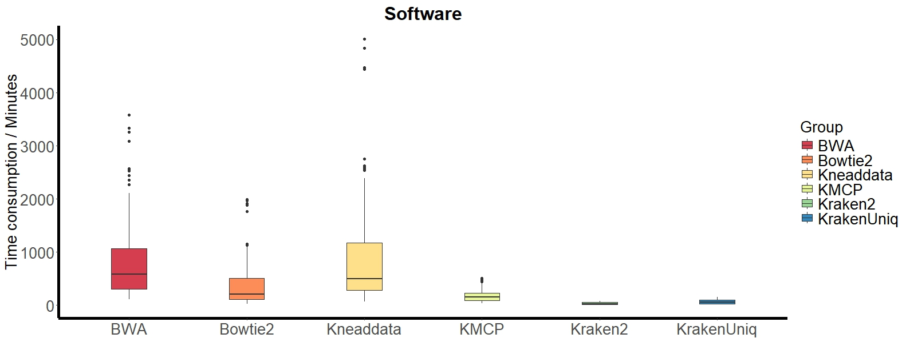

```{r setup, include = FALSE}
knitr::opts_chunk$set(
  collapse  =  T, echo = T, comment = "#>", message = F, warning = F,
	fig.align  =  "center", fig.width  =  5, fig.height = 3, dpi = 150)
```

If you use this script, please cited 如果你使用本代码，请引用：

 Yunyun Gao, Hao Luo, Yong-Xin Liu,et al, Benchmarking metagenomics tools for purging host contamination. 

# Scatter plot



Example-Figure1a-FunctionAnnotation


# Create a sample data frame

```{r}
data <- read.table("data.txt", header = TRUE)

```
# R Package Loading

```{r install, echo = TRUE}
library(ggplot2)
library(dunn.test)
library(car)
library(carData)
```

# Translate the vactor

```{r parameter}
data$Microbiometype <- as.factor(data$Microbiometype)
data$HostGenomeProportion <- as.factor(data$HostGenomeProportion)
data$Hosttype <- as.factor(data$Hosttype)
data$Software <- as.factor(data$Software)
data$Size <- as.factor(data$DataSize)
data$Software <- factor(data$Software, levels = c("BWA", "Bowtie2", "Kneaddata", "KMCP", "Kraken2", "KrakenUniq"))
```


# 1) Create the CPU barplot

```{r}
levene_test_result <- leveneTest(Gigabytes ~ Software, data = data)
levene_test_result
# Check homogeneity of variances and select appropriate analysis method
if (levene_test_result$`Pr(>F)`[1] > 0.05) {
  # Homogeneity of variances is confirmed, use ANOVA
  anova_result <- aov(Gigabytes ~ Software, data = data)
  print(summary(anova_result))
  # Visualize the analysis results
  data$Software <- factor(data$Software, levels = c("BWA", "Bowtie2", "Kneaddata", "KMCP", "Kraken2", "KrakenUniq"))
} else {
  # Homogeneity of variances is not confirmed, use Kruskal-Wallis test
  kruskal_result <- kruskal.test(Gigabytes ~ Software, data = data)
  print(kruskal_result)
  # Perform post hoc test (if needed)
  posthoc_result <- dunn.test(data$Gigabytes, data$Software, method = "bonferroni")
  print(posthoc_result)
}
ggplot(data, aes(x = Software, y = Gigabytes, fill = Software)) +
  geom_boxplot(width = 0.3) +
  labs(x = "", y = "Memory Usage / Gigabytes", title = "Software", color = "black", fill = "Group") +
  theme_classic() +
  theme(
    axis.text = element_text(size = 20),
    axis.title = element_text(size = 20),
    plot.title = element_text(size = 24, face = "bold", hjust = 0.5, vjust = 0.5),
    legend.title = element_text(size = 20, color = "black"),
    legend.text = element_text(size = 20, color = "black"),
    axis.line = element_line(color = "black",size = 2),  # Adjust axis line color
  ) +
  scale_fill_manual(values =c("#d53e4f", "#fc8d59", "#fee08b", "#e6f598", "#99d594", "#3288bd"))
```

# 2) Create the time barplot
```{r}
levene_test_result <- leveneTest(Times ~ Software, data = data)
levene_test_result

# Check homogeneity of variances and select appropriate analysis method
if (levene_test_result$`Pr(>F)`[1] > 0.05) {
  # Homogeneity of variances is confirmed, use ANOVA
  anova_result <- aov(Times ~ Software, data = data)
  print(summary(anova_result))
  # Visualize the analysis results
  data$Software <- factor(data$Software, levels = c("BWA", "Bowtie2", "Kneaddata", "KMCP", "Kraken2", "KrakenUniq"))
} else {
  # Homogeneity of variances is not confirmed, use Kruskal-Wallis test
  kruskal_result <- kruskal.test(Times ~ Software, data = data)
  print(kruskal_result)
  # Perform post hoc test (if needed)
  posthoc_result <- dunn.test(data$Times, data$Software, method = "bonferroni")
  print(posthoc_result)
}

ggplot(data, aes(x = Software, y = Times, fill = Software)) +
  geom_boxplot(width = 0.3) +
  labs(x = "", y = "Time consumption / Minutes", title = "Software", color = "black", fill = "Group") +
  theme_classic() +
  theme(
    axis.text = element_text(size = 20),
    axis.title = element_text(size = 20),
    plot.title = element_text(size = 24, face = "bold", hjust = 0.5, vjust = 0.5),
    legend.title = element_text(size = 20, color = "black"),
    legend.text = element_text(size = 20, color = "black"),
    axis.line = element_line(color = "black",size = 2),  # Adjust axis line color
  ) +
  scale_fill_manual(values =c("#d53e4f", "#fc8d59", "#fee08b", "#e6f598", "#99d594", "#3288bd"))
```

If you use this script, please cited 如果你使用本代码，请引用：

 Yunyun Gao, Hao Luo, Yong-Xin Liu,et al, Benchmarking metagenomics tools for purging host contamination. 

Copyright 2016-2023 Yunyun Gao(高云云), Yong-Xin Liu(刘永鑫) <liuyongxin@caas.cn>, Agricultural Genomics Institute at Shenzhen, Chinese Academy of Agricultural Sciences
