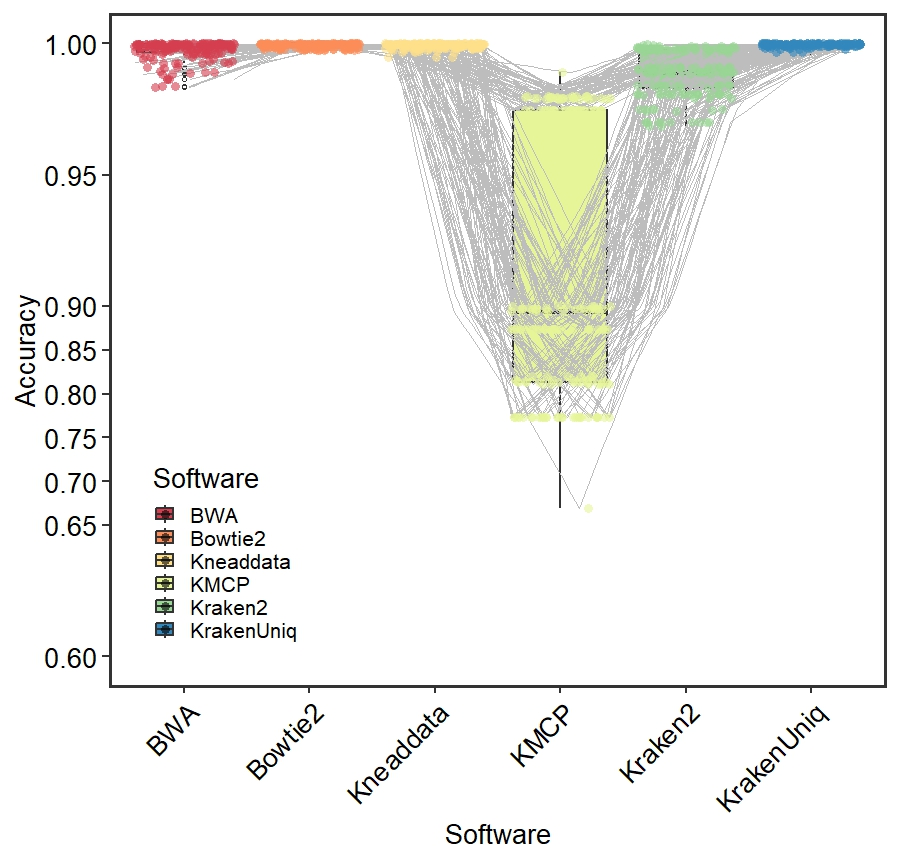

```{r setup, include = FALSE}
knitr::opts_chunk$set(
  collapse  =  T, echo = T, comment = "#>", message = F, warning = F,
	fig.align  =  "center", fig.width  =  5, fig.height = 3, dpi = 150)
```

If you use this script, please cited 如果你使用本代码，请引用：

 Yunyun Gao, Hao Luo, Yong-Xin Liu,et al, Benchmarking metagenomics tools for purging host contamination. 

# Barplot



Example-Figure3a-Accuracy


# Read your data

```{r}
data <- read.table("data.txt", header = TRUE)
```
# R Package Loading

```{r install, echo = TRUE}
library(scales)
library(ggplot2)
library(car)
library(dunn.test)
```


# Reorder factor levels for the Software column
```{r readdata}
data$Software <- factor(data$Software, levels = c("BWA", "Bowtie2", "Kneaddata", "KMCP", "Kraken2", "KrakenUniq"))
data$DataSize <- factor(data$DataSize, levels = c("10G", "30G","60G"))
data$HostGenomeProportion <- factor(data$HostGenomeProportion, levels = c("90%", "50%","10%"))
```

# Create the barplot

```{r}
# Define custom colors
colors <- c("#d53e4f", "#fc8d59", "#fee08b", "#e6f598", "#99d594", "#3288bd")

squash_axis <- function(from, to, factor) { 
  # Args:
  #   from: left end of the axis
  #   to: right end of the axis
  #   factor: the compression factor of the range [from, to]
  trans <- function(x) {    
    # get indices for the relevant regions
    isq <- x > from & x < to
    ito <- x >= to
    
    # apply transformation
    x[isq] <- from + (x[isq] - from)/factor
    x[ito] <- from + (to - from)/factor + (x[ito] - to)
    
    return(x)
  }
  inv <- function(x) {
    # get indices for the relevant regions
    isq <- x > from & x < from + (to - from)/factor
    ito <- x >= from + (to - from)/factor
    
    # apply transformation
    x[isq] <- from + (x[isq] - from) * factor
    x[ito] <- to + (x[ito] - (from + (to - from)/factor))
    
    return(x)
  }
  # return the transformation
  return(trans_new("squash_axis", trans, inv))
}

ggplot(data, aes(x = Software, y = Accuracy, fill = Software)) +
  theme_test(base_size = 20) +  
  theme(
    legend.position = c(0.15,0.2),  # Show legend on the right
    panel.border = element_rect(size = 2, fill = 'transparent'),
    axis.text = element_text(color = 'black', size = 20),
    axis.text.x = element_text(angle = 45, hjust = 1),  # Rotate x-axis labels for better visibility
    plot.title = element_text(size = 28, face = "bold", hjust = 0.5, vjust = 0.5)
  ) +
  geom_boxplot(alpha = 1, size = 1, outlier.shape = 1, position = position_dodge(width = 0.4)) +  # Specify the width here
  geom_line(aes(group = SampleID), position = position_jitter(width = 0.4), 
            color = '#bdbdbd', size = 0.01) +
  geom_jitter(position = position_jitter(width = 0.4), alpha =0.6, size = 3, shape =16, color = colors[as.integer(data$Software)]) +  
  labs(x = "Software", y = "Accuracy") +
  scale_fill_manual(values = colors, guide = guide_legend(title = "Software"))  +
  coord_trans(y = squash_axis(0.65, 0.9, 3))+   scale_y_continuous(
    limits = c(0.6, 1),  # 设置y轴显示范围
    breaks = seq(0.6, 1, by = 0.05)# 设置刻度标签
  ) 

```

# 1) Check Accuracy of Microbiometype, Normality test
```{r}
shapiro_test <- by(data$Accuracy, data$Microbiometype, shapiro.test)
p_values <- sapply(shapiro_test, function(x) x$p.value)
normal_data <- p_values > 0.05
if (all(normal_data)) {
  summary_stats <- aggregate(Accuracy ~ Microbiometype, data = data, FUN = function(x) c(mean = mean(x), se = sd(x)/sqrt(length(x))))
  print(summary_stats)
} else {
  summary_stats <- aggregate(Accuracy ~ Microbiometype, data = data, FUN = function(x) c(median = median(x), p25 = quantile(x, 0.25), p75 = quantile(x, 0.75)))
  print(summary_stats)
}
levene_test_result <- leveneTest(Accuracy ~ Microbiometype, data = data)
p_value_levene <- levene_test_result$`Pr(>F)`[1]

if (all(normal_data)) {
  if (p_value_levene > 0.05) {
    t_test_result <- t.test(Accuracy ~ Microbiometype, data = data, paired = TRUE)
    print(t_test_result)
  } else {
    wilcox_result <- wilcox.test(Accuracy ~ Microbiometype, data = data, paired = TRUE)
    print(wilcox_result)
  }
} else {
  wilcox_result <- wilcox.test(Accuracy ~ Microbiometype, data = data, paired = TRUE)
  print(wilcox_result)
}

```

# 2) Check Accuracy of Hosttype, Normality test
```{r}
shapiro_test <- by(data$Accuracy, data$Microbiometype, shapiro.test)
p_values <- sapply(shapiro_test, function(x) x$p.value)
normal_data <- p_values > 0.05

if (all(normal_data)) {
  summary_stats <- aggregate(Accuracy ~ Hosttype, data = data, FUN = function(x) c(mean = mean(x), se = sd(x)/sqrt(length(x))))
  print(summary_stats)
} else {
  summary_stats <- aggregate(Accuracy ~ Hosttype, data = data, FUN = function(x) c(median = median(x), p25 = quantile(x, 0.25), p75 = quantile(x, 0.75)))
  print(summary_stats)
}
levene_test_result <- leveneTest(Accuracy ~ Hosttype, data = data)
p_value_levene <- levene_test_result$`Pr(>F)`[1]


if (all(normal_data)) {
  if (p_value_levene > 0.05) {
    t_test_result <- t.test(Accuracy ~ Hosttype, data = data, paired = TRUE)
    print(t_test_result)
  } else {
    wilcox_result <- wilcox.test(Accuracy ~ Hosttype, data = data, paired = TRUE)
    print(wilcox_result)
  }
} else {
  wilcox_result <- wilcox.test(Accuracy ~ Hosttype, data = data, paired = TRUE)
  print(wilcox_result)
}
```

# 3) Check Accuracy of HostGenomeProportion, Normality test
```{r}
shapiro_test <- by(data$Accuracy, data$HostGenomeProportion, shapiro.test)
p_values <- sapply(shapiro_test, function(x) x$p.value)
normal_data <- p_values > 0.05

if (all(normal_data)) {
  summary_stats <- aggregate(Accuracy ~ HostGenomeProportion, data = data, FUN = function(x) c(mean = mean(x), se = sd(x)/sqrt(length(x))))
  print(summary_stats)
} else {
  summary_stats <- aggregate(Accuracy ~ HostGenomeProportion, data = data, FUN = function(x) c(median = median(x), p25 = quantile(x, 0.25), p75 = quantile(x, 0.75)))
  print(summary_stats)
}
levene_test_result <- leveneTest(Accuracy ~ HostGenomeProportion, data = data)
p_value_levene <- levene_test_result$`Pr(>F)`[1]

if (all(normal_data)) {
  anova_result <- aov(Accuracy ~ HostGenomeProportion, data = data)
  print(summary(anova_result))
} else {
  kruskal_result <- kruskal.test(Accuracy ~ HostGenomeProportion, data = data)
  print(kruskal_result)
  if (kruskal_result$p.value < 0.05) {
    # Perform Bonferroni-Dunn post-hoc test
    posthoc_result <- dunn.test(data$Accuracy, data$HostGenomeProportion, method = "bonferroni")
    print(posthoc_result)
  } else {
    print("Kruskal-Wallis test is not significant. No post-hoc test needed.")
  }
}

```

# 4) Check Accuracy of DataSize, Normality test
```{r}
shapiro_test <- by(data$Accuracy, data$DataSize, shapiro.test)
p_values <- sapply(shapiro_test, function(x) x$p.value)
normal_data <- p_values > 0.05

if (all(normal_data)) {
  summary_stats <- aggregate(Accuracy ~ DataSize, data = data, FUN = function(x) c(mean = mean(x), se = sd(x)/sqrt(length(x))))
  print(summary_stats)
} else {
  summary_stats <- aggregate(Accuracy ~ DataSize, data = data, FUN = function(x) c(median = median(x), p25 = quantile(x, 0.25), p75 = quantile(x, 0.75)))
  print(summary_stats)
}

levene_test_result <- leveneTest(Accuracy ~ DataSize, data = data)
p_value_levene <- levene_test_result$`Pr(>F)`[1]

if (all(normal_data)) {
  anova_result <- aov(Accuracy ~ DataSize, data = data)
  print(summary(anova_result))
} else {
  kruskal_result <- kruskal.test(Accuracy ~ DataSize, data = data)
  print(kruskal_result)
  if (kruskal_result$p.value < 0.05) {
    # Perform post-hoc pairwise comparisons
    posthoc_result <- dunn.test(data$Accuracy, data$DataSize, method = "bonferroni")
    print(posthoc_result)
  } else {
    print("Kruskal-Wallis test is not significant. No post-hoc test needed.")
  }
}
```

# 5) Check Accuracy of Software, Normality test
```{r}
shapiro_test <- by(data$Accuracy, data$Software, shapiro.test)
p_values <- sapply(shapiro_test, function(x) x$p.value)
normal_data <- p_values > 0.05

if (all(normal_data)) {
  summary_stats <- aggregate(Accuracy ~ Software, data = data, FUN = function(x) c(mean = mean(x), se = sd(x)/sqrt(length(x))))
  print(summary_stats)
} else {
  summary_stats <- aggregate(Accuracy ~ Software, data = data, FUN = function(x) c(median = median(x), p25 = quantile(x, 0.25), p75 = quantile(x, 0.75)))
  print(summary_stats)
}

levene_test_result <- leveneTest(Accuracy ~ Software, data = data)
p_value_levene <- levene_test_result$`Pr(>F)`[1]

if (all(normal_data)) {
  anova_result <- aov(Accuracy ~ Software, data = data)
  print(summary(anova_result))
} else {
  kruskal_result <- kruskal.test(Accuracy ~ Software, data = data)
  print(kruskal_result)
  if (kruskal_result$p.value < 0.05) {
    # Perform post-hoc pairwise comparisons
    posthoc_result <- dunn.test(data$Accuracy, data$Software, method = "bonferroni")
    print(posthoc_result)
  } else {
    print("Kruskal-Wallis test is not significant. No post-hoc test needed.")
  }
}
```

# 6) Check Accuracy of BWA, Normality test
```{r}
data2 <- subset(data, Software == "BWA")
#Microbiometype
shapiro_test <- by(data2$Accuracy, data2$Microbiometype, shapiro.test)
p_values <- sapply(shapiro_test, function(x) x$p.value)
normal_data2 <- p_values > 0.05
if (all(normal_data2)) {
  summary_stats <- aggregate(Accuracy ~ Microbiometype, data = data2, FUN = function(x) c(mean = mean(x), se = sd(x)/sqrt(length(x))))
  print(summary_stats)
} else {
  summary_stats <- aggregate(Accuracy ~ Microbiometype, data = data2, FUN = function(x) c(median = median(x), p25 = quantile(x, 0.25), p75 = quantile(x, 0.75)))
  print(summary_stats)
}
levene_test_result <- leveneTest(Accuracy ~ Microbiometype, data = data2)
p_value_levene <- levene_test_result$`Pr(>F)`[1]
if (all(normal_data2)) {
  if (p_value_levene > 0.05) {
    t_test_result <- t.test(Accuracy ~ Microbiometype, data = data2, paired = TRUE)
    print(t_test_result)
  } else {
    wilcox_result <- wilcox.test(Accuracy ~ Microbiometype, data = data2, paired = TRUE)
    print(wilcox_result)
  }
} else {
  wilcox_result <- wilcox.test(Accuracy ~ Microbiometype, data = data2, paired = TRUE)
  print(wilcox_result)
}
#Hostytype
shapiro_test <- by(data2$Accuracy, data2$Hosttype, shapiro.test)
p_values <- sapply(shapiro_test, function(x) x$p.value)
normal_data2 <- p_values > 0.05
if (all(normal_data2)) {
  summary_stats <- aggregate(Accuracy ~ Hosttype, data = data2, FUN = function(x) c(mean = mean(x), se = sd(x)/sqrt(length(x))))
  print(summary_stats)
} else {
  summary_stats <- aggregate(Accuracy ~ Hosttype, data = data2, FUN = function(x) c(median = median(x), p25 = quantile(x, 0.25), p75 = quantile(x, 0.75)))
  print(summary_stats)
}
levene_test_result <- leveneTest(Accuracy ~ Hosttype, data = data2)
p_value_levene <- levene_test_result$`Pr(>F)`[1]
if (all(normal_data2)) {
  if (p_value_levene > 0.05) {
    t_test_result <- t.test(Accuracy ~ Hosttype, data = data2, paired = TRUE)
    print(t_test_result)
  } else {
    wilcox_result <- wilcox.test(Accuracy ~ Hosttype, data = data2, paired = TRUE)
    print(wilcox_result)
  }
} else {
  wilcox_result <- wilcox.test(Accuracy ~ Hosttype, data = data2, paired = TRUE)
  print(wilcox_result)
}
```

# 7) Check Accuracy of Bowtie2, Normality test
```{r}
data2 <- subset(data, Software == "Bowtie2")
#Microbiometype
shapiro_test <- by(data2$Accuracy, data2$Microbiometype, shapiro.test)
p_values <- sapply(shapiro_test, function(x) x$p.value)
normal_data2 <- p_values > 0.05
if (all(normal_data2)) {
  summary_stats <- aggregate(Accuracy ~ Microbiometype, data = data2, FUN = function(x) c(mean = mean(x), se = sd(x)/sqrt(length(x))))
  print(summary_stats)
} else {
  summary_stats <- aggregate(Accuracy ~ Microbiometype, data = data2, FUN = function(x) c(median = median(x), p25 = quantile(x, 0.25), p75 = quantile(x, 0.75)))
  print(summary_stats)
}
levene_test_result <- leveneTest(Accuracy ~ Microbiometype, data = data2)
p_value_levene <- levene_test_result$`Pr(>F)`[1]
if (all(normal_data2)) {
  if (p_value_levene > 0.05) {
    t_test_result <- t.test(Accuracy ~ Microbiometype, data = data2, paired = TRUE)
    print(t_test_result)
  } else {
    wilcox_result <- wilcox.test(Accuracy ~ Microbiometype, data = data2, paired = TRUE)
    print(wilcox_result)
  }
} else {
  wilcox_result <- wilcox.test(Accuracy ~ Microbiometype, data = data2, paired = TRUE)
  print(wilcox_result)
}
#Hostytype
shapiro_test <- by(data2$Accuracy, data2$Hosttype, shapiro.test)
p_values <- sapply(shapiro_test, function(x) x$p.value)
normal_data2 <- p_values > 0.05
if (all(normal_data2)) {
  summary_stats <- aggregate(Accuracy ~ Hosttype, data = data2, FUN = function(x) c(mean = mean(x), se = sd(x)/sqrt(length(x))))
  print(summary_stats)
} else {
  summary_stats <- aggregate(Accuracy ~ Hosttype, data = data2, FUN = function(x) c(median = median(x), p25 = quantile(x, 0.25), p75 = quantile(x, 0.75)))
  print(summary_stats)
}
levene_test_result <- leveneTest(Accuracy ~ Hosttype, data = data2)
p_value_levene <- levene_test_result$`Pr(>F)`[1]
if (all(normal_data2)) {
  if (p_value_levene > 0.05) {
    t_test_result <- t.test(Accuracy ~ Hosttype, data = data2, paired = TRUE)
    print(t_test_result)
  } else {
    wilcox_result <- wilcox.test(Accuracy ~ Hosttype, data = data2, paired = TRUE)
    print(wilcox_result)
  }
} else {
  wilcox_result <- wilcox.test(Accuracy ~ Hosttype, data = data2, paired = TRUE)
  print(wilcox_result)
}

```

# 8) Check Accuracy of KneadData, Normality test
```{r}
data2 <- subset(data, Software == "Kneaddata")
#Microbiometype
shapiro_test <- by(data2$Accuracy, data2$Microbiometype, shapiro.test)
p_values <- sapply(shapiro_test, function(x) x$p.value)
normal_data2 <- p_values > 0.05
if (all(normal_data2)) {
  summary_stats <- aggregate(Accuracy ~ Microbiometype, data = data2, FUN = function(x) c(mean = mean(x), se = sd(x)/sqrt(length(x))))
  print(summary_stats)
} else {
  summary_stats <- aggregate(Accuracy ~ Microbiometype, data = data2, FUN = function(x) c(median = median(x), p25 = quantile(x, 0.25), p75 = quantile(x, 0.75)))
  print(summary_stats)
}
levene_test_result <- leveneTest(Accuracy ~ Microbiometype, data = data2)
p_value_levene <- levene_test_result$`Pr(>F)`[1]
if (all(normal_data2)) {
  if (p_value_levene > 0.05) {
    t_test_result <- t.test(Accuracy ~ Microbiometype, data = data2, paired = TRUE)
    print(t_test_result)
  } else {
    wilcox_result <- wilcox.test(Accuracy ~ Microbiometype, data = data2, paired = TRUE)
    print(wilcox_result)
  }
} else {
  wilcox_result <- wilcox.test(Accuracy ~ Microbiometype, data = data2, paired = TRUE)
  print(wilcox_result)
}
#Hostytype
shapiro_test <- by(data2$Accuracy, data2$Hosttype, shapiro.test)
p_values <- sapply(shapiro_test, function(x) x$p.value)
normal_data2 <- p_values > 0.05
if (all(normal_data2)) {
  summary_stats <- aggregate(Accuracy ~ Hosttype, data = data2, FUN = function(x) c(mean = mean(x), se = sd(x)/sqrt(length(x))))
  print(summary_stats)
} else {
  summary_stats <- aggregate(Accuracy ~ Hosttype, data = data2, FUN = function(x) c(median = median(x), p25 = quantile(x, 0.25), p75 = quantile(x, 0.75)))
  print(summary_stats)
}
levene_test_result <- leveneTest(Accuracy ~ Hosttype, data = data2)
p_value_levene <- levene_test_result$`Pr(>F)`[1]
if (all(normal_data2)) {
  if (p_value_levene > 0.05) {
    t_test_result <- t.test(Accuracy ~ Hosttype, data = data2, paired = TRUE)
    print(t_test_result)
  } else {
    wilcox_result <- wilcox.test(Accuracy ~ Hosttype, data = data2, paired = TRUE)
    print(wilcox_result)
  }
} else {
  wilcox_result <- wilcox.test(Accuracy ~ Hosttype, data = data2, paired = TRUE)
  print(wilcox_result)
}

```

# 9) Check Accuracy of KMCP, Normality test
```{r}
data2 <- subset(data, Software == "KMCP")
#Microbiometype
shapiro_test <- by(data2$Accuracy, data2$Microbiometype, shapiro.test)
p_values <- sapply(shapiro_test, function(x) x$p.value)
normal_data2 <- p_values > 0.05
if (all(normal_data2)) {
  summary_stats <- aggregate(Accuracy ~ Microbiometype, data = data2, FUN = function(x) c(mean = mean(x), se = sd(x)/sqrt(length(x))))
  print(summary_stats)
} else {
  summary_stats <- aggregate(Accuracy ~ Microbiometype, data = data2, FUN = function(x) c(median = median(x), p25 = quantile(x, 0.25), p75 = quantile(x, 0.75)))
  print(summary_stats)
}
levene_test_result <- leveneTest(Accuracy ~ Microbiometype, data = data2)
p_value_levene <- levene_test_result$`Pr(>F)`[1]
if (all(normal_data2)) {
  if (p_value_levene > 0.05) {
    t_test_result <- t.test(Accuracy ~ Microbiometype, data = data2, paired = TRUE)
    print(t_test_result)
  } else {
    wilcox_result <- wilcox.test(Accuracy ~ Microbiometype, data = data2, paired = TRUE)
    print(wilcox_result)
  }
} else {
  wilcox_result <- wilcox.test(Accuracy ~ Microbiometype, data = data2, paired = TRUE)
  print(wilcox_result)
}
#Hostytype
shapiro_test <- by(data2$Accuracy, data2$Hosttype, shapiro.test)
p_values <- sapply(shapiro_test, function(x) x$p.value)
normal_data2 <- p_values > 0.05
if (all(normal_data2)) {
  summary_stats <- aggregate(Accuracy ~ Hosttype, data = data2, FUN = function(x) c(mean = mean(x), se = sd(x)/sqrt(length(x))))
  print(summary_stats)
} else {
  summary_stats <- aggregate(Accuracy ~ Hosttype, data = data2, FUN = function(x) c(median = median(x), p25 = quantile(x, 0.25), p75 = quantile(x, 0.75)))
  print(summary_stats)
}
levene_test_result <- leveneTest(Accuracy ~ Hosttype, data = data2)
p_value_levene <- levene_test_result$`Pr(>F)`[1]
if (all(normal_data2)) {
  if (p_value_levene > 0.05) {
    t_test_result <- t.test(Accuracy ~ Hosttype, data = data2, paired = TRUE)
    print(t_test_result)
  } else {
    wilcox_result <- wilcox.test(Accuracy ~ Hosttype, data = data2, paired = TRUE)
    print(wilcox_result)
  }
} else {
  wilcox_result <- wilcox.test(Accuracy ~ Hosttype, data = data2, paired = TRUE)
  print(wilcox_result)
}
```

# 10) Check Accuracy of Kraken2, Normality test
```{r}
data2 <- subset(data, Software == "Kraken2")
#Microbiometype
shapiro_test <- by(data2$Accuracy, data2$Microbiometype, shapiro.test)
p_values <- sapply(shapiro_test, function(x) x$p.value)
normal_data2 <- p_values > 0.05
if (all(normal_data2)) {
  summary_stats <- aggregate(Accuracy ~ Microbiometype, data = data2, FUN = function(x) c(mean = mean(x), se = sd(x)/sqrt(length(x))))
  print(summary_stats)
} else {
  summary_stats <- aggregate(Accuracy ~ Microbiometype, data = data2, FUN = function(x) c(median = median(x), p25 = quantile(x, 0.25), p75 = quantile(x, 0.75)))
  print(summary_stats)
}
levene_test_result <- leveneTest(Accuracy ~ Microbiometype, data = data2)
p_value_levene <- levene_test_result$`Pr(>F)`[1]
if (all(normal_data2)) {
  if (p_value_levene > 0.05) {
    t_test_result <- t.test(Accuracy ~ Microbiometype, data = data2, paired = TRUE)
    print(t_test_result)
  } else {
    wilcox_result <- wilcox.test(Accuracy ~ Microbiometype, data = data2, paired = TRUE)
    print(wilcox_result)
  }
} else {
  wilcox_result <- wilcox.test(Accuracy ~ Microbiometype, data = data2, paired = TRUE)
  print(wilcox_result)
}
#Hostytype
shapiro_test <- by(data2$Accuracy, data2$Hosttype, shapiro.test)
p_values <- sapply(shapiro_test, function(x) x$p.value)
normal_data2 <- p_values > 0.05
if (all(normal_data2)) {
  summary_stats <- aggregate(Accuracy ~ Hosttype, data = data2, FUN = function(x) c(mean = mean(x), se = sd(x)/sqrt(length(x))))
  print(summary_stats)
} else {
  summary_stats <- aggregate(Accuracy ~ Hosttype, data = data2, FUN = function(x) c(median = median(x), p25 = quantile(x, 0.25), p75 = quantile(x, 0.75)))
  print(summary_stats)
}
levene_test_result <- leveneTest(Accuracy ~ Hosttype, data = data2)
p_value_levene <- levene_test_result$`Pr(>F)`[1]
if (all(normal_data2)) {
  if (p_value_levene > 0.05) {
    t_test_result <- t.test(Accuracy ~ Hosttype, data = data2, paired = TRUE)
    print(t_test_result)
  } else {
    wilcox_result <- wilcox.test(Accuracy ~ Hosttype, data = data2, paired = TRUE)
    print(wilcox_result)
  }
} else {
  wilcox_result <- wilcox.test(Accuracy ~ Hosttype, data = data2, paired = TRUE)
  print(wilcox_result)
}
```

# 11) Check Accuracy of KrakenUniq, Normality test
```{r}
data2 <- subset(data, Software == "KrakenUniq")
#Microbiometype
shapiro_test <- by(data2$Accuracy, data2$Microbiometype, shapiro.test)
p_values <- sapply(shapiro_test, function(x) x$p.value)
normal_data2 <- p_values > 0.05
if (all(normal_data2)) {
  summary_stats <- aggregate(Accuracy ~ Microbiometype, data = data2, FUN = function(x) c(mean = mean(x), se = sd(x)/sqrt(length(x))))
  print(summary_stats)
} else {
  summary_stats <- aggregate(Accuracy ~ Microbiometype, data = data2, FUN = function(x) c(median = median(x), p25 = quantile(x, 0.25), p75 = quantile(x, 0.75)))
  print(summary_stats)
}
levene_test_result <- leveneTest(Accuracy ~ Microbiometype, data = data2)
p_value_levene <- levene_test_result$`Pr(>F)`[1]
if (all(normal_data2)) {
  if (p_value_levene > 0.05) {
    t_test_result <- t.test(Accuracy ~ Microbiometype, data = data2, paired = TRUE)
    print(t_test_result)
  } else {
    wilcox_result <- wilcox.test(Accuracy ~ Microbiometype, data = data2, paired = TRUE)
    print(wilcox_result)
  }
} else {
  wilcox_result <- wilcox.test(Accuracy ~ Microbiometype, data = data2, paired = TRUE)
  print(wilcox_result)
}
#Hostytype
shapiro_test <- by(data2$Accuracy, data2$Hosttype, shapiro.test)
p_values <- sapply(shapiro_test, function(x) x$p.value)
normal_data2 <- p_values > 0.05
if (all(normal_data2)) {
  summary_stats <- aggregate(Accuracy ~ Hosttype, data = data2, FUN = function(x) c(mean = mean(x), se = sd(x)/sqrt(length(x))))
  print(summary_stats)
} else {
  summary_stats <- aggregate(Accuracy ~ Hosttype, data = data2, FUN = function(x) c(median = median(x), p25 = quantile(x, 0.25), p75 = quantile(x, 0.75)))
  print(summary_stats)
}
levene_test_result <- leveneTest(Accuracy ~ Hosttype, data = data2)
p_value_levene <- levene_test_result$`Pr(>F)`[1]
if (all(normal_data2)) {
  if (p_value_levene > 0.05) {
    t_test_result <- t.test(Accuracy ~ Hosttype, data = data2, paired = TRUE)
    print(t_test_result)
  } else {
    wilcox_result <- wilcox.test(Accuracy ~ Hosttype, data = data2, paired = TRUE)
    print(wilcox_result)
  }
} else {
  wilcox_result <- wilcox.test(Accuracy ~ Hosttype, data = data2, paired = TRUE)
  print(wilcox_result)
}
```

If you use this script, please cited 如果你使用本代码，请引用：

 Yunyun Gao, Hao Luo, Yong-Xin Liu,et al, Benchmarking metagenomics tools for purging host contamination. 

Copyright 2016-2023 Yunyun Gao(高云云), Yong-Xin Liu(刘永鑫) <liuyongxin@caas.cn>, Agricultural Genomics Institute at Shenzhen, Chinese Academy of Agricultural Sciences
