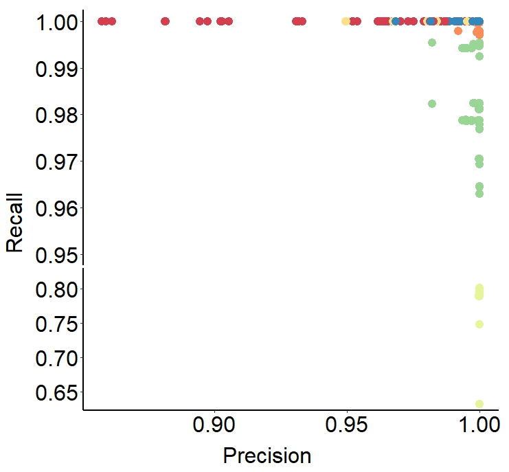

```{r setup, include = FALSE}
knitr::opts_chunk$set(
  collapse  =  T, echo = T, comment = "#>", message = F, warning = F,
	fig.align  =  "center", fig.width  =  5, fig.height = 3, dpi = 150)
```

If you use this script, please cited 如果你使用本代码，请引用：

 Yunyun Gao, Hao Luo, Yong-Xin Liu,et al, Benchmarking metagenomics tools for purging host contamination. 

# Barplot



Example-Figure3b-Precision&Recall


# Read your data

```{r}
data <- read.table("data.txt", header = TRUE)
```
# R Package Loading

```{r install, echo = TRUE}
library(ggplot2)
library(ggbreak)
library(scales)
library(car)
library(dunn.test)
```


# Reorder factor levels for the Software column
```{r readdata}
data$Software <- factor(data$Software, levels = c("BWA", "Bowtie2", "Kneaddata", "KMCP", "Kraken2", "KrakenUniq"))
data$DataSize <- factor(data$DataSize, levels = c("10G", "30G","60G"))
data$HostGenomeProportion <- factor(data$HostGenomeProportion, levels = c("90%", "50%","10%"))
```

# Create the barplot

```{r}
ggplot(data, aes(x = Precision, y = Recall, color = Software)) +
  geom_point(size = 4) +  # Adjust the size parameter as needed
  labs(x = "Precision", y = "Recall", color = "Software") +
  theme_minimal() +
  theme_classic() +
  theme(
    axis.text = element_text(size = 24, color = 'black'),
    axis.title = element_text(size = 24),
    plot.title = element_text(size = 24, face = "bold", hjust = 0.5, vjust = 0.5),
    legend.title = element_text(size = 24, color = "black"),
    legend.text = element_text(size = 24, color = "black"),
    legend.position = c(0.1, 0.1),
    axis.line = element_line(size = 1, color = "black")
  ) +
  scale_color_manual(values = c("#d53e4f", "#fc8d59", "#fee08b", "#e6f598", "#99d594", "#3288bd")) +
  scale_y_break(c(0.82,0.95), space = 0, scales = 1.8)
```

# 1. Check Precision
## 1) Check Precision of Microbiometype, Normality test
```{r}
shapiro_test <- by(data$Precision, data$Microbiometype, shapiro.test)
p_values <- sapply(shapiro_test, function(x) x$p.value)
normal_data <- p_values > 0.05
if (all(normal_data)) {
  summary_stats <- aggregate(Precision ~ Microbiometype, data = data, FUN = function(x) c(mean = mean(x), se = sd(x)/sqrt(length(x))))
  print(summary_stats)
} else {
  summary_stats <- aggregate(Precision ~ Microbiometype, data = data, FUN = function(x) c(median = median(x), p25 = quantile(x, 0.25), p75 = quantile(x, 0.75)))
  print(summary_stats)
}
levene_test_result <- leveneTest(Precision ~ Microbiometype, data = data)
p_value_levene <- levene_test_result$`Pr(>F)`[1]

if (all(normal_data)) {
  if (p_value_levene > 0.05) {
    t_test_result <- t.test(Precision ~ Microbiometype, data = data, paired = TRUE)
    print(t_test_result)
  } else {
    wilcox_result <- wilcox.test(Precision ~ Microbiometype, data = data, paired = TRUE)
    print(wilcox_result)
  }
} else {
  wilcox_result <- wilcox.test(Precision ~ Microbiometype, data = data, paired = TRUE)
  print(wilcox_result)
}
```

## 2) Check Precision of Hosttype, Normality test
```{r}
shapiro_test <- by(data$Precision, data$Microbiometype, shapiro.test)
p_values <- sapply(shapiro_test, function(x) x$p.value)
normal_data <- p_values > 0.05

if (all(normal_data)) {
  summary_stats <- aggregate(Precision ~ Hosttype, data = data, FUN = function(x) c(mean = mean(x), se = sd(x)/sqrt(length(x))))
  print(summary_stats)
} else {
  summary_stats <- aggregate(Precision ~ Hosttype, data = data, FUN = function(x) c(median = median(x), p25 = quantile(x, 0.25), p75 = quantile(x, 0.75)))
  print(summary_stats)
}
levene_test_result <- leveneTest(Precision ~ Hosttype, data = data)
p_value_levene <- levene_test_result$`Pr(>F)`[1]
if (all(normal_data)) {
  if (p_value_levene > 0.05) {
    t_test_result <- t.test(Precision ~ Hosttype, data = data, paired = TRUE)
    print(t_test_result)
  } else {
    wilcox_result <- wilcox.test(Precision ~ Hosttype, data = data, paired = TRUE)
    print(wilcox_result)
  }
} else {
  wilcox_result <- wilcox.test(Precision ~ Hosttype, data = data, paired = TRUE)
  print(wilcox_result)
}
```

## 3) Check Precision of HostGenomeProportion, Normality test
```{r}
shapiro_test <- by(data$Precision, data$HostGenomeProportion, shapiro.test)
p_values <- sapply(shapiro_test, function(x) x$p.value)
normal_data <- p_values > 0.05
if (all(normal_data)) {
  summary_stats <- aggregate(Precision ~ HostGenomeProportion, data = data, FUN = function(x) c(mean = mean(x), se = sd(x)/sqrt(length(x))))
  print(summary_stats)
} else {
  summary_stats <- aggregate(Precision ~ HostGenomeProportion, data = data, FUN = function(x) c(median = median(x), p25 = quantile(x, 0.25), p75 = quantile(x, 0.75)))
  print(summary_stats)
}
levene_test_result <- leveneTest(Precision ~ HostGenomeProportion, data = data)
p_value_levene <- levene_test_result$`Pr(>F)`[1]

if (all(normal_data)) {
  anova_result <- aov(Precision ~ HostGenomeProportion, data = data)
  print(summary(anova_result))
} else {
  kruskal_result <- kruskal.test(Precision ~ HostGenomeProportion, data = data)
  print(kruskal_result)
  if (kruskal_result$p.value < 0.05) {
    # Perform Bonferroni-Dunn post-hoc test
    posthoc_result <- dunn.test(data$Precision, data$HostGenomeProportion, method = "bonferroni")
    print(posthoc_result)
  } else {
    print("Kruskal-Wallis test is not significant. No post-hoc test needed.")
  }
}
```
## 4) Check Precision of DataSize, Normality test
```{r}
shapiro_test <- by(data$Precision, data$DataSize, shapiro.test)
p_values <- sapply(shapiro_test, function(x) x$p.value)
normal_data <- p_values > 0.05

if (all(normal_data)) {
  summary_stats <- aggregate(Precision ~ DataSize, data = data, FUN = function(x) c(mean = mean(x), se = sd(x)/sqrt(length(x))))
  print(summary_stats)
} else {
  summary_stats <- aggregate(Precision ~ DataSize, data = data, FUN = function(x) c(median = median(x), p25 = quantile(x, 0.25), p75 = quantile(x, 0.75)))
  print(summary_stats)
}

levene_test_result <- leveneTest(Precision ~ DataSize, data = data)
p_value_levene <- levene_test_result$`Pr(>F)`[1]
if (all(normal_data)) {
  anova_result <- aov(Precision ~ DataSize, data = data)
  print(summary(anova_result))
} else {
  kruskal_result <- kruskal.test(Precision ~ DataSize, data = data)
  print(kruskal_result)
  if (kruskal_result$p.value < 0.05) {
    # Perform post-hoc pairwise comparisons
    posthoc_result <- dunn.test(data$Precision, data$DataSize, method = "bonferroni")
    print(posthoc_result)
  } else {
    print("Kruskal-Wallis test is not significant. No post-hoc test needed.")
  }
}
```
## 5) Check Precision of Software, Normality test
```{r}
shapiro_test <- by(data$Precision, data$Software, shapiro.test)
p_values <- sapply(shapiro_test, function(x) x$p.value)
normal_data <- p_values > 0.05

if (all(normal_data)) {
  summary_stats <- aggregate(Precision ~ Software, data = data, FUN = function(x) c(mean = mean(x), se = sd(x)/sqrt(length(x))))
  print(summary_stats)
} else {
  summary_stats <- aggregate(Precision ~ Software, data = data, FUN = function(x) c(median = median(x), p25 = quantile(x, 0.25), p75 = quantile(x, 0.75)))
  print(summary_stats)
}

levene_test_result <- leveneTest(Precision ~ Software, data = data)
p_value_levene <- levene_test_result$`Pr(>F)`[1]
if (all(normal_data)) {
  anova_result <- aov(Precision ~ Software, data = data)
  print(summary(anova_result))
} else {
  kruskal_result <- kruskal.test(Precision ~ Software, data = data)
  print(kruskal_result)
  if (kruskal_result$p.value < 0.05) {
    # Perform post-hoc pairwise comparisons
    posthoc_result <- dunn.test(data$Precision, data$Software, method = "bonferroni")
    print(posthoc_result)
  } else {
    print("Kruskal-Wallis test is not significant. No post-hoc test needed.")
  }
}
```

## 6) Check Precision of BWA, Normality test
```{r}
data2 <- subset(data, Software == "BWA")
#Microbiometype
shapiro_test <- by(data2$Precision, data2$Microbiometype, shapiro.test)
p_values <- sapply(shapiro_test, function(x) x$p.value)
normal_data2 <- p_values > 0.05
if (all(normal_data2)) {
  summary_stats <- aggregate(Precision ~ Microbiometype, data = data2, FUN = function(x) c(mean = mean(x), se = sd(x)/sqrt(length(x))))
  print(summary_stats)
} else {
  summary_stats <- aggregate(Precision ~ Microbiometype, data = data2, FUN = function(x) c(median = median(x), p25 = quantile(x, 0.25), p75 = quantile(x, 0.75)))
  print(summary_stats)
}
levene_test_result <- leveneTest(Precision ~ Microbiometype, data = data2)
p_value_levene <- levene_test_result$`Pr(>F)`[1]
if (all(normal_data2)) {
  if (p_value_levene > 0.05) {
    t_test_result <- t.test(Precision ~ Microbiometype, data = data2, paired = TRUE)
    print(t_test_result)
  } else {
    wilcox_result <- wilcox.test(Precision ~ Microbiometype, data = data2, paired = TRUE)
    print(wilcox_result)
  }
} else {
  wilcox_result <- wilcox.test(Precision ~ Microbiometype, data = data2, paired = TRUE)
  print(wilcox_result)
}
#Hostytype
shapiro_test <- by(data2$Precision, data2$Hosttype, shapiro.test)
p_values <- sapply(shapiro_test, function(x) x$p.value)
normal_data2 <- p_values > 0.05
if (all(normal_data2)) {
  summary_stats <- aggregate(Precision ~ Hosttype, data = data2, FUN = function(x) c(mean = mean(x), se = sd(x)/sqrt(length(x))))
  print(summary_stats)
} else {
  summary_stats <- aggregate(Precision ~ Hosttype, data = data2, FUN = function(x) c(median = median(x), p25 = quantile(x, 0.25), p75 = quantile(x, 0.75)))
  print(summary_stats)
}
levene_test_result <- leveneTest(Precision ~ Hosttype, data = data2)
p_value_levene <- levene_test_result$`Pr(>F)`[1]
if (all(normal_data2)) {
  if (p_value_levene > 0.05) {
    t_test_result <- t.test(Precision ~ Hosttype, data = data2, paired = TRUE)
    print(t_test_result)
  } else {
    wilcox_result <- wilcox.test(Precision ~ Hosttype, data = data2, paired = TRUE)
    print(wilcox_result)
  }
} else {
  wilcox_result <- wilcox.test(Precision ~ Hosttype, data = data2, paired = TRUE)
  print(wilcox_result)
}
#HostGenomeProportion
shapiro_test <- by(data2$Precision, data2$HostGenomeProportion, shapiro.test)
p_values <- sapply(shapiro_test, function(x) x$p.value)
normal_data2 <- p_values > 0.05

if (all(normal_data2)) {
  summary_stats <- aggregate(Precision ~ HostGenomeProportion, data = data2, FUN = function(x) c(mean = mean(x), se = sd(x)/sqrt(length(x))))
  print(summary_stats)
} else {
  summary_stats <- aggregate(Precision ~ HostGenomeProportion, data = data2, FUN = function(x) c(median = median(x), p25 = quantile(x, 0.25), p75 = quantile(x, 0.75)))
  print(summary_stats)
}
levene_test_result <- leveneTest(Precision ~ HostGenomeProportion, data = data2)
p_value_levene <- levene_test_result$`Pr(>F)`[1]

if (all(normal_data2)) {
  anova_result <- aov(Precision ~ HostGenomeProportion, data = data2)
  print(summary(anova_result))
} else {
  kruskal_result <- kruskal.test(Precision ~ HostGenomeProportion, data = data2)
  print(kruskal_result)
  if (kruskal_result$p.value < 0.05) {
    # Perform Bonferroni-Dunn post-hoc test
    posthoc_result <- dunn.test(data2$Precision, data2$HostGenomeProportion, method = "bonferroni")
    print(posthoc_result)
  } else {
    print("Kruskal-Wallis test is not significant. No post-hoc test needed.")
  }
}
```
## 7) Check Precision of Bowtie2, Normality test
```{r}
data2 <- subset(data, Software == "Bowtie2")
#Microbiometype
shapiro_test <- by(data2$Precision, data2$Microbiometype, shapiro.test)
p_values <- sapply(shapiro_test, function(x) x$p.value)
normal_data2 <- p_values > 0.05
if (all(normal_data2)) {
  summary_stats <- aggregate(Precision ~ Microbiometype, data = data2, FUN = function(x) c(mean = mean(x), se = sd(x)/sqrt(length(x))))
  print(summary_stats)
} else {
  summary_stats <- aggregate(Precision ~ Microbiometype, data = data2, FUN = function(x) c(median = median(x), p25 = quantile(x, 0.25), p75 = quantile(x, 0.75)))
  print(summary_stats)
}
levene_test_result <- leveneTest(Precision ~ Microbiometype, data = data2)
p_value_levene <- levene_test_result$`Pr(>F)`[1]
if (all(normal_data2)) {
  if (p_value_levene > 0.05) {
    t_test_result <- t.test(Precision ~ Microbiometype, data = data2, paired = TRUE)
    print(t_test_result)
  } else {
    wilcox_result <- wilcox.test(Precision ~ Microbiometype, data = data2, paired = TRUE)
    print(wilcox_result)
  }
} else {
  wilcox_result <- wilcox.test(Precision ~ Microbiometype, data = data2, paired = TRUE)
  print(wilcox_result)
}
#Hostytype
shapiro_test <- by(data2$Precision, data2$Hosttype, shapiro.test)
p_values <- sapply(shapiro_test, function(x) x$p.value)
normal_data2 <- p_values > 0.05
if (all(normal_data2)) {
  summary_stats <- aggregate(Precision ~ Hosttype, data = data2, FUN = function(x) c(mean = mean(x), se = sd(x)/sqrt(length(x))))
  print(summary_stats)
} else {
  summary_stats <- aggregate(Precision ~ Hosttype, data = data2, FUN = function(x) c(median = median(x), p25 = quantile(x, 0.25), p75 = quantile(x, 0.75)))
  print(summary_stats)
}
levene_test_result <- leveneTest(Precision ~ Hosttype, data = data2)
p_value_levene <- levene_test_result$`Pr(>F)`[1]
if (all(normal_data2)) {
  if (p_value_levene > 0.05) {
    t_test_result <- t.test(Precision ~ Hosttype, data = data2, paired = TRUE)
    print(t_test_result)
  } else {
    wilcox_result <- wilcox.test(Precision ~ Hosttype, data = data2, paired = TRUE)
    print(wilcox_result)
  }
} else {
  wilcox_result <- wilcox.test(Precision ~ Hosttype, data = data2, paired = TRUE)
  print(wilcox_result)
}
#HostGenomeProportion
shapiro_test <- by(data2$Precision, data2$HostGenomeProportion, shapiro.test)
p_values <- sapply(shapiro_test, function(x) x$p.value)
normal_data2 <- p_values > 0.05

if (all(normal_data2)) {
  summary_stats <- aggregate(Precision ~ HostGenomeProportion, data = data2, FUN = function(x) c(mean = mean(x), se = sd(x)/sqrt(length(x))))
  print(summary_stats)
} else {
  summary_stats <- aggregate(Precision ~ HostGenomeProportion, data = data2, FUN = function(x) c(median = median(x), p25 = quantile(x, 0.25), p75 = quantile(x, 0.75)))
  print(summary_stats)
}
levene_test_result <- leveneTest(Precision ~ HostGenomeProportion, data = data2)
p_value_levene <- levene_test_result$`Pr(>F)`[1]

if (all(normal_data2)) {
  anova_result <- aov(Precision ~ HostGenomeProportion, data = data2)
  print(summary(anova_result))
} else {
  kruskal_result <- kruskal.test(Precision ~ HostGenomeProportion, data = data2)
  print(kruskal_result)
  if (kruskal_result$p.value < 0.05) {
    # Perform Bonferroni-Dunn post-hoc test
    posthoc_result <- dunn.test(data2$Precision, data2$HostGenomeProportion, method = "bonferroni")
    print(posthoc_result)
  } else {
    print("Kruskal-Wallis test is not significant. No post-hoc test needed.")
  }
}
```
# 8) Check Precision of KneadData, Normality test
```{r}
data2 <- subset(data, Software == "Kneaddata")
#Microbiometype
shapiro_test <- by(data2$Precision, data2$Microbiometype, shapiro.test)
p_values <- sapply(shapiro_test, function(x) x$p.value)
normal_data2 <- p_values > 0.05
if (all(normal_data2)) {
  summary_stats <- aggregate(Precision ~ Microbiometype, data = data2, FUN = function(x) c(mean = mean(x), se = sd(x)/sqrt(length(x))))
  print(summary_stats)
} else {
  summary_stats <- aggregate(Precision ~ Microbiometype, data = data2, FUN = function(x) c(median = median(x), p25 = quantile(x, 0.25), p75 = quantile(x, 0.75)))
  print(summary_stats)
}
levene_test_result <- leveneTest(Precision ~ Microbiometype, data = data2)
p_value_levene <- levene_test_result$`Pr(>F)`[1]
if (all(normal_data2)) {
  if (p_value_levene > 0.05) {
    t_test_result <- t.test(Precision ~ Microbiometype, data = data2, paired = TRUE)
    print(t_test_result)
  } else {
    wilcox_result <- wilcox.test(Precision ~ Microbiometype, data = data2, paired = TRUE)
    print(wilcox_result)
  }
} else {
  wilcox_result <- wilcox.test(Precision ~ Microbiometype, data = data2, paired = TRUE)
  print(wilcox_result)
}
#Hostytype
shapiro_test <- by(data2$Precision, data2$Hosttype, shapiro.test)
p_values <- sapply(shapiro_test, function(x) x$p.value)
normal_data2 <- p_values > 0.05
if (all(normal_data2)) {
  summary_stats <- aggregate(Precision ~ Hosttype, data = data2, FUN = function(x) c(mean = mean(x), se = sd(x)/sqrt(length(x))))
  print(summary_stats)
} else {
  summary_stats <- aggregate(Precision ~ Hosttype, data = data2, FUN = function(x) c(median = median(x), p25 = quantile(x, 0.25), p75 = quantile(x, 0.75)))
  print(summary_stats)
}
levene_test_result <- leveneTest(Precision ~ Hosttype, data = data2)
p_value_levene <- levene_test_result$`Pr(>F)`[1]
if (all(normal_data2)) {
  if (p_value_levene > 0.05) {
    t_test_result <- t.test(Precision ~ Hosttype, data = data2, paired = TRUE)
    print(t_test_result)
  } else {
    wilcox_result <- wilcox.test(Precision ~ Hosttype, data = data2, paired = TRUE)
    print(wilcox_result)
  }
} else {
  wilcox_result <- wilcox.test(Precision ~ Hosttype, data = data2, paired = TRUE)
  print(wilcox_result)
}
#HostGenomeProportion
shapiro_test <- by(data2$Precision, data2$HostGenomeProportion, shapiro.test)
p_values <- sapply(shapiro_test, function(x) x$p.value)
normal_data2 <- p_values > 0.05

if (all(normal_data2)) {
  summary_stats <- aggregate(Precision ~ HostGenomeProportion, data = data2, FUN = function(x) c(mean = mean(x), se = sd(x)/sqrt(length(x))))
  print(summary_stats)
} else {
  summary_stats <- aggregate(Precision ~ HostGenomeProportion, data = data2, FUN = function(x) c(median = median(x), p25 = quantile(x, 0.25), p75 = quantile(x, 0.75)))
  print(summary_stats)
}
levene_test_result <- leveneTest(Precision ~ HostGenomeProportion, data = data2)
p_value_levene <- levene_test_result$`Pr(>F)`[1]

if (all(normal_data2)) {
  anova_result <- aov(Precision ~ HostGenomeProportion, data = data2)
  print(summary(anova_result))
} else {
  kruskal_result <- kruskal.test(Precision ~ HostGenomeProportion, data = data2)
  print(kruskal_result)
  if (kruskal_result$p.value < 0.05) {
    # Perform Bonferroni-Dunn post-hoc test
    posthoc_result <- dunn.test(data2$Precision, data2$HostGenomeProportion, method = "bonferroni")
    print(posthoc_result)
  } else {
    print("Kruskal-Wallis test is not significant. No post-hoc test needed.")
  }
}
```
## 9) Check Precision of KMCP, Normality test
```{r}
data2 <- subset(data, Software == "KMCP")
#Microbiometype
#shapiro_test <- by(data2$Precision, data2$Microbiometype, shapiro.test)
p_values <- sapply(shapiro_test, function(x) x$p.value)
normal_data2 <- p_values > 0.05
if (all(normal_data2)) {
  summary_stats <- aggregate(Precision ~ Microbiometype, data = data2, FUN = function(x) c(mean = mean(x), se = sd(x)/sqrt(length(x))))
  print(summary_stats)
} else {
  summary_stats <- aggregate(Precision ~ Microbiometype, data = data2, FUN = function(x) c(median = median(x), p25 = quantile(x, 0.25), p75 = quantile(x, 0.75)))
  print(summary_stats)
}
levene_test_result <- leveneTest(Precision ~ Microbiometype, data = data2)
p_value_levene <- levene_test_result$`Pr(>F)`[1]
if (all(normal_data2)) {
  if (p_value_levene > 0.05) {
    t_test_result <- t.test(Precision ~ Microbiometype, data = data2, paired = TRUE)
    print(t_test_result)
  } else {
    wilcox_result <- wilcox.test(Precision ~ Microbiometype, data = data2, paired = TRUE)
    print(wilcox_result)
  }
} else {
  wilcox_result <- wilcox.test(Precision ~ Microbiometype, data = data2, paired = TRUE)
  print(wilcox_result)
}
#Hostytype
shapiro_test <- by(data2$Precision, data2$Hosttype, shapiro.test)
p_values <- sapply(shapiro_test, function(x) x$p.value)
normal_data2 <- p_values > 0.05
if (all(normal_data2)) {
  summary_stats <- aggregate(Precision ~ Hosttype, data = data2, FUN = function(x) c(mean = mean(x), se = sd(x)/sqrt(length(x))))
  print(summary_stats)
} else {
  summary_stats <- aggregate(Precision ~ Hosttype, data = data2, FUN = function(x) c(median = median(x), p25 = quantile(x, 0.25), p75 = quantile(x, 0.75)))
  print(summary_stats)
}
levene_test_result <- leveneTest(Precision ~ Hosttype, data = data2)
p_value_levene <- levene_test_result$`Pr(>F)`[1]
if (all(normal_data2)) {
  if (p_value_levene > 0.05) {
    t_test_result <- t.test(Precision ~ Hosttype, data = data2, paired = TRUE)
    print(t_test_result)
  } else {
    wilcox_result <- wilcox.test(Precision ~ Hosttype, data = data2, paired = TRUE)
    print(wilcox_result)
  }
} else {
  wilcox_result <- wilcox.test(Precision ~ Hosttype, data = data2, paired = TRUE)
  print(wilcox_result)
}
#HostGenomeProportion
shapiro_test <- by(data2$Precision, data2$HostGenomeProportion, shapiro.test)
p_values <- sapply(shapiro_test, function(x) x$p.value)
normal_data2 <- p_values > 0.05

if (all(normal_data2)) {
  summary_stats <- aggregate(Precision ~ HostGenomeProportion, data = data2, FUN = function(x) c(mean = mean(x), se = sd(x)/sqrt(length(x))))
  print(summary_stats)
} else {
  summary_stats <- aggregate(Precision ~ HostGenomeProportion, data = data2, FUN = function(x) c(median = median(x), p25 = quantile(x, 0.25), p75 = quantile(x, 0.75)))
  print(summary_stats)
}
levene_test_result <- leveneTest(Precision ~ HostGenomeProportion, data = data2)
p_value_levene <- levene_test_result$`Pr(>F)`[1]

if (all(normal_data2)) {
  anova_result <- aov(Precision ~ HostGenomeProportion, data = data2)
  print(summary(anova_result))
} else {
  kruskal_result <- kruskal.test(Precision ~ HostGenomeProportion, data = data2)
  print(kruskal_result)
  if (kruskal_result$p.value < 0.05) {
    # Perform Bonferroni-Dunn post-hoc test
    posthoc_result <- dunn.test(data2$Precision, data2$HostGenomeProportion, method = "bonferroni")
    print(posthoc_result)
  } else {
    print("Kruskal-Wallis test is not significant. No post-hoc test needed.")
  }
}
```
## 10) Check Precision of Kraken2, Normality test
```{r}
data2 <- subset(data, Software == "Kraken2")
#Microbiometype
shapiro_test <- by(data2$Precision, data2$Microbiometype, shapiro.test)
p_values <- sapply(shapiro_test, function(x) x$p.value)
normal_data2 <- p_values > 0.05
if (all(normal_data2)) {
  summary_stats <- aggregate(Precision ~ Microbiometype, data = data2, FUN = function(x) c(mean = mean(x), se = sd(x)/sqrt(length(x))))
  print(summary_stats)
} else {
  summary_stats <- aggregate(Precision ~ Microbiometype, data = data2, FUN = function(x) c(median = median(x), p25 = quantile(x, 0.25), p75 = quantile(x, 0.75)))
  print(summary_stats)
}
levene_test_result <- leveneTest(Precision ~ Microbiometype, data = data2)
p_value_levene <- levene_test_result$`Pr(>F)`[1]
if (all(normal_data2)) {
  if (p_value_levene > 0.05) {
    t_test_result <- t.test(Precision ~ Microbiometype, data = data2, paired = TRUE)
    print(t_test_result)
  } else {
    wilcox_result <- wilcox.test(Precision ~ Microbiometype, data = data2, paired = TRUE)
    print(wilcox_result)
  }
} else {
  wilcox_result <- wilcox.test(Precision ~ Microbiometype, data = data2, paired = TRUE)
  print(wilcox_result)
}
#Hostytype
shapiro_test <- by(data2$Precision, data2$Hosttype, shapiro.test)
p_values <- sapply(shapiro_test, function(x) x$p.value)
normal_data2 <- p_values > 0.05
if (all(normal_data2)) {
  summary_stats <- aggregate(Precision ~ Hosttype, data = data2, FUN = function(x) c(mean = mean(x), se = sd(x)/sqrt(length(x))))
  print(summary_stats)
} else {
  summary_stats <- aggregate(Precision ~ Hosttype, data = data2, FUN = function(x) c(median = median(x), p25 = quantile(x, 0.25), p75 = quantile(x, 0.75)))
  print(summary_stats)
}
levene_test_result <- leveneTest(Precision ~ Hosttype, data = data2)
p_value_levene <- levene_test_result$`Pr(>F)`[1]
if (all(normal_data2)) {
  if (p_value_levene > 0.05) {
    t_test_result <- t.test(Precision ~ Hosttype, data = data2, paired = TRUE)
    print(t_test_result)
  } else {
    wilcox_result <- wilcox.test(Precision ~ Hosttype, data = data2, paired = TRUE)
    print(wilcox_result)
  }
} else {
  wilcox_result <- wilcox.test(Precision ~ Hosttype, data = data2, paired = TRUE)
  print(wilcox_result)
}
#HostGenomeProportion
shapiro_test <- by(data2$Precision, data2$HostGenomeProportion, shapiro.test)
p_values <- sapply(shapiro_test, function(x) x$p.value)
normal_data2 <- p_values > 0.05

if (all(normal_data2)) {
  summary_stats <- aggregate(Precision ~ HostGenomeProportion, data = data2, FUN = function(x) c(mean = mean(x), se = sd(x)/sqrt(length(x))))
  print(summary_stats)
} else {
  summary_stats <- aggregate(Precision ~ HostGenomeProportion, data = data2, FUN = function(x) c(median = median(x), p25 = quantile(x, 0.25), p75 = quantile(x, 0.75)))
  print(summary_stats)
}
levene_test_result <- leveneTest(Precision ~ HostGenomeProportion, data = data2)
p_value_levene <- levene_test_result$`Pr(>F)`[1]

if (all(normal_data2)) {
  anova_result <- aov(Precision ~ HostGenomeProportion, data = data2)
  print(summary(anova_result))
} else {
  kruskal_result <- kruskal.test(Precision ~ HostGenomeProportion, data = data2)
  print(kruskal_result)
  if (kruskal_result$p.value < 0.05) {
    # Perform Bonferroni-Dunn post-hoc test
    posthoc_result <- dunn.test(data2$Precision, data2$HostGenomeProportion, method = "bonferroni")
    print(posthoc_result)
  } else {
    print("Kruskal-Wallis test is not significant. No post-hoc test needed.")
  }
}
```

# 11) Check Precision of KrakenUniq, Normality test
```{r}
data2 <- subset(data, Software == "KrakenUniq")
#Microbiometype
shapiro_test <- by(data2$Precision, data2$Microbiometype, shapiro.test)
p_values <- sapply(shapiro_test, function(x) x$p.value)
normal_data2 <- p_values > 0.05
if (all(normal_data2)) {
  summary_stats <- aggregate(Precision ~ Microbiometype, data = data2, FUN = function(x) c(mean = mean(x), se = sd(x)/sqrt(length(x))))
  print(summary_stats)
} else {
  summary_stats <- aggregate(Precision ~ Microbiometype, data = data2, FUN = function(x) c(median = median(x), p25 = quantile(x, 0.25), p75 = quantile(x, 0.75)))
  print(summary_stats)
}
levene_test_result <- leveneTest(Precision ~ Microbiometype, data = data2)
p_value_levene <- levene_test_result$`Pr(>F)`[1]
if (all(normal_data2)) {
  if (p_value_levene > 0.05) {
    t_test_result <- t.test(Precision ~ Microbiometype, data = data2, paired = TRUE)
    print(t_test_result)
  } else {
    wilcox_result <- wilcox.test(Precision ~ Microbiometype, data = data2, paired = TRUE)
    print(wilcox_result)
  }
} else {
  wilcox_result <- wilcox.test(Precision ~ Microbiometype, data = data2, paired = TRUE)
  print(wilcox_result)
}
#Hostytype
shapiro_test <- by(data2$Precision, data2$Hosttype, shapiro.test)
p_values <- sapply(shapiro_test, function(x) x$p.value)
normal_data2 <- p_values > 0.05
if (all(normal_data2)) {
  summary_stats <- aggregate(Precision ~ Hosttype, data = data2, FUN = function(x) c(mean = mean(x), se = sd(x)/sqrt(length(x))))
  print(summary_stats)
} else {
  summary_stats <- aggregate(Precision ~ Hosttype, data = data2, FUN = function(x) c(median = median(x), p25 = quantile(x, 0.25), p75 = quantile(x, 0.75)))
  print(summary_stats)
}
levene_test_result <- leveneTest(Precision ~ Hosttype, data = data2)
p_value_levene <- levene_test_result$`Pr(>F)`[1]
if (all(normal_data2)) {
  if (p_value_levene > 0.05) {
    t_test_result <- t.test(Precision ~ Hosttype, data = data2, paired = TRUE)
    print(t_test_result)
  } else {
    wilcox_result <- wilcox.test(Precision ~ Hosttype, data = data2, paired = TRUE)
    print(wilcox_result)
  }
} else {
  wilcox_result <- wilcox.test(Precision ~ Hosttype, data = data2, paired = TRUE)
  print(wilcox_result)
}
#HostGenomeProportion
shapiro_test <- by(data2$Precision, data2$HostGenomeProportion, shapiro.test)
p_values <- sapply(shapiro_test, function(x) x$p.value)
normal_data2 <- p_values > 0.05

if (all(normal_data2)) {
  summary_stats <- aggregate(Precision ~ HostGenomeProportion, data = data2, FUN = function(x) c(mean = mean(x), se = sd(x)/sqrt(length(x))))
  print(summary_stats)
} else {
  summary_stats <- aggregate(Precision ~ HostGenomeProportion, data = data2, FUN = function(x) c(median = median(x), p25 = quantile(x, 0.25), p75 = quantile(x, 0.75)))
  print(summary_stats)
}
levene_test_result <- leveneTest(Precision ~ HostGenomeProportion, data = data2)
p_value_levene <- levene_test_result$`Pr(>F)`[1]

if (all(normal_data2)) {
  anova_result <- aov(Precision ~ HostGenomeProportion, data = data2)
  print(summary(anova_result))
} else {
  kruskal_result <- kruskal.test(Precision ~ HostGenomeProportion, data = data2)
  print(kruskal_result)
  if (kruskal_result$p.value < 0.05) {
    # Perform Bonferroni-Dunn post-hoc test
    posthoc_result <- dunn.test(data2$Precision, data2$HostGenomeProportion, method = "bonferroni")
    print(posthoc_result)
  } else {
    print("Kruskal-Wallis test is not significant. No post-hoc test needed.")
  }
}
```
# 2. Check Recall
## 1) Check Recall of Microbiometype, Normality test
```{r}
shapiro_test <- by(data$Recall, data$Microbiometype, shapiro.test)
p_values <- sapply(shapiro_test, function(x) x$p.value)
normal_data <- p_values > 0.05
if (all(normal_data)) {
  summary_stats <- aggregate(Recall ~ Microbiometype, data = data, FUN = function(x) c(mean = mean(x), se = sd(x)/sqrt(length(x))))
  print(summary_stats)
} else {
  summary_stats <- aggregate(Recall ~ Microbiometype, data = data, FUN = function(x) c(median = median(x), p25 = quantile(x, 0.25), p75 = quantile(x, 0.75)))
  print(summary_stats)
}
levene_test_result <- leveneTest(Recall ~ Microbiometype, data = data)
p_value_levene <- levene_test_result$`Pr(>F)`[1]

if (all(normal_data)) {
  if (p_value_levene > 0.05) {
    t_test_result <- t.test(Recall ~ Microbiometype, data = data, paired = TRUE)
    print(t_test_result)
  } else {
    wilcox_result <- wilcox.test(Recall ~ Microbiometype, data = data, paired = TRUE)
    print(wilcox_result)
  }
} else {
  wilcox_result <- wilcox.test(Recall ~ Microbiometype, data = data, paired = TRUE)
  print(wilcox_result)
}
```

## 2) Check Recall of Hosttype, Normality test
```{r}
shapiro_test <- by(data$Recall, data$Microbiometype, shapiro.test)
p_values <- sapply(shapiro_test, function(x) x$p.value)
normal_data <- p_values > 0.05

if (all(normal_data)) {
  summary_stats <- aggregate(Recall ~ Hosttype, data = data, FUN = function(x) c(mean = mean(x), se = sd(x)/sqrt(length(x))))
  print(summary_stats)
} else {
  summary_stats <- aggregate(Recall ~ Hosttype, data = data, FUN = function(x) c(median = median(x), p25 = quantile(x, 0.25), p75 = quantile(x, 0.75)))
  print(summary_stats)
}
levene_test_result <- leveneTest(Recall ~ Hosttype, data = data)
p_value_levene <- levene_test_result$`Pr(>F)`[1]
if (all(normal_data)) {
  if (p_value_levene > 0.05) {
    t_test_result <- t.test(Recall ~ Hosttype, data = data, paired = TRUE)
    print(t_test_result)
  } else {
    wilcox_result <- wilcox.test(Recall ~ Hosttype, data = data, paired = TRUE)
    print(wilcox_result)
  }
} else {
  wilcox_result <- wilcox.test(Recall ~ Hosttype, data = data, paired = TRUE)
  print(wilcox_result)
}
```
## 3) Check Recall of HostGenomeProportion, Normality test
```{r}
shapiro_test <- by(data$Recall, data$HostGenomeProportion, shapiro.test)
p_values <- sapply(shapiro_test, function(x) x$p.value)
normal_data <- p_values > 0.05

if (all(normal_data)) {
  summary_stats <- aggregate(Recall ~ HostGenomeProportion, data = data, FUN = function(x) c(mean = mean(x), se = sd(x)/sqrt(length(x))))
  print(summary_stats)
} else {
  summary_stats <- aggregate(Recall ~ HostGenomeProportion, data = data, FUN = function(x) c(median = median(x), p25 = quantile(x, 0.25), p75 = quantile(x, 0.75)))
  print(summary_stats)
}
levene_test_result <- leveneTest(Recall ~ HostGenomeProportion, data = data)
p_value_levene <- levene_test_result$`Pr(>F)`[1]

if (all(normal_data)) {
  anova_result <- aov(Recall ~ HostGenomeProportion, data = data)
  print(summary(anova_result))
} else {
  kruskal_result <- kruskal.test(Recall ~ HostGenomeProportion, data = data)
  print(kruskal_result)
  if (kruskal_result$p.value < 0.05) {
    # Perform Bonferroni-Dunn post-hoc test
    posthoc_result <- dunn.test(data$Recall, data$HostGenomeProportion, method = "bonferroni")
    print(posthoc_result)
  } else {
    print("Kruskal-Wallis test is not significant. No post-hoc test needed.")
  }
}
```

## 4) Check Recall of DataSize, Normality test
```{r}
shapiro_test <- by(data$Recall, data$DataSize, shapiro.test)
p_values <- sapply(shapiro_test, function(x) x$p.value)
normal_data <- p_values > 0.05

if (all(normal_data)) {
  summary_stats <- aggregate(Recall ~ DataSize, data = data, FUN = function(x) c(mean = mean(x), se = sd(x)/sqrt(length(x))))
  print(summary_stats)
} else {
  summary_stats <- aggregate(Recall ~ DataSize, data = data, FUN = function(x) c(median = median(x), p25 = quantile(x, 0.25), p75 = quantile(x, 0.75)))
  print(summary_stats)
}

levene_test_result <- leveneTest(Recall ~ DataSize, data = data)
p_value_levene <- levene_test_result$`Pr(>F)`[1]

if (all(normal_data)) {
  anova_result <- aov(Recall ~ DataSize, data = data)
  print(summary(anova_result))
} else {
  kruskal_result <- kruskal.test(Recall ~ DataSize, data = data)
  print(kruskal_result)
  if (kruskal_result$p.value < 0.05) {
    # Perform post-hoc pairwise comparisons
    posthoc_result <- dunn.test(data$Recall, data$DataSize, method = "bonferroni")
    print(posthoc_result)
  } else {
    print("Kruskal-Wallis test is not significant. No post-hoc test needed.")
  }
}
```

## 5) Check Recall of Software, Normality test
```{r}
shapiro_test <- by(data$Recall, data$Software, shapiro.test)
p_values <- sapply(shapiro_test, function(x) x$p.value)
normal_data <- p_values > 0.05

if (all(normal_data)) {
  summary_stats <- aggregate(Recall ~ Software, data = data, FUN = function(x) c(mean = mean(x), se = sd(x)/sqrt(length(x))))
  print(summary_stats)
} else {
  summary_stats <- aggregate(Recall ~ Software, data = data, FUN = function(x) c(median = median(x), p25 = quantile(x, 0.25), p75 = quantile(x, 0.75)))
  print(summary_stats)
}

levene_test_result <- leveneTest(Recall ~ Software, data = data)
p_value_levene <- levene_test_result$`Pr(>F)`[1]


if (all(normal_data)) {
  anova_result <- aov(Recall ~ Software, data = data)
  print(summary(anova_result))
} else {
  kruskal_result <- kruskal.test(Recall ~ Software, data = data)
  print(kruskal_result)
  if (kruskal_result$p.value < 0.05) {
    # Perform post-hoc pairwise comparisons
    posthoc_result <- dunn.test(data$Recall, data$Software, method = "bonferroni")
    print(posthoc_result)
  } else {
    print("Kruskal-Wallis test is not significant. No post-hoc test needed.")
  }
}
```
## 6) Check Recall of BWA, Normality test
```{r}
data2 <- subset(data, Software == "BWA")
#Hostytype
shapiro_test <- by(data2$Recall, data2$Hosttype, shapiro.test)
p_values <- sapply(shapiro_test, function(x) x$p.value)
normal_data2 <- p_values > 0.05
if (all(normal_data2)) {
  summary_stats <- aggregate(Recall ~ Hosttype, data = data2, FUN = function(x) c(mean = mean(x), se = sd(x)/sqrt(length(x))))
  print(summary_stats)
} else {
  summary_stats <- aggregate(Recall ~ Hosttype, data = data2, FUN = function(x) c(median = median(x), p25 = quantile(x, 0.25), p75 = quantile(x, 0.75)))
  print(summary_stats)
}
levene_test_result <- leveneTest(Recall ~ Hosttype, data = data2)
p_value_levene <- levene_test_result$`Pr(>F)`[1]
if (all(normal_data2)) {
  if (p_value_levene > 0.05) {
    t_test_result <- t.test(Recall ~ Hosttype, data = data2, paired = TRUE)
    print(t_test_result)
  } else {
    wilcox_result <- wilcox.test(Recall ~ Hosttype, data = data2, paired = TRUE)
    print(wilcox_result)
  }
} else {
  wilcox_result <- wilcox.test(Recall ~ Hosttype, data = data2, paired = TRUE)
  print(wilcox_result)
}
```

## 7) Check Recall of Bowtie2, Normality test
```{r}
data2 <- subset(data, Software == "Bowtie2")
#Hostytype
shapiro_test <- by(data2$Recall, data2$Hosttype, shapiro.test)
p_values <- sapply(shapiro_test, function(x) x$p.value)
normal_data2 <- p_values > 0.05
if (all(normal_data2)) {
  summary_stats <- aggregate(Recall ~ Hosttype, data = data2, FUN = function(x) c(mean = mean(x), se = sd(x)/sqrt(length(x))))
  print(summary_stats)
} else {
  summary_stats <- aggregate(Recall ~ Hosttype, data = data2, FUN = function(x) c(median = median(x), p25 = quantile(x, 0.25), p75 = quantile(x, 0.75)))
  print(summary_stats)
}
levene_test_result <- leveneTest(Recall ~ Hosttype, data = data2)
p_value_levene <- levene_test_result$`Pr(>F)`[1]
if (all(normal_data2)) {
  if (p_value_levene > 0.05) {
    t_test_result <- t.test(Recall ~ Hosttype, data = data2, paired = TRUE)
    print(t_test_result)
  } else {
    wilcox_result <- wilcox.test(Recall ~ Hosttype, data = data2, paired = TRUE)
    print(wilcox_result)
  }
} else {
  wilcox_result <- wilcox.test(Recall ~ Hosttype, data = data2, paired = TRUE)
  print(wilcox_result)
}
```

## 8) Check Recall of KneadData, Normality test
```{r}
data2 <- subset(data, Software == "Kneaddata")
#Hostytype
#shapiro_test <- by(data2$Recall, data2$Hosttype, shapiro.test)
p_values <- sapply(shapiro_test, function(x) x$p.value)
normal_data2 <- p_values > 0.05
if (all(normal_data2)) {
  summary_stats <- aggregate(Recall ~ Hosttype, data = data2, FUN = function(x) c(mean = mean(x), se = sd(x)/sqrt(length(x))))
  print(summary_stats)
} else {
  summary_stats <- aggregate(Recall ~ Hosttype, data = data2, FUN = function(x) c(median = median(x), p25 = quantile(x, 0.25), p75 = quantile(x, 0.75)))
  print(summary_stats)
}
levene_test_result <- leveneTest(Recall ~ Hosttype, data = data2)
p_value_levene <- levene_test_result$`Pr(>F)`[1]
if (all(normal_data2)) {
  if (p_value_levene > 0.05) {
    t_test_result <- t.test(Recall ~ Hosttype, data = data2, paired = TRUE)
    print(t_test_result)
  } else {
    wilcox_result <- wilcox.test(Recall ~ Hosttype, data = data2, paired = TRUE)
    print(wilcox_result)
  }
} else {
  wilcox_result <- wilcox.test(Recall ~ Hosttype, data = data2, paired = TRUE)
  print(wilcox_result)
}
```

## 9) Check Recall of KMCP, Normality test
```{r}
data2 <- subset(data, Software == "KMCP")
#Hostytype
shapiro_test <- by(data2$Recall, data2$Hosttype, shapiro.test)
p_values <- sapply(shapiro_test, function(x) x$p.value)
normal_data2 <- p_values > 0.05
if (all(normal_data2)) {
  summary_stats <- aggregate(Recall ~ Hosttype, data = data2, FUN = function(x) c(mean = mean(x), se = sd(x)/sqrt(length(x))))
  print(summary_stats)
} else {
  summary_stats <- aggregate(Recall ~ Hosttype, data = data2, FUN = function(x) c(median = median(x), p25 = quantile(x, 0.25), p75 = quantile(x, 0.75)))
  print(summary_stats)
}
levene_test_result <- leveneTest(Recall ~ Hosttype, data = data2)
p_value_levene <- levene_test_result$`Pr(>F)`[1]
if (all(normal_data2)) {
  if (p_value_levene > 0.05) {
    t_test_result <- t.test(Recall ~ Hosttype, data = data2, paired = TRUE)
    print(t_test_result)
  } else {
    wilcox_result <- wilcox.test(Recall ~ Hosttype, data = data2, paired = TRUE)
    print(wilcox_result)
  }
} else {
  wilcox_result <- wilcox.test(Recall ~ Hosttype, data = data2, paired = TRUE)
  print(wilcox_result)
}
```

## 10) Check Recall of Kraken2, Normality test
```{r}
data2 <- subset(data, Software == "Kraken2")
#Hostytype
shapiro_test <- by(data2$Recall, data2$Hosttype, shapiro.test)
p_values <- sapply(shapiro_test, function(x) x$p.value)
normal_data2 <- p_values > 0.05
if (all(normal_data2)) {
  summary_stats <- aggregate(Recall ~ Hosttype, data = data2, FUN = function(x) c(mean = mean(x), se = sd(x)/sqrt(length(x))))
  print(summary_stats)
} else {
  summary_stats <- aggregate(Recall ~ Hosttype, data = data2, FUN = function(x) c(median = median(x), p25 = quantile(x, 0.25), p75 = quantile(x, 0.75)))
  print(summary_stats)
}
levene_test_result <- leveneTest(Recall ~ Hosttype, data = data2)
p_value_levene <- levene_test_result$`Pr(>F)`[1]
if (all(normal_data2)) {
  if (p_value_levene > 0.05) {
    t_test_result <- t.test(Recall ~ Hosttype, data = data2, paired = TRUE)
    print(t_test_result)
  } else {
    wilcox_result <- wilcox.test(Recall ~ Hosttype, data = data2, paired = TRUE)
    print(wilcox_result)
  }
} else {
  wilcox_result <- wilcox.test(Recall ~ Hosttype, data = data2, paired = TRUE)
  print(wilcox_result)
}
```

## 11) Check Recall of KrakenUniq, Normality test
```{r}
data2 <- subset(data, Software == "KrakenUniq")
#Hostytype
shapiro_test <- by(data2$Recall, data2$Hosttype, shapiro.test)
p_values <- sapply(shapiro_test, function(x) x$p.value)
normal_data2 <- p_values > 0.05
if (all(normal_data2)) {
  summary_stats <- aggregate(Recall ~ Hosttype, data = data2, FUN = function(x) c(mean = mean(x), se = sd(x)/sqrt(length(x))))
  print(summary_stats)
} else {
  summary_stats <- aggregate(Recall ~ Hosttype, data = data2, FUN = function(x) c(median = median(x), p25 = quantile(x, 0.25), p75 = quantile(x, 0.75)))
  print(summary_stats)
}
levene_test_result <- leveneTest(Recall ~ Hosttype, data = data2)
p_value_levene <- levene_test_result$`Pr(>F)`[1]
if (all(normal_data2)) {
  if (p_value_levene > 0.05) {
    t_test_result <- t.test(Recall ~ Hosttype, data = data2, paired = TRUE)
    print(t_test_result)
  } else {
    wilcox_result <- wilcox.test(Recall ~ Hosttype, data = data2, paired = TRUE)
    print(wilcox_result)
  }
} else {
  wilcox_result <- wilcox.test(Recall ~ Hosttype, data = data2, paired = TRUE)
  print(wilcox_result)
}
```

If you use this script, please cited 如果你使用本代码，请引用：

 Yunyun Gao, Hao Luo, Yong-Xin Liu,et al, Benchmarking metagenomics tools for purging host contamination. 

Copyright 2016-2023 Yunyun Gao(高云云), Yong-Xin Liu(刘永鑫) <liuyongxin@caas.cn>, Agricultural Genomics Institute at Shenzhen, Chinese Academy of Agricultural Sciences
