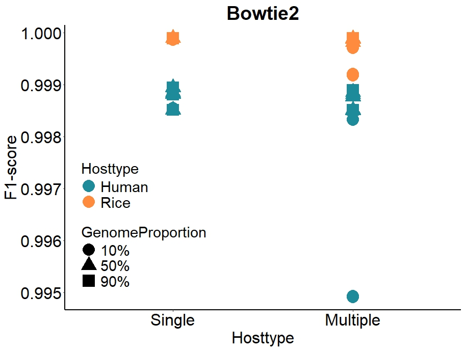

```{r setup, include = FALSE}
knitr::opts_chunk$set(
  collapse  =  T, echo = T, comment = "#>", message = F, warning = F,
	fig.align  =  "center", fig.width  =  5, fig.height = 3, dpi = 150)
```

If you use this script, please cited 如果你使用本代码，请引用：

 Yunyun Gao, Hao Luo, Yong-Xin Liu,et al, Benchmarking metagenomics tools for purging host contamination. 

# Barplot



Example-Figure3c-F1-Bowtie2


# Read your data

```{r}
data <- read.table("data.txt", header = TRUE)
```
# R Package Loading

```{r install, echo = TRUE}
library(ggplot2)
library(dunn.test)
library(car)
```


# Reorder factor levels for the Software column
```{r readdata}
data$Microbiometype <- as.factor(data$Microbiometype)
data$GenomeProportion <- as.factor(data$HostGenomeProportion )
data$Hosttype <- as.factor(data$Hosttype)
data$Software <- as.factor(data$Software)
data$Size <- as.factor(data$DataSize)
data$Software <- factor(data$Software, levels = c( "BWA", "Bowtie2","Kneaddata", "KMCP", "Kraken2", "KrakenUniq"))
data$DataSize <- factor(data$DataSize, levels = c("10G", "30G","60G"))
data$HostGenomeProportion <- factor(data$HostGenomeProportion, levels = c("90%", "50%","10%"))

```

# Create the barplot

```{r}
# 1). Bowtie2
data2 <- subset(data, Software == "Bowtie2")
data2$Hosttype <- factor(data2$Hosttype, levels = c("Human", "Rice"))
data2$Microbiometype <- factor(data2$Microbiometype, levels = c("Single", "Multiple"))

# Create the scatter plot
ggplot(data2, aes(x = Microbiometype, y = F1, color = Hosttype, shape = GenomeProportion)) +
  geom_point(size = 8) +
  labs(x = "Hosttype", y = "F1-score", title = "Bowtie2") +
  theme_minimal() + theme_classic() + theme(
    panel.background = element_rect(fill="white", color="white", size=0.25),
    axis.line = element_line(color="black", size=1),
    axis.title = element_text(size=24, color="black"),
    axis.text = element_text(size=24, color="black"),
    legend.position = c(0.2, 0.3),
    legend.text = element_text(size = 22),
    legend.title = element_text(size = 22),
    plot.title = element_text(size = 28, face = "bold", hjust = 0.5, vjust = 0.5),
  ) + scale_color_manual(values = c( "#1e8b9b","#ff8c3e"))  # Set the colors for different groups
# 2). BWA
data2 <- subset(data, Software == "BWA")
data2$Hosttype <- factor(data2$Hosttype, levels = c("Human", "Rice"))
data2$Microbiometype <- factor(data2$Microbiometype, levels = c("Single", "Multiple"))

ggplot(data2, aes(x = Microbiometype, y = F1, color = Hosttype, shape = GenomeProportion)) +
  geom_point(size = 8) +
  labs(x = "Hosttype", y = "F1-score", title = "BWA") +
  theme_minimal() + theme_classic() + theme(
    panel.background = element_rect(fill="white", color="white", size=0.25),
    axis.line = element_line(color="black", size=1),
    axis.title = element_text(size=24, color="black"),
    axis.text = element_text(size=24, color="black"),
    legend.position = "top",
    plot.title = element_text(size = 28, face = "bold", hjust = 0.5, vjust = 0.5),
  ) + scale_color_manual(values = c( "#1e8b9b","#ff8c3e"))

# 3). Kneaddata
data2 <- subset(data, Software == "Kneaddata")
data2$Hosttype <- factor(data2$Hosttype, levels = c("Human", "Rice"))
data2$Microbiometype <- factor(data2$Microbiometype, levels = c("Single", "Multiple"))
# Create the scatter plot
ggplot(data2, aes(x = Microbiometype, y = F1, color = Hosttype, shape = GenomeProportion)) +
  geom_point(size = 8) +
  labs(x = "Hosttype", y = "F1-score", title = "Kneaddata") +
  theme_minimal() + theme_classic() + theme(
    panel.background = element_rect(fill="white", color="white", size=0.25),
    axis.line = element_line(color="black", size=1),
    axis.title = element_text(size=24, color="black"),
    axis.text = element_text(size=24, color="black"),
    legend.position = "none",
    plot.title = element_text(size = 28, face = "bold", hjust = 0.5, vjust = 0.5),
  ) + scale_color_manual(values = c("#1e8b9b", "#ff8c3e"))
# 4). KMCP
data2 <- subset(data, Software == "KMCP")
data2$Hosttype <- factor(data2$Hosttype, levels = c("Human", "Rice"))
data2$Microbiometype <- factor(data2$Microbiometype, levels = c("Single", "Multiple"))
# Create the scatter plot
ggplot(data2, aes(x = Microbiometype, y = F1, color = Hosttype, shape = GenomeProportion)) +
  geom_point(size = 8) +
  labs(x = "Hosttype", y = "F1-score", title = "KMCP") +
  theme_minimal() + theme_classic() + theme(
    panel.background = element_rect(fill="white", color="white", size=0.25),
    axis.line = element_line(color="black", size=1),
    axis.title = element_text(size=24, color="black"),
    axis.text = element_text(size=24, color="black"),
    legend.position = "none",
    plot.title = element_text(size = 28, face = "bold", hjust = 0.5, vjust = 0.5),
  ) + scale_color_manual(values = c( "#1e8b9b","#ff8c3e")) +
  scale_y_continuous(limits = c(0.700, 1.000)) # Set the colors for different groups
# 5). Kraken2
data2 <- subset(data, Software == "Kraken2")
data2$Hosttype <- factor(data2$Hosttype, levels = c("Human", "Rice"))
data2$Microbiometype <- factor(data2$Microbiometype, levels = c("Single", "Multiple"))
# Create the scatter plot
ggplot(data2, aes(x = Microbiometype, y = F1, color = Hosttype, shape = GenomeProportion)) +
  geom_point(size = 8) +
  labs(x = "Hosttype", y = "F1-score", title = "Kraken2") +
  theme_minimal() + theme_classic() + theme(
    panel.background = element_rect(fill="white", color="white", size=0.25),
    axis.line = element_line(color="black", size=1),
    axis.title = element_text(size=24, color="black"),
    axis.text = element_text(size=24, color="black"),
    legend.position = "none",
    plot.title = element_text(size = 28, face = "bold", hjust = 0.5, vjust = 0.5),
  ) + scale_color_manual(values = c("#1e8b9b","#ff8c3e" )) 

# 6). KrakenUniq
data2 <- subset(data, Software == "KrakenUniq")
data2$Hosttype <- factor(data2$Hosttype, levels = c("Human", "Rice"))
data2$Microbiometype <- factor(data2$Microbiometype, levels = c("Single", "Multiple"))
# Create the scatter plot
ggplot(data2, aes(x = Microbiometype, y = F1, color = Hosttype, shape = GenomeProportion)) +
  geom_point(size = 8) +
  labs(x = "Hosttype", y = "F1-score", title = "KrakenUniq") +
  theme_minimal() + theme_classic() + theme(
    panel.background = element_rect(fill="white", color="white", size=0.25),
    axis.line = element_line(color="black", size=1),
    axis.title = element_text(size=24, color="black"),
    axis.text = element_text(size=24, color="black"),
    legend.position = "none",
    plot.title = element_text(size = 28, face = "bold", hjust = 0.5, vjust = 0.5),
  ) + scale_color_manual(values = c( "#1e8b9b","#ff8c3e")) 
```

# 1) Check F1 of Microbiometype, Normality test
```{r}
shapiro_test <- by(data$F1, data$Microbiometype, shapiro.test)
p_values <- sapply(shapiro_test, function(x) x$p.value)
normal_data <- p_values > 0.05
if (all(normal_data)) {
  summary_stats <- aggregate(F1 ~ Microbiometype, data = data, FUN = function(x) c(mean = mean(x), se = sd(x)/sqrt(length(x))))
  print(summary_stats)
} else {
  summary_stats <- aggregate(F1 ~ Microbiometype, data = data, FUN = function(x) c(median = median(x), p25 = quantile(x, 0.25), p75 = quantile(x, 0.75)))
  print(summary_stats)
}
levene_test_result <- leveneTest(F1 ~ Microbiometype, data = data)
p_value_levene <- levene_test_result$`Pr(>F)`[1]

if (all(normal_data)) {
  if (p_value_levene > 0.05) {
    t_test_result <- t.test(F1 ~ Microbiometype, data = data, paired = TRUE)
    print(t_test_result)
  } else {
    wilcox_result <- wilcox.test(F1 ~ Microbiometype, data = data, paired = TRUE)
    print(wilcox_result)
  }
} else {
  wilcox_result <- wilcox.test(F1 ~ Microbiometype, data = data, paired = TRUE)
  print(wilcox_result)
}
```
# 2) Check F1 of Hosttype, Normality test
```{r}
shapiro_test <- by(data$F1, data$Microbiometype, shapiro.test)
p_values <- sapply(shapiro_test, function(x) x$p.value)
normal_data <- p_values > 0.05

if (all(normal_data)) {
  summary_stats <- aggregate(F1 ~ Hosttype, data = data, FUN = function(x) c(mean = mean(x), se = sd(x)/sqrt(length(x))))
  print(summary_stats)
} else {
  summary_stats <- aggregate(F1 ~ Hosttype, data = data, FUN = function(x) c(median = median(x), p25 = quantile(x, 0.25), p75 = quantile(x, 0.75)))
  print(summary_stats)
}
levene_test_result <- leveneTest(F1 ~ Hosttype, data = data)
p_value_levene <- levene_test_result$`Pr(>F)`[1]

if (all(normal_data)) {
  if (p_value_levene > 0.05) {
    t_test_result <- t.test(F1 ~ Hosttype, data = data, paired = TRUE)
    print(t_test_result)
  } else {
    wilcox_result <- wilcox.test(F1 ~ Hosttype, data = data, paired = TRUE)
    print(wilcox_result)
  }
} else {
  wilcox_result <- wilcox.test(F1 ~ Hosttype, data = data, paired = TRUE)
  print(wilcox_result)
}
```

# 3) Check F1 of HostGenomeProportion, Normality test
```{r}
shapiro_test <- by(data$F1, data$HostGenomeProportion, shapiro.test)
p_values <- sapply(shapiro_test, function(x) x$p.value)
normal_data <- p_values > 0.05

if (all(normal_data)) {
  summary_stats <- aggregate(F1 ~ HostGenomeProportion, data = data, FUN = function(x) c(mean = mean(x), se = sd(x)/sqrt(length(x))))
  print(summary_stats)
} else {
  summary_stats <- aggregate(F1 ~ HostGenomeProportion, data = data, FUN = function(x) c(median = median(x), p25 = quantile(x, 0.25), p75 = quantile(x, 0.75)))
  print(summary_stats)
}
levene_test_result <- leveneTest(F1 ~ HostGenomeProportion, data = data)
p_value_levene <- levene_test_result$`Pr(>F)`[1]

if (all(normal_data)) {
  anova_result <- aov(F1 ~ HostGenomeProportion, data = data)
  print(summary(anova_result))
} else {
  kruskal_result <- kruskal.test(F1 ~ HostGenomeProportion, data = data)
  print(kruskal_result)
  if (kruskal_result$p.value < 0.05) {
    # Perform Bonferroni-Dunn post-hoc test
    posthoc_result <- dunn.test(data$F1, data$HostGenomeProportion, method = "bonferroni")
    print(posthoc_result)
  } else {
    print("Kruskal-Wallis test is not significant. No post-hoc test needed.")
  }
}
```
# 4) Check F1 of DataSize, Normality test
```{r}
shapiro_test <- by(data$F1, data$DataSize, shapiro.test)
p_values <- sapply(shapiro_test, function(x) x$p.value)
normal_data <- p_values > 0.05

if (all(normal_data)) {
  summary_stats <- aggregate(F1 ~ DataSize, data = data, FUN = function(x) c(mean = mean(x), se = sd(x)/sqrt(length(x))))
  print(summary_stats)
} else {
  summary_stats <- aggregate(F1 ~ DataSize, data = data, FUN = function(x) c(median = median(x), p25 = quantile(x, 0.25), p75 = quantile(x, 0.75)))
  print(summary_stats)
}

levene_test_result <- leveneTest(F1 ~ DataSize, data = data)
p_value_levene <- levene_test_result$`Pr(>F)`[1]

if (all(normal_data)) {
  anova_result <- aov(F1 ~ DataSize, data = data)
  print(summary(anova_result))
} else {
  kruskal_result <- kruskal.test(F1 ~ DataSize, data = data)
  print(kruskal_result)
  if (kruskal_result$p.value < 0.05) {
    # Perform post-hoc pairwise comparisons
    posthoc_result <- dunn.test(data$F1, data$DataSize, method = "bonferroni")
    print(posthoc_result)
  } else {
    print("Kruskal-Wallis test is not significant. No post-hoc test needed.")
  }
}
```
# 5) Check F1 of Software, Normality test
```{r}
shapiro_test <- by(data$F1, data$Software, shapiro.test)
p_values <- sapply(shapiro_test, function(x) x$p.value)
normal_data <- p_values > 0.05

if (all(normal_data)) {
  summary_stats <- aggregate(F1 ~ Software, data = data, FUN = function(x) c(mean = mean(x), se = sd(x)/sqrt(length(x))))
  print(summary_stats)
} else {
  summary_stats <- aggregate(F1 ~ Software, data = data, FUN = function(x) c(median = median(x), p25 = quantile(x, 0.25), p75 = quantile(x, 0.75)))
  print(summary_stats)
}

levene_test_result <- leveneTest(F1 ~ Software, data = data)
p_value_levene <- levene_test_result$`Pr(>F)`[1]

if (all(normal_data)) {
  anova_result <- aov(F1 ~ Software, data = data)
  print(summary(anova_result))
} else {
  kruskal_result <- kruskal.test(F1 ~ Software, data = data)
  print(kruskal_result)
  if (kruskal_result$p.value < 0.05) {
    # Perform post-hoc pairwise comparisons
    posthoc_result <- dunn.test(data$F1, data$Software, method = "bonferroni")
    print(posthoc_result)
  } else {
    print("Kruskal-Wallis test is not significant. No post-hoc test needed.")
  }
}
```
# 6) Check F1 of BWA, Normality test
```{r}
data2 <- subset(data, Software == "BWA")
#Microbiometype
shapiro_test <- by(data2$F1, data2$Microbiometype, shapiro.test)
p_values <- sapply(shapiro_test, function(x) x$p.value)
normal_data2 <- p_values > 0.05
if (all(normal_data2)) {
  summary_stats <- aggregate(F1 ~ Microbiometype, data = data2, FUN = function(x) c(mean = mean(x), se = sd(x)/sqrt(length(x))))
  print(summary_stats)
} else {
  summary_stats <- aggregate(F1 ~ Microbiometype, data = data2, FUN = function(x) c(median = median(x), p25 = quantile(x, 0.25), p75 = quantile(x, 0.75)))
  print(summary_stats)
}
levene_test_result <- leveneTest(F1 ~ Microbiometype, data = data2)
p_value_levene <- levene_test_result$`Pr(>F)`[1]
if (all(normal_data2)) {
  if (p_value_levene > 0.05) {
    t_test_result <- t.test(F1 ~ Microbiometype, data = data2, paired = TRUE)
    print(t_test_result)
  } else {
    wilcox_result <- wilcox.test(F1 ~ Microbiometype, data = data2, paired = TRUE)
    print(wilcox_result)
  }
} else {
  wilcox_result <- wilcox.test(F1 ~ Microbiometype, data = data2, paired = TRUE)
  print(wilcox_result)
}
#Hostytype
shapiro_test <- by(data2$F1, data2$Hosttype, shapiro.test)
p_values <- sapply(shapiro_test, function(x) x$p.value)
normal_data2 <- p_values > 0.05
if (all(normal_data2)) {
  summary_stats <- aggregate(F1 ~ Hosttype, data = data2, FUN = function(x) c(mean = mean(x), se = sd(x)/sqrt(length(x))))
  print(summary_stats)
} else {
  summary_stats <- aggregate(F1 ~ Hosttype, data = data2, FUN = function(x) c(median = median(x), p25 = quantile(x, 0.25), p75 = quantile(x, 0.75)))
  print(summary_stats)
}
levene_test_result <- leveneTest(F1 ~ Hosttype, data = data2)
p_value_levene <- levene_test_result$`Pr(>F)`[1]
if (all(normal_data2)) {
  if (p_value_levene > 0.05) {
    t_test_result <- t.test(F1 ~ Hosttype, data = data2, paired = TRUE)
    print(t_test_result)
  } else {
    wilcox_result <- wilcox.test(F1 ~ Hosttype, data = data2, paired = TRUE)
    print(wilcox_result)
  }
} else {
  wilcox_result <- wilcox.test(F1 ~ Hosttype, data = data2, paired = TRUE)
  print(wilcox_result)
}
#HostGenomeProportion
shapiro_test <- by(data2$F1, data2$HostGenomeProportion, shapiro.test)
p_values <- sapply(shapiro_test, function(x) x$p.value)
normal_data2 <- p_values > 0.05
if (all(normal_data2)) {
  summary_stats <- aggregate(F1 ~ HostGenomeProportion, data = data2, FUN = function(x) c(mean = mean(x), se = sd(x)/sqrt(length(x))))
  print(summary_stats)
} else {
  summary_stats <- aggregate(F1 ~ HostGenomeProportion, data = data2, FUN = function(x) c(median = median(x), p25 = quantile(x, 0.25), p75 = quantile(x, 0.75)))
  print(summary_stats)
}
levene_test_result <- leveneTest(F1 ~ HostGenomeProportion, data = data2)
p_value_levene <- levene_test_result$`Pr(>F)`[1]
if (all(normal_data2)) {
  anova_result <- aov(F1 ~ HostGenomeProportion, data = data2)
  print(summary(anova_result))
} else {
  kruskal_result <- kruskal.test(F1 ~ HostGenomeProportion, data = data2)
  print(kruskal_result)
  if (kruskal_result$p.value < 0.05) {
    posthoc_result <- dunn.test(data2$F1, data2$HostGenomeProportion, method = "bonferroni")
    print(posthoc_result)
  } else {
    print("Kruskal-Wallis test is not significant. No post-hoc test needed.")
  }
}
```
# 7) Check F1 of Bowtie2, Normality test
```{r}
data2 <- subset(data, Software == "Bowtie2")
#Microbiometype
shapiro_test <- by(data2$F1, data2$Microbiometype, shapiro.test)
p_values <- sapply(shapiro_test, function(x) x$p.value)
normal_data2 <- p_values > 0.05
if (all(normal_data2)) {
  summary_stats <- aggregate(F1 ~ Microbiometype, data = data2, FUN = function(x) c(mean = mean(x), se = sd(x)/sqrt(length(x))))
  print(summary_stats)
} else {
  summary_stats <- aggregate(F1 ~ Microbiometype, data = data2, FUN = function(x) c(median = median(x), p25 = quantile(x, 0.25), p75 = quantile(x, 0.75)))
  print(summary_stats)
}
levene_test_result <- leveneTest(F1 ~ Microbiometype, data = data2)
p_value_levene <- levene_test_result$`Pr(>F)`[1]
if (all(normal_data2)) {
  if (p_value_levene > 0.05) {
    t_test_result <- t.test(F1 ~ Microbiometype, data = data2, paired = TRUE)
    print(t_test_result)
  } else {
    wilcox_result <- wilcox.test(F1 ~ Microbiometype, data = data2, paired = TRUE)
    print(wilcox_result)
  }
} else {
  wilcox_result <- wilcox.test(F1 ~ Microbiometype, data = data2, paired = TRUE)
  print(wilcox_result)
}
#Hostytype
shapiro_test <- by(data2$F1, data2$Hosttype, shapiro.test)
p_values <- sapply(shapiro_test, function(x) x$p.value)
normal_data2 <- p_values > 0.05
if (all(normal_data2)) {
  summary_stats <- aggregate(F1 ~ Hosttype, data = data2, FUN = function(x) c(mean = mean(x), se = sd(x)/sqrt(length(x))))
  print(summary_stats)
} else {
  summary_stats <- aggregate(F1 ~ Hosttype, data = data2, FUN = function(x) c(median = median(x), p25 = quantile(x, 0.25), p75 = quantile(x, 0.75)))
  print(summary_stats)
}
levene_test_result <- leveneTest(F1 ~ Hosttype, data = data2)
p_value_levene <- levene_test_result$`Pr(>F)`[1]
if (all(normal_data2)) {
  if (p_value_levene > 0.05) {
    t_test_result <- t.test(F1 ~ Hosttype, data = data2, paired = TRUE)
    print(t_test_result)
  } else {
    wilcox_result <- wilcox.test(F1 ~ Hosttype, data = data2, paired = TRUE)
    print(wilcox_result)
  }
} else {
  wilcox_result <- wilcox.test(F1 ~ Hosttype, data = data2, paired = TRUE)
  print(wilcox_result)
}
#HostGenomeProportion
shapiro_test <- by(data2$F1, data2$HostGenomeProportion, shapiro.test)
p_values <- sapply(shapiro_test, function(x) x$p.value)
normal_data2 <- p_values > 0.05
if (all(normal_data2)) {
  summary_stats <- aggregate(F1 ~ HostGenomeProportion, data = data2, FUN = function(x) c(mean = mean(x), se = sd(x)/sqrt(length(x))))
  print(summary_stats)
} else {
  summary_stats <- aggregate(F1 ~ HostGenomeProportion, data = data2, FUN = function(x) c(median = median(x), p25 = quantile(x, 0.25), p75 = quantile(x, 0.75)))
  print(summary_stats)
}
levene_test_result <- leveneTest(F1 ~ HostGenomeProportion, data = data2)
p_value_levene <- levene_test_result$`Pr(>F)`[1]
if (all(normal_data2)) {
  anova_result <- aov(F1 ~ HostGenomeProportion, data = data2)
  print(summary(anova_result))
} else {
  kruskal_result <- kruskal.test(F1 ~ HostGenomeProportion, data = data2)
  print(kruskal_result)
  if (kruskal_result$p.value < 0.05) {
    posthoc_result <- dunn.test(data2$F1, data2$HostGenomeProportion, method = "bonferroni")
    print(posthoc_result)
  } else {
    print("Kruskal-Wallis test is not significant. No post-hoc test needed.")
  }
}
```
# 8) Check F1 of Kneaddata, Normality test
```{r}
data2 <- subset(data, Software == "Kneaddata")
#Microbiometype
shapiro_test <- by(data2$F1, data2$Microbiometype, shapiro.test)
p_values <- sapply(shapiro_test, function(x) x$p.value)
normal_data2 <- p_values > 0.05
if (all(normal_data2)) {
  summary_stats <- aggregate(F1 ~ Microbiometype, data = data2, FUN = function(x) c(mean = mean(x), se = sd(x)/sqrt(length(x))))
  print(summary_stats)
} else {
  summary_stats <- aggregate(F1 ~ Microbiometype, data = data2, FUN = function(x) c(median = median(x), p25 = quantile(x, 0.25), p75 = quantile(x, 0.75)))
  print(summary_stats)
}
levene_test_result <- leveneTest(F1 ~ Microbiometype, data = data2)
p_value_levene <- levene_test_result$`Pr(>F)`[1]
if (all(normal_data2)) {
  if (p_value_levene > 0.05) {
    t_test_result <- t.test(F1 ~ Microbiometype, data = data2, paired = TRUE)
    print(t_test_result)
  } else {
    wilcox_result <- wilcox.test(F1 ~ Microbiometype, data = data2, paired = TRUE)
    print(wilcox_result)
  }
} else {
  wilcox_result <- wilcox.test(F1 ~ Microbiometype, data = data2, paired = TRUE)
  print(wilcox_result)
}
#Hostytype
shapiro_test <- by(data2$F1, data2$Hosttype, shapiro.test)
p_values <- sapply(shapiro_test, function(x) x$p.value)
normal_data2 <- p_values > 0.05
if (all(normal_data2)) {
  summary_stats <- aggregate(F1 ~ Hosttype, data = data2, FUN = function(x) c(mean = mean(x), se = sd(x)/sqrt(length(x))))
  print(summary_stats)
} else {
  summary_stats <- aggregate(F1 ~ Hosttype, data = data2, FUN = function(x) c(median = median(x), p25 = quantile(x, 0.25), p75 = quantile(x, 0.75)))
  print(summary_stats)
}
levene_test_result <- leveneTest(F1 ~ Hosttype, data = data2)
p_value_levene <- levene_test_result$`Pr(>F)`[1]
if (all(normal_data2)) {
  if (p_value_levene > 0.05) {
    t_test_result <- t.test(F1 ~ Hosttype, data = data2, paired = TRUE)
    print(t_test_result)
  } else {
    wilcox_result <- wilcox.test(F1 ~ Hosttype, data = data2, paired = TRUE)
    print(wilcox_result)
  }
} else {
  wilcox_result <- wilcox.test(F1 ~ Hosttype, data = data2, paired = TRUE)
  print(wilcox_result)
}
#HostGenomeProportion
shapiro_test <- by(data2$F1, data2$HostGenomeProportion, shapiro.test)
p_values <- sapply(shapiro_test, function(x) x$p.value)
normal_data2 <- p_values > 0.05
if (all(normal_data2)) {
  summary_stats <- aggregate(F1 ~ HostGenomeProportion, data = data2, FUN = function(x) c(mean = mean(x), se = sd(x)/sqrt(length(x))))
  print(summary_stats)
} else {
  summary_stats <- aggregate(F1 ~ HostGenomeProportion, data = data2, FUN = function(x) c(median = median(x), p25 = quantile(x, 0.25), p75 = quantile(x, 0.75)))
  print(summary_stats)
}
levene_test_result <- leveneTest(F1 ~ HostGenomeProportion, data = data2)
p_value_levene <- levene_test_result$`Pr(>F)`[1]
if (all(normal_data2)) {
  anova_result <- aov(F1 ~ HostGenomeProportion, data = data2)
  print(summary(anova_result))
} else {
  kruskal_result <- kruskal.test(F1 ~ HostGenomeProportion, data = data2)
  print(kruskal_result)
  if (kruskal_result$p.value < 0.05) {
    posthoc_result <- dunn.test(data2$F1, data2$HostGenomeProportion, method = "bonferroni")
    print(posthoc_result)
  } else {
    print("Kruskal-Wallis test is not significant. No post-hoc test needed.")
  }
}
```
# 9) Check F1 of KMCP, Normality test
```{r}
data2 <- subset(data, Software == "KMCP")
#Microbiometype
shapiro_test <- by(data2$F1, data2$Microbiometype, shapiro.test)
p_values <- sapply(shapiro_test, function(x) x$p.value)
normal_data2 <- p_values > 0.05
if (all(normal_data2)) {
  summary_stats <- aggregate(F1 ~ Microbiometype, data = data2, FUN = function(x) c(mean = mean(x), se = sd(x)/sqrt(length(x))))
  print(summary_stats)
} else {
  summary_stats <- aggregate(F1 ~ Microbiometype, data = data2, FUN = function(x) c(median = median(x), p25 = quantile(x, 0.25), p75 = quantile(x, 0.75)))
  print(summary_stats)
}
levene_test_result <- leveneTest(F1 ~ Microbiometype, data = data2)
p_value_levene <- levene_test_result$`Pr(>F)`[1]
if (all(normal_data2)) {
  if (p_value_levene > 0.05) {
    t_test_result <- t.test(F1 ~ Microbiometype, data = data2, paired = TRUE)
    print(t_test_result)
  } else {
    wilcox_result <- wilcox.test(F1 ~ Microbiometype, data = data2, paired = TRUE)
    print(wilcox_result)
  }
} else {
  wilcox_result <- wilcox.test(F1 ~ Microbiometype, data = data2, paired = TRUE)
  print(wilcox_result)
}
#Hostytype
shapiro_test <- by(data2$F1, data2$Hosttype, shapiro.test)
p_values <- sapply(shapiro_test, function(x) x$p.value)
normal_data2 <- p_values > 0.05
if (all(normal_data2)) {
  summary_stats <- aggregate(F1 ~ Hosttype, data = data2, FUN = function(x) c(mean = mean(x), se = sd(x)/sqrt(length(x))))
  print(summary_stats)
} else {
  summary_stats <- aggregate(F1 ~ Hosttype, data = data2, FUN = function(x) c(median = median(x), p25 = quantile(x, 0.25), p75 = quantile(x, 0.75)))
  print(summary_stats)
}
levene_test_result <- leveneTest(F1 ~ Hosttype, data = data2)
p_value_levene <- levene_test_result$`Pr(>F)`[1]
if (all(normal_data2)) {
  if (p_value_levene > 0.05) {
    t_test_result <- t.test(F1 ~ Hosttype, data = data2, paired = TRUE)
    print(t_test_result)
  } else {
    wilcox_result <- wilcox.test(F1 ~ Hosttype, data = data2, paired = TRUE)
    print(wilcox_result)
  }
} else {
  wilcox_result <- wilcox.test(F1 ~ Hosttype, data = data2, paired = TRUE)
  print(wilcox_result)
}
#HostGenomeProportion
shapiro_test <- by(data2$F1, data2$HostGenomeProportion, shapiro.test)
p_values <- sapply(shapiro_test, function(x) x$p.value)
normal_data2 <- p_values > 0.05
if (all(normal_data2)) {
  summary_stats <- aggregate(F1 ~ HostGenomeProportion, data = data2, FUN = function(x) c(mean = mean(x), se = sd(x)/sqrt(length(x))))
  print(summary_stats)
} else {
  summary_stats <- aggregate(F1 ~ HostGenomeProportion, data = data2, FUN = function(x) c(median = median(x), p25 = quantile(x, 0.25), p75 = quantile(x, 0.75)))
  print(summary_stats)
}
levene_test_result <- leveneTest(F1 ~ HostGenomeProportion, data = data2)
p_value_levene <- levene_test_result$`Pr(>F)`[1]
if (all(normal_data2)) {
  anova_result <- aov(F1 ~ HostGenomeProportion, data = data2)
  print(summary(anova_result))
} else {
  kruskal_result <- kruskal.test(F1 ~ HostGenomeProportion, data = data2)
  print(kruskal_result)
  if (kruskal_result$p.value < 0.05) {
    posthoc_result <- dunn.test(data2$F1, data2$HostGenomeProportion, method = "bonferroni")
    print(posthoc_result)
  } else {
    print("Kruskal-Wallis test is not significant. No post-hoc test needed.")
  }
}
```
# 10) Check F1 of Kraken2, Normality test
```{r}
data2 <- subset(data, Software == "Kraken2")
#Microbiometype
shapiro_test <- by(data2$F1, data2$Microbiometype, shapiro.test)
p_values <- sapply(shapiro_test, function(x) x$p.value)
normal_data2 <- p_values > 0.05
if (all(normal_data2)) {
  summary_stats <- aggregate(F1 ~ Microbiometype, data = data2, FUN = function(x) c(mean = mean(x), se = sd(x)/sqrt(length(x))))
  print(summary_stats)
} else {
  summary_stats <- aggregate(F1 ~ Microbiometype, data = data2, FUN = function(x) c(median = median(x), p25 = quantile(x, 0.25), p75 = quantile(x, 0.75)))
  print(summary_stats)
}
levene_test_result <- leveneTest(F1 ~ Microbiometype, data = data2)
p_value_levene <- levene_test_result$`Pr(>F)`[1]
if (all(normal_data2)) {
  if (p_value_levene > 0.05) {
    t_test_result <- t.test(F1 ~ Microbiometype, data = data2, paired = TRUE)
    print(t_test_result)
  } else {
    wilcox_result <- wilcox.test(F1 ~ Microbiometype, data = data2, paired = TRUE)
    print(wilcox_result)
  }
} else {
  wilcox_result <- wilcox.test(F1 ~ Microbiometype, data = data2, paired = TRUE)
  print(wilcox_result)
}
#Hostytype
shapiro_test <- by(data2$F1, data2$Hosttype, shapiro.test)
p_values <- sapply(shapiro_test, function(x) x$p.value)
normal_data2 <- p_values > 0.05
if (all(normal_data2)) {
  summary_stats <- aggregate(F1 ~ Hosttype, data = data2, FUN = function(x) c(mean = mean(x), se = sd(x)/sqrt(length(x))))
  print(summary_stats)
} else {
  summary_stats <- aggregate(F1 ~ Hosttype, data = data2, FUN = function(x) c(median = median(x), p25 = quantile(x, 0.25), p75 = quantile(x, 0.75)))
  print(summary_stats)
}
levene_test_result <- leveneTest(F1 ~ Hosttype, data = data2)
p_value_levene <- levene_test_result$`Pr(>F)`[1]
if (all(normal_data2)) {
  if (p_value_levene > 0.05) {
    t_test_result <- t.test(F1 ~ Hosttype, data = data2, paired = TRUE)
    print(t_test_result)
  } else {
    wilcox_result <- wilcox.test(F1 ~ Hosttype, data = data2, paired = TRUE)
    print(wilcox_result)
  }
} else {
  wilcox_result <- wilcox.test(F1 ~ Hosttype, data = data2, paired = TRUE)
  print(wilcox_result)
}
#HostGenomeProportion
shapiro_test <- by(data2$F1, data2$HostGenomeProportion, shapiro.test)
p_values <- sapply(shapiro_test, function(x) x$p.value)
normal_data2 <- p_values > 0.05
if (all(normal_data2)) {
  summary_stats <- aggregate(F1 ~ HostGenomeProportion, data = data2, FUN = function(x) c(mean = mean(x), se = sd(x)/sqrt(length(x))))
  print(summary_stats)
} else {
  summary_stats <- aggregate(F1 ~ HostGenomeProportion, data = data2, FUN = function(x) c(median = median(x), p25 = quantile(x, 0.25), p75 = quantile(x, 0.75)))
  print(summary_stats)
}
levene_test_result <- leveneTest(F1 ~ HostGenomeProportion, data = data2)
p_value_levene <- levene_test_result$`Pr(>F)`[1]
if (all(normal_data2)) {
  anova_result <- aov(F1 ~ HostGenomeProportion, data = data2)
  print(summary(anova_result))
} else {
  kruskal_result <- kruskal.test(F1 ~ HostGenomeProportion, data = data2)
  print(kruskal_result)
  if (kruskal_result$p.value < 0.05) {
    posthoc_result <- dunn.test(data2$F1, data2$HostGenomeProportion, method = "bonferroni")
    print(posthoc_result)
  } else {
    print("Kruskal-Wallis test is not significant. No post-hoc test needed.")
  }
}
```
# 11) Check F1 of KrakenUniq, Normality test
```{r}
data2 <- subset(data, Software == "KrakenUniq")
#Microbiometype
shapiro_test <- by(data2$F1, data2$Microbiometype, shapiro.test)
p_values <- sapply(shapiro_test, function(x) x$p.value)
normal_data2 <- p_values > 0.05
if (all(normal_data2)) {
  summary_stats <- aggregate(F1 ~ Microbiometype, data = data2, FUN = function(x) c(mean = mean(x), se = sd(x)/sqrt(length(x))))
  print(summary_stats)
} else {
  summary_stats <- aggregate(F1 ~ Microbiometype, data = data2, FUN = function(x) c(median = median(x), p25 = quantile(x, 0.25), p75 = quantile(x, 0.75)))
  print(summary_stats)
}
levene_test_result <- leveneTest(F1 ~ Microbiometype, data = data2)
p_value_levene <- levene_test_result$`Pr(>F)`[1]
if (all(normal_data2)) {
  if (p_value_levene > 0.05) {
    t_test_result <- t.test(F1 ~ Microbiometype, data = data2, paired = TRUE)
    print(t_test_result)
  } else {
    wilcox_result <- wilcox.test(F1 ~ Microbiometype, data = data2, paired = TRUE)
    print(wilcox_result)
  }
} else {
  wilcox_result <- wilcox.test(F1 ~ Microbiometype, data = data2, paired = TRUE)
  print(wilcox_result)
}
#Hostytype
shapiro_test <- by(data2$F1, data2$Hosttype, shapiro.test)
p_values <- sapply(shapiro_test, function(x) x$p.value)
normal_data2 <- p_values > 0.05
if (all(normal_data2)) {
  summary_stats <- aggregate(F1 ~ Hosttype, data = data2, FUN = function(x) c(mean = mean(x), se = sd(x)/sqrt(length(x))))
  print(summary_stats)
} else {
  summary_stats <- aggregate(F1 ~ Hosttype, data = data2, FUN = function(x) c(median = median(x), p25 = quantile(x, 0.25), p75 = quantile(x, 0.75)))
  print(summary_stats)
}
levene_test_result <- leveneTest(F1 ~ Hosttype, data = data2)
p_value_levene <- levene_test_result$`Pr(>F)`[1]
if (all(normal_data2)) {
  if (p_value_levene > 0.05) {
    t_test_result <- t.test(F1 ~ Hosttype, data = data2, paired = TRUE)
    print(t_test_result)
  } else {
    wilcox_result <- wilcox.test(F1 ~ Hosttype, data = data2, paired = TRUE)
    print(wilcox_result)
  }
} else {
  wilcox_result <- wilcox.test(F1 ~ Hosttype, data = data2, paired = TRUE)
  print(wilcox_result)
}
#HostGenomeProportion
shapiro_test <- by(data2$F1, data2$HostGenomeProportion, shapiro.test)
p_values <- sapply(shapiro_test, function(x) x$p.value)
normal_data2 <- p_values > 0.05
if (all(normal_data2)) {
  summary_stats <- aggregate(F1 ~ HostGenomeProportion, data = data2, FUN = function(x) c(mean = mean(x), se = sd(x)/sqrt(length(x))))
  print(summary_stats)
} else {
  summary_stats <- aggregate(F1 ~ HostGenomeProportion, data = data2, FUN = function(x) c(median = median(x), p25 = quantile(x, 0.25), p75 = quantile(x, 0.75)))
  print(summary_stats)
}
levene_test_result <- leveneTest(F1 ~ HostGenomeProportion, data = data2)
p_value_levene <- levene_test_result$`Pr(>F)`[1]
if (all(normal_data2)) {
  anova_result <- aov(F1 ~ HostGenomeProportion, data = data2)
  print(summary(anova_result))
} else {
  kruskal_result <- kruskal.test(F1 ~ HostGenomeProportion, data = data2)
  print(kruskal_result)
  if (kruskal_result$p.value < 0.05) {
    posthoc_result <- dunn.test(data2$F1, data2$HostGenomeProportion, method = "bonferroni")
    print(posthoc_result)
  } else {
    print("Kruskal-Wallis test is not significant. No post-hoc test needed.")
  }
}
```

If you use this script, please cited 如果你使用本代码，请引用：

 Yunyun Gao, Hao Luo, Yong-Xin Liu,et al, Benchmarking metagenomics tools for purging host contamination. 

Copyright 2016-2023 Yunyun Gao(高云云), Yong-Xin Liu(刘永鑫) <liuyongxin@caas.cn>, Agricultural Genomics Institute at Shenzhen, Chinese Academy of Agricultural Sciences
