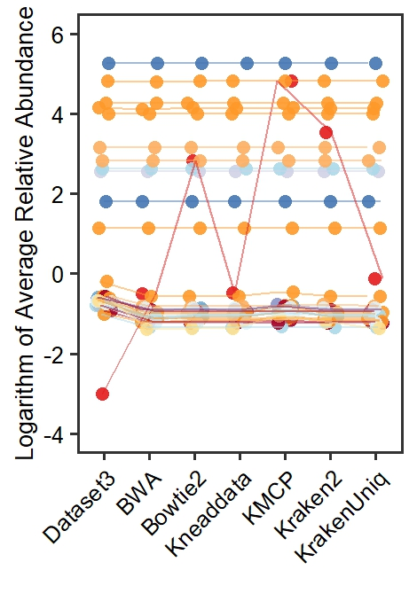

```{r setup, include = FALSE}
knitr::opts_chunk$set(
  collapse  =  T, echo = T, comment = "#>", message = F, warning = F,
	fig.align  =  "center", fig.width  =  5, fig.height = 3, dpi = 150)
```

If you use this script, please cited 如果你使用本代码，请引用：

 Yunyun Gao, Hao Luo, Yong-Xin Liu,et al, Benchmarking metagenomics tools for purging host contamination. 

# Plot



Example-Figure3d-humansyco1


# R Package Loading

```{r install, echo = TRUE}
library(ggplot2)
library(ggbreak)
```

# 1) Create the Ricebarplot

```{r}
data <- read.table("rice1.txt", header = TRUE, sep = "\t")
# Add a small constant to avoid issues with logarithm of zero
small_constant <- 0.001
data[, 9:15] <- data[, 9:15] + small_constant

# Logarithmic transformation
data[, 9:15] <- log10(data[, 9:15])

# Reshape data for plotting
data_long <- reshape2::melt(data, id.vars = c("taxa", "Species", "Domain", "Kingdom", "Phylum", "Class", "Order", "Family"))
# Set colors for the plot
colors <- c("#8c510a", "#d8b365", "#dfc27d", "#f6e8c3", "#80cdc1", "#5ab4ac", "#01665e")
# Plot the data
ggplot(data_long, aes(x = variable, y = value, color = Class)) +
  labs(x = "",
       y = "Logarithm of Average Relative Abundance",
       color = "Class") +
  theme_minimal() +
  theme_test(base_size = 24) +
  theme(
    legend.position = 'none',
    panel.border = element_rect(size = 2, fill = 'transparent'),
    axis.text = element_text(color = 'black'),
    axis.title = element_text(size = 20),
    legend.title = element_text(size = 20, color = "black"),
    legend.text = element_text(size = 20, color = "black"),
    axis.text.x = element_text(angle = 45, hjust = 1)  # Rotate x-axis labels for better visibility
  ) +
  geom_jitter(position = position_jitter(width = 0.18), alpha = 0.9, shape = 16, size = 5) +
  geom_line(aes(group = taxa), position = position_jitter(width = 0.18), alpha = 0.5, size = 1) +
  scale_color_manual(values = setNames(colors, levels(data_long$Class))) +
  scale_y_continuous(breaks = seq(-4, 6, by = 2), limits = c(-4, 6))  # Adjusted breaks based on the actual data range

```

# 2) Create the Humanbarplot

```{r}
# Read the data
data <- read.table("human3.txt", header = TRUE, sep = "\t")

# Add a small constant to avoid issues with logarithm of zero
small_constant <- 0.001
data[, 9:15] <- data[, 9:15] + small_constant

# Logarithmic transformation
data[, 9:15] <- log10(data[, 9:15])

# Reshape data for plotting
data_long <- reshape2::melt(data, id.vars = c("taxa", "Species", "Domain", "Kingdom", "Phylum", "Class", "Order", "Family"))
# Set colors for the plot
colors <- c(  "#e0f3f8","#abd9e9", "#8c96c6", "#d0d1e6", "#fe9929","#a50026", "#4575b4", "#fdae61", "#e31a1c", "#fee090", "#74add1")
# Plot the data
ggplot(data_long, aes(x = variable, y = value, color = Class)) +
  labs(x = "",
       y = "Logarithm of Average Relative Abundance",
       color = "Class") +
  theme_minimal() +
  theme_test(base_size = 24) +
  theme(
    legend.position = 'none',
    panel.border = element_rect(size = 2, fill = 'transparent'),
    axis.text = element_text(color = 'black'),
    axis.title = element_text(size = 20),
    legend.title = element_text(size = 20, color = "black"),
    legend.text = element_text(size = 20, color = "black"),
    axis.text.x = element_text(angle = 45, hjust = 1)  # Rotate x-axis labels for better visibility
  ) +
  geom_jitter(position = position_jitter(width = 0.18), alpha = 0.9, shape = 16, size = 5) +
  geom_line(aes(group = taxa), position = position_jitter(width = 0.18), alpha = 0.5, size = 1) +
  scale_color_manual(values = setNames(colors, levels(data_long$Class))) +
  scale_y_continuous(breaks = seq(-4, 6, by = 2), limits = c(-4, 6)) 

```


If you use this script, please cited 如果你使用本代码，请引用：

 Yunyun Gao, Hao Luo, Yong-Xin Liu,et al, Benchmarking metagenomics tools for purging host contamination. 

Copyright 2016-2023 Yunyun Gao(高云云), Yong-Xin Liu(刘永鑫) <liuyongxin@caas.cn>, Agricultural Genomics Institute at Shenzhen, Chinese Academy of Agricultural Sciences
