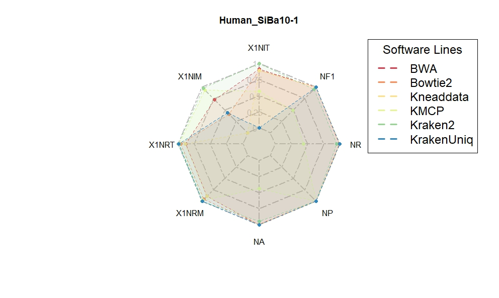

```{r setup, include = FALSE}
knitr::opts_chunk$set(
  collapse  =  T, echo = T, comment = "#>", message = F, warning = F,
	fig.align  =  "center", fig.width  =  5, fig.height = 3, dpi = 150)
```

If you use this script, please cited 如果你使用本代码，请引用：

 Yunyun Gao, Hao Luo, Yong-Xin Liu,et al, Benchmarking metagenomics tools for purging host contamination. 

# Plot



Example-Figure3e-radar-Human_SiBa10-1


# R Package Loading

```{r install, echo = TRUE}
library(ggplot2)
library(dunn.test)
library(car)
library(fmsb)
```

# 1) Min-Max Normalization

```{r}
data <- read.table("data.txt", header = TRUE, sep = "\t")

# Min-Max Normalization function
min_max_normalize <- function(x) {
  return((x - min(x)) / (max(x) - min(x)))
}

# Calculate normalized values
data$`X1NIT` <- 1 - min_max_normalize(data$IndexingMemory)
data$`X1NIM` <- 1 - min_max_normalize(data$IndexingTime)
data$`X1NRT` <- 1 - min_max_normalize(data$RunningTime)
data$`X1NRM` <- 1 - min_max_normalize(data$RunningTime)
data$`NA` <- min_max_normalize(data$Accuracy)
data$`NP` <- min_max_normalize(data$Precision)
data$`NR` <- min_max_normalize(data$Recall)
data$`NF1` <- min_max_normalize(data$F1)
# Calculate the sum of all normalized values and add it to the 'data' dataframe
data$SUM <- data$`X1NIT` + data$`X1NIM` + data$`X1NRT` + data$`X1NRM` + data$`NA` + data$`NP` + data$`NR` + data$`NF1`
data$SuM2 <- data$`NA` + data$`NF1`
# Write modified data to file
write.table(data, file = "Normalizeddata.txt", sep = "\t", eol = "\n", row.names = FALSE, quote = FALSE)

```

# 2) DataAnalyses

```{r}
shapiro_test <- by(data$SUM, data$Software, shapiro.test)

p_values <- sapply(shapiro_test, function(x) x$p.value)

normal_data <- p_values > 0.05

if (all(normal_data)) {
  summary_stats <- aggregate(SUM ~ Hosttype, data = data, FUN = function(x) c(mean = mean(x), se = sd(x)/sqrt(length(x))))

  print(summary_stats)
} else {
  summary_stats <- aggregate(SUM ~ Hosttype, data = data, FUN = function(x) c(median = median(x), p25 = quantile(x, 0.25), p75 = quantile(x, 0.75)))

  print(summary_stats)
}

data2 <- subset(data, Hosttype == "Human")

shapiro_test <- by(data2$SUM, data2$Software, shapiro.test)
p_values <- sapply(shapiro_test, function(x) x$p.value)
if (all(normal_data)) {
  summary_stats <- aggregate(SUM ~ Software, data = data2, FUN = function(x) c(mean = mean(x), se = sd(x)/sqrt(length(x))))

  print(summary_stats)
} else {
  summary_stats <- aggregate(SUM ~ Software, data = data2, FUN = function(x) c(median = median(x), p25 = quantile(x, 0.25), p75 = quantile(x, 0.75)))
  
  print(summary_stats)
}

levene_test_result <- leveneTest(SUM ~ Software, data = data2)
levene_test_result

if (levene_test_result$`Pr(>F)`[1] > 0.05) {
  anova_result <- aov(SUM ~ Software, data = data2)
  print(summary(anova_result))
} else {
  kruskal_result <- kruskal.test(SUM ~ Software, data = data2)
  print(kruskal_result)
  posthoc_result <- dunn.test(data$Accuracy, data2$Software, method = "bonferroni")
  print(posthoc_result)
}


data2 <- subset(data, Hosttype == "Rice")
shapiro_test <- by(data2$SUM, data2$Software, shapiro.test)
p_values <- sapply(shapiro_test, function(x) x$p.value)
if (all(normal_data)) {
  summary_stats <- aggregate(SUM ~ Software, data = data2, FUN = function(x) c(mean = mean(x), se = sd(x)/sqrt(length(x))))

  print(summary_stats)
} else {
  summary_stats <- aggregate(SUM ~ Software, data = data2, FUN = function(x) c(median = median(x), p25 = quantile(x, 0.25), p75 = quantile(x, 0.75)))
  print(summary_stats)
}

levene_test_result <- leveneTest(SUM ~ Software, data = data2)
levene_test_result

if (levene_test_result$`Pr(>F)`[1] > 0.05) {
  anova_result <- aov(SUM ~ Software, data = data2)
  print(summary(anova_result))
} else {
  kruskal_result <- kruskal.test(SUM ~ Software, data = data2)
  print(kruskal_result)
  posthoc_result <- dunn.test(data$Accuracy, data2$Software, method = "bonferroni")
  print(posthoc_result)
}

```

# 3) Plot
```{r}
#Plot 
data3 <- data[, c("SampleID", "Software", "Hosttype","Microbiometype", "HostGenomeProportion", "DataSize","X1NIT", "X1NIM", "X1NRT", "X1NRM", "NA", "NP", "NR", "NF1")]

data4 <- subset(data3, Hosttype == "Human" & Microbiometype =="Single" & DataSize == "10G" & HostGenomeProportion == "90%" )
data5 <- data4[, c( "Software", "X1NIT", "X1NIM", "X1NRT", "X1NRM", "NA", "NP", "NR", "NF1")]
# Compute mean values for each software group
mean_data <- aggregate(. ~ Software, data = data5, FUN = mean)
max_row <- c("Max", rep(1, 8))
min_row <- c("Min", rep(0, 8))
mean_data <- rbind(mean_data, max_row, min_row)
mean_data[, -1] <- lapply(mean_data[, -1], as.numeric)
rownames(mean_data) <- mean_data$Software
mean_data$Software <- NULL


write.table(mean_data, file = "radardata/Rice_SyCo60_3.txt", sep = "\t", eol = "\n", row.names = FALSE, quote = FALSE)

# Define the order of software and colors
software_order <- c("BWA", "Bowtie2", "Kneaddata", "KMCP", "Kraken2", "KrakenUniq")
colors <- c("#d53e4f", "#fc8d59", "#fee08b", "#e6f598", "#99d594", "#3288bd")

# Select the data for the specified order
software_data <- mean_data[c("Max", "Min", software_order), ]
# Set transparency (alpha) for lines
alpha_value <- 0.1  # Adjust this value as needed

# Plot combined radar chart with transparency for lines
radarchart(
  software_data,
  axistype = 1,
  pcol = colors,
  plcol = scales::alpha(colors), 
  pfcol = scales::alpha(colors, alpha_value), 
  plwd = 1,  # Adjust line thickness
  plty = 2,  # Adjust line type (1 for solid)
  cglcol = "grey",
  cglty = 6,
  cglwd = 2,
  cglcex = 1,
  axislabcol = "grey",
  vlcex = 1,
  vlabels = colnames(software_data),
  caxislabels = c(0, 0.25, 0.5, 0.75, 1),
  title = "Rice_SyCo60_3",
  cex = 2
)
legend("topright", legend = software_order, col = colors, lty = 2, lwd = 3, title = "Software Lines", cex = 1.5)


```

If you use this script, please cited 如果你使用本代码，请引用：

 Yunyun Gao, Hao Luo, Yong-Xin Liu,et al, Benchmarking metagenomics tools for purging host contamination. 

Copyright 2016-2023 Yunyun Gao(高云云), Yong-Xin Liu(刘永鑫) <liuyongxin@caas.cn>, Agricultural Genomics Institute at Shenzhen, Chinese Academy of Agricultural Sciences
