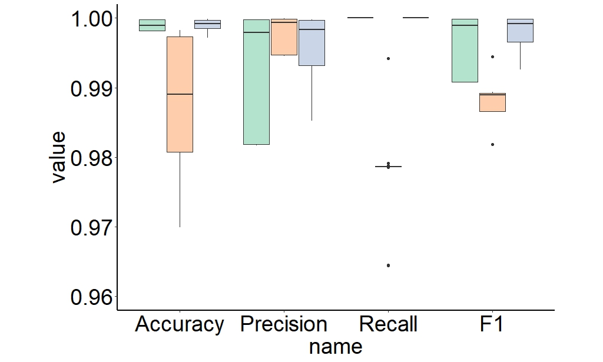

```{r setup, include = FALSE}
knitr::opts_chunk$set(
  collapse  =  T, echo = T, comment = "#>", message = F, warning = F,
	fig.align  =  "center", fig.width  =  5, fig.height = 3, dpi = 150)
```

If you use this script, please cited 如果你使用本代码，请引用：

 Yunyun Gao, Hao Luo, Yong-Xin Liu,et al, Benchmarking metagenomics tools for purging host contamination. 

# Plot



Example-Figure4c-all


# Read data from the text file
```{r}
data <- read.table("data.txt", header = TRUE)
```

# R Package Loading
```{r}
library(ggplot2)
library(car)
library(dunn.test)
```
# Select subset data
```{r}
data2 <- data[, c("Software", "Accuracy", "Precision", "Recall", "F1")]
# Pivot the selected columns
data_long <- tidyr::pivot_longer(data2, -Software)
```

# Reorder the factor levels for the Software column
```{r}
data_long$Software <- factor(data_long$Software, levels = c("Kneaddata", "Kraken2", "HostPurge"))
data_long$name <- factor(data_long$name, levels = c("Accuracy", "Precision", "Recall", "F1"))
```

# Create the plot

```{r}
ggplot(data_long, aes(x = name, y = value, fill = Software)) +
  geom_boxplot(position = position_dodge(width = 0.8)) +  # Adjust the width of dodging
  labs(fill = "Software") +
  coord_cartesian(ylim = c(0.96, 1)) +  # Fix the y-axis limits
  scale_x_discrete(expand = c(0.2, 0)) +  # Adjust the distance from the y-axis
  theme_minimal() +
  theme_classic() +
  theme(
    panel.background = element_rect(fill="white", color="white", size=0.25),
    axis.line = element_line(color="black", size=1),
    axis.title = element_text(size=28, color="black"),
    axis.text = element_text(size=28, color="black"),
    legend.position = c(1.3, 0.5),
    legend.text = element_text(size = 28),
    legend.title = element_text(size=28, color="black"),
    plot.title = element_text(size = 28, face = "bold", hjust = 0.5, vjust = 0.5),
    aspect.ratio =0.7    ,  # set figure size to 8x6 inches
  ) +
  scale_fill_manual(values = c("Kneaddata" = "#b3e2cd", "Kraken2" = "#fdcdac", "HostPurge" = "#cbd5e8"))
```

# Reorder the factor levels for the Software column
```{r readdata}
data$Software <- factor(data$Software, levels = c("HostPurge","Kneaddata", "Kraken2"))
data$Group <- factor(data$Group, levels = c("10G", "30G", "60G"))
data$GenomeProportion <- factor(data$GenomeProportion, levels = c("90%", "50%", "10%"))
```

# 1) Check Accuracy of Software, Normality test
```{r}
shapiro_test <- by(data$Accuracy, data$Software, shapiro.test)
p_values <- sapply(shapiro_test, function(x) x$p.value)
normal_data <- p_values > 0.05

if (all(normal_data)) {
  summary_stats <- aggregate(Accuracy ~ Software, data = data, FUN = function(x) c(mean = mean(x), se = sd(x)/sqrt(length(x))))
  print(summary_stats)
} else {
  summary_stats <- aggregate(Accuracy ~ Software, data = data, FUN = function(x) c(median = median(x), p25 = quantile(x, 0.25), p75 = quantile(x, 0.75)))
  print(summary_stats)
}

levene_test_result <- leveneTest(Accuracy ~ Software, data = data)
p_value_levene <- levene_test_result$`Pr(>F)`[1]

if (all(normal_data)) {
  anova_result <- aov(Accuracy ~ Software, data = data)
  print(summary(anova_result))
} else {
  kruskal_result <- kruskal.test(Accuracy ~ Software, data = data)
  print(kruskal_result)
  if (kruskal_result$p.value < 0.05) {
    # Perform post-hoc pairwise comparisons
    posthoc_result <- dunn.test(data$Accuracy, data$Software, method = "bonferroni")
    print(posthoc_result)
  } else {
    print("Kruskal-Wallis test is not significant. No post-hoc test needed.")
  }
}
```
# 2) Check Accuracy of Datasize, Normality test
```{r}
shapiro_test <- by(data$Accuracy, data$Group, shapiro.test)
p_values <- sapply(shapiro_test, function(x) x$p.value)
normal_data <- p_values > 0.05

if (all(normal_data)) {
  summary_stats <- aggregate(Accuracy ~ Group, data = data, FUN = function(x) c(mean = mean(x), se = sd(x)/sqrt(length(x))))
  print(summary_stats)
} else {
  summary_stats <- aggregate(Accuracy ~ Group, data = data, FUN = function(x) c(median = median(x), p25 = quantile(x, 0.25), p75 = quantile(x, 0.75)))
  print(summary_stats)
}

levene_test_result <- leveneTest(Accuracy ~ Group, data = data)
p_value_levene <- levene_test_result$`Pr(>F)`[1]

if (all(normal_data)) {
  anova_result <- aov(Accuracy ~ Group, data = data)
  print(summary(anova_result))
} else {
  kruskal_result <- kruskal.test(Accuracy ~ Group, data = data)
  print(kruskal_result)
  if (kruskal_result$p.value < 0.05) {
    # Perform post-hoc pairwise comparisons
    posthoc_result <- dunn.test(data$Accuracy, data$Group, method = "bonferroni")
    print(posthoc_result)
  } else {
    print("Kruskal-Wallis test is not significant. No post-hoc test needed.")
  }
}
```
# 3) Check Accuracy of HostGenomeProportion, Normality test
```{r}
shapiro_test <- by(data$Accuracy, data$GenomeProportion, shapiro.test)
p_values <- sapply(shapiro_test, function(x) x$p.value)
normal_data <- p_values > 0.05

if (all(normal_data)) {
  summary_stats <- aggregate(Accuracy ~ GenomeProportion, data = data, FUN = function(x) c(mean = mean(x), se = sd(x)/sqrt(length(x))))
  print(summary_stats)
} else {
  summary_stats <- aggregate(Accuracy ~ GenomeProportion, data = data, FUN = function(x) c(median = median(x), p25 = quantile(x, 0.25), p75 = quantile(x, 0.75)))
  print(summary_stats)
}

levene_test_result <- leveneTest(Accuracy ~ GenomeProportion, data = data)
p_value_levene <- levene_test_result$`Pr(>F)`[1]

if (all(normal_data)) {
  anova_result <- aov(Accuracy ~ GenomeProportion, data = data)
  print(summary(anova_result))
} else {
  kruskal_result <- kruskal.test(Accuracy ~ GenomeProportion, data = data)
  print(kruskal_result)
  if (kruskal_result$p.value < 0.05) {
    # Perform post-hoc pairwise comparisons
    posthoc_result <- dunn.test(data$Accuracy, data$GenomeProportion, method = "bonferroni")
    print(posthoc_result)
  } else {
    print("Kruskal-Wallis test is not significant. No post-hoc test needed.")
  }
}
```
# 4) Check Precision of Software, Normality test
```{r}
shapiro_test <- by(data$Precision, data$Software, shapiro.test)
p_values <- sapply(shapiro_test, function(x) x$p.value)
normal_data <- p_values > 0.05

if (all(normal_data)) {
  summary_stats <- aggregate(Precision ~ Software, data = data, FUN = function(x) c(mean = mean(x), se = sd(x)/sqrt(length(x))))
  print(summary_stats)
} else {
  summary_stats <- aggregate(Precision ~ Software, data = data, FUN = function(x) c(median = median(x), p25 = quantile(x, 0.25), p75 = quantile(x, 0.75)))
  print(summary_stats)
}

levene_test_result <- leveneTest(Precision ~ Software, data = data)
p_value_levene <- levene_test_result$`Pr(>F)`[1]

if (all(normal_data)) {
  anova_result <- aov(Precision ~ Software, data = data)
  print(summary(anova_result))
} else {
  kruskal_result <- kruskal.test(Precision ~ Software, data = data)
  print(kruskal_result)
  if (kruskal_result$p.value < 0.05) {
    # Perform post-hoc pairwise comparisons
    posthoc_result <- dunn.test(data$Precision, data$Software, method = "bonferroni")
    print(posthoc_result)
  } else {
    print("Kruskal-Wallis test is not significant. No post-hoc test needed.")
  }
}
```
# 5) Check Precision of Datasize, Normality test
```{r}
shapiro_test <- by(data$Precision, data$Group, shapiro.test)
p_values <- sapply(shapiro_test, function(x) x$p.value)
normal_data <- p_values > 0.05

if (all(normal_data)) {
  summary_stats <- aggregate(Precision ~ Group, data = data, FUN = function(x) c(mean = mean(x), se = sd(x)/sqrt(length(x))))
  print(summary_stats)
} else {
  summary_stats <- aggregate(Precision ~ Group, data = data, FUN = function(x) c(median = median(x), p25 = quantile(x, 0.25), p75 = quantile(x, 0.75)))
  print(summary_stats)
}

levene_test_result <- leveneTest(Precision ~ Group, data = data)
p_value_levene <- levene_test_result$`Pr(>F)`[1]


if (all(normal_data)) {
  anova_result <- aov(Precision ~ Group, data = data)
  print(summary(anova_result))
} else {
  kruskal_result <- kruskal.test(Precision ~ Group, data = data)
  print(kruskal_result)
  if (kruskal_result$p.value < 0.05) {
    # Perform post-hoc pairwise comparisons
    posthoc_result <- dunn.test(data$Precision, data$Group, method = "bonferroni")
    print(posthoc_result)
  } else {
    print("Kruskal-Wallis test is not significant. No post-hoc test needed.")
  }
}
```

# 6) Check Precision of HostGenomeProportion, Normality test
```{r}
shapiro_test <- by(data$Precision, data$GenomeProportion, shapiro.test)
p_values <- sapply(shapiro_test, function(x) x$p.value)
normal_data <- p_values > 0.05

if (all(normal_data)) {
  summary_stats <- aggregate(Precision ~ GenomeProportion, data = data, FUN = function(x) c(mean = mean(x), se = sd(x)/sqrt(length(x))))
  print(summary_stats)
} else {
  summary_stats <- aggregate(Precision ~ GenomeProportion, data = data, FUN = function(x) c(median = median(x), p25 = quantile(x, 0.25), p75 = quantile(x, 0.75)))
  print(summary_stats)
}

levene_test_result <- leveneTest(Precision ~ GenomeProportion, data = data)
p_value_levene <- levene_test_result$`Pr(>F)`[1]


if (all(normal_data)) {
  anova_result <- aov(Precision ~ GenomeProportion, data = data)
  print(summary(anova_result))
} else {
  kruskal_result <- kruskal.test(Precision ~ GenomeProportion, data = data)
  print(kruskal_result)
  if (kruskal_result$p.value < 0.05) {
    # Perform post-hoc pairwise comparisons
    posthoc_result <- dunn.test(data$Precision, data$GenomeProportion, method = "bonferroni")
    print(posthoc_result)
  } else {
    print("Kruskal-Wallis test is not significant. No post-hoc test needed.")
  }
}
```
# 7) Check Recall of Software, Normality test
```{r}
#shapiro_test <- by(data$Recall, data$Software, shapiro.test)
p_values <- sapply(shapiro_test, function(x) x$p.value)
normal_data <- p_values > 0.05

if (all(normal_data)) {
  summary_stats <- aggregate(Recall ~ Software, data = data, FUN = function(x) c(mean = mean(x), se = sd(x)/sqrt(length(x))))
  print(summary_stats)
} else {
  summary_stats <- aggregate(Recall ~ Software, data = data, FUN = function(x) c(median = median(x), p25 = quantile(x, 0.25), p75 = quantile(x, 0.75)))
  print(summary_stats)
}

levene_test_result <- leveneTest(Recall ~ Software, data = data)
p_value_levene <- levene_test_result$`Pr(>F)`[1]


if (all(normal_data)) {
  anova_result <- aov(Recall ~ Software, data = data)
  print(summary(anova_result))
} else {
  kruskal_result <- kruskal.test(Recall ~ Software, data = data)
  print(kruskal_result)
  if (kruskal_result$p.value < 0.05) {
    # Perform post-hoc pairwise comparisons
    posthoc_result <- dunn.test(data$Recall, data$Software, method = "bonferroni")
    print(posthoc_result)
  } else {
    print("Kruskal-Wallis test is not significant. No post-hoc test needed.")
  }
}
```
# 8) Check Recall of Datasize, Normality test
```{r}
shapiro_test <- by(data$Recall, data$Group, shapiro.test)
p_values <- sapply(shapiro_test, function(x) x$p.value)
normal_data <- p_values > 0.05

if (all(normal_data)) {
  summary_stats <- aggregate(Recall ~ Group, data = data, FUN = function(x) c(mean = mean(x), se = sd(x)/sqrt(length(x))))
  print(summary_stats)
} else {
  summary_stats <- aggregate(Recall ~ Group, data = data, FUN = function(x) c(median = median(x), p25 = quantile(x, 0.25), p75 = quantile(x, 0.75)))
  print(summary_stats)
}

levene_test_result <- leveneTest(Recall ~ Group, data = data)
p_value_levene <- levene_test_result$`Pr(>F)`[1]


if (all(normal_data)) {
  anova_result <- aov(Recall ~ Group, data = data)
  print(summary(anova_result))
} else {
  kruskal_result <- kruskal.test(Recall ~ Group, data = data)
  print(kruskal_result)
  if (kruskal_result$p.value < 0.05) {
    # Perform post-hoc pairwise comparisons
    posthoc_result <- dunn.test(data$Recall, data$Group, method = "bonferroni")
    print(posthoc_result)
  } else {
    print("Kruskal-Wallis test is not significant. No post-hoc test needed.")
  }
}
```

# 9) Check Recall of HostGenomeProportion, Normality test
```{r}
shapiro_test <- by(data$Recall, data$GenomeProportion, shapiro.test)
p_values <- sapply(shapiro_test, function(x) x$p.value)
normal_data <- p_values > 0.05

if (all(normal_data)) {
  summary_stats <- aggregate(Recall ~ GenomeProportion, data = data, FUN = function(x) c(mean = mean(x), se = sd(x)/sqrt(length(x))))
  print(summary_stats)
} else {
  summary_stats <- aggregate(Recall ~ GenomeProportion, data = data, FUN = function(x) c(median = median(x), p25 = quantile(x, 0.25), p75 = quantile(x, 0.75)))
  print(summary_stats)
}

levene_test_result <- leveneTest(Recall ~ GenomeProportion, data = data)
p_value_levene <- levene_test_result$`Pr(>F)`[1]


if (all(normal_data)) {
  anova_result <- aov(Recall ~ GenomeProportion, data = data)
  print(summary(anova_result))
} else {
  kruskal_result <- kruskal.test(Recall ~ GenomeProportion, data = data)
  print(kruskal_result)
  if (kruskal_result$p.value < 0.05) {
    # Perform post-hoc pairwise comparisons
    posthoc_result <- dunn.test(data$Recall, data$GenomeProportion, method = "bonferroni")
    print(posthoc_result)
  } else {
    print("Kruskal-Wallis test is not significant. No post-hoc test needed.")
  }
}
```
# 10) Check F1 of Software, Normality test
```{r}
shapiro_test <- by(data$F1, data$Software, shapiro.test)
p_values <- sapply(shapiro_test, function(x) x$p.value)
normal_data <- p_values > 0.05

if (all(normal_data)) {
  summary_stats <- aggregate(F1 ~ Software, data = data, FUN = function(x) c(mean = mean(x), se = sd(x)/sqrt(length(x))))
  print(summary_stats)
} else {
  summary_stats <- aggregate(F1 ~ Software, data = data, FUN = function(x) c(median = median(x), p25 = quantile(x, 0.25), p75 = quantile(x, 0.75)))
  print(summary_stats)
}

levene_test_result <- leveneTest(F1 ~ Software, data = data)
p_value_levene <- levene_test_result$`Pr(>F)`[1]


if (all(normal_data)) {
  anova_result <- aov(F1 ~ Software, data = data)
  print(summary(anova_result))
} else {
  kruskal_result <- kruskal.test(F1 ~ Software, data = data)
  print(kruskal_result)
  if (kruskal_result$p.value < 0.05) {
    # Perform post-hoc pairwise comparisons
    posthoc_result <- dunn.test(data$F1, data$Software, method = "bonferroni")
    print(posthoc_result)
  } else {
    print("Kruskal-Wallis test is not significant. No post-hoc test needed.")
  }
}
```

# 11) Check F1 of Datasize, Normality test
```{r}
shapiro_test <- by(data$F1, data$Group, shapiro.test)
p_values <- sapply(shapiro_test, function(x) x$p.value)
normal_data <- p_values > 0.05

if (all(normal_data)) {
  summary_stats <- aggregate(F1 ~ Group, data = data, FUN = function(x) c(mean = mean(x), se = sd(x)/sqrt(length(x))))
  print(summary_stats)
} else {
  summary_stats <- aggregate(F1 ~ Group, data = data, FUN = function(x) c(median = median(x), p25 = quantile(x, 0.25), p75 = quantile(x, 0.75)))
  print(summary_stats)
}

levene_test_result <- leveneTest(F1 ~ Group, data = data)
p_value_levene <- levene_test_result$`Pr(>F)`[1]


if (all(normal_data)) {
  anova_result <- aov(F1 ~ Group, data = data)
  print(summary(anova_result))
} else {
  kruskal_result <- kruskal.test(F1 ~ Group, data = data)
  print(kruskal_result)
  if (kruskal_result$p.value < 0.05) {
    # Perform post-hoc pairwise comparisons
    posthoc_result <- dunn.test(data$F1, data$Group, method = "bonferroni")
    print(posthoc_result)
  } else {
    print("Kruskal-Wallis test is not significant. No post-hoc test needed.")
  }
}
```
# 12) Check F1 of HostGenomeProportion, Normality test
```{r}
shapiro_test <- by(data$F1, data$GenomeProportion, shapiro.test)
p_values <- sapply(shapiro_test, function(x) x$p.value)
normal_data <- p_values > 0.05

if (all(normal_data)) {
  summary_stats <- aggregate(F1 ~ GenomeProportion, data = data, FUN = function(x) c(mean = mean(x), se = sd(x)/sqrt(length(x))))
  print(summary_stats)
} else {
  summary_stats <- aggregate(F1 ~ GenomeProportion, data = data, FUN = function(x) c(median = median(x), p25 = quantile(x, 0.25), p75 = quantile(x, 0.75)))
  print(summary_stats)
}

levene_test_result <- leveneTest(F1 ~ GenomeProportion, data = data)
p_value_levene <- levene_test_result$`Pr(>F)`[1]


if (all(normal_data)) {
  anova_result <- aov(F1 ~ GenomeProportion, data = data)
  print(summary(anova_result))
} else {
  kruskal_result <- kruskal.test(F1 ~ GenomeProportion, data = data)
  print(kruskal_result)
  if (kruskal_result$p.value < 0.05) {
    # Perform post-hoc pairwise comparisons
    posthoc_result <- dunn.test(data$F1, data$GenomeProportion, method = "bonferroni")
    print(posthoc_result)
  } else {
    print("Kruskal-Wallis test is not significant. No post-hoc test needed.")
  }
}
```

If you use this script, please cited 如果你使用本代码，请引用：

 Yunyun Gao, Hao Luo, Yong-Xin Liu,et al, Benchmarking metagenomics tools for purging host contamination. 

Copyright 2016-2023 Yunyun Gao(高云云), Yong-Xin Liu(刘永鑫) <liuyongxin@caas.cn>, Agricultural Genomics Institute at Shenzhen, Chinese Academy of Agricultural Sciences
