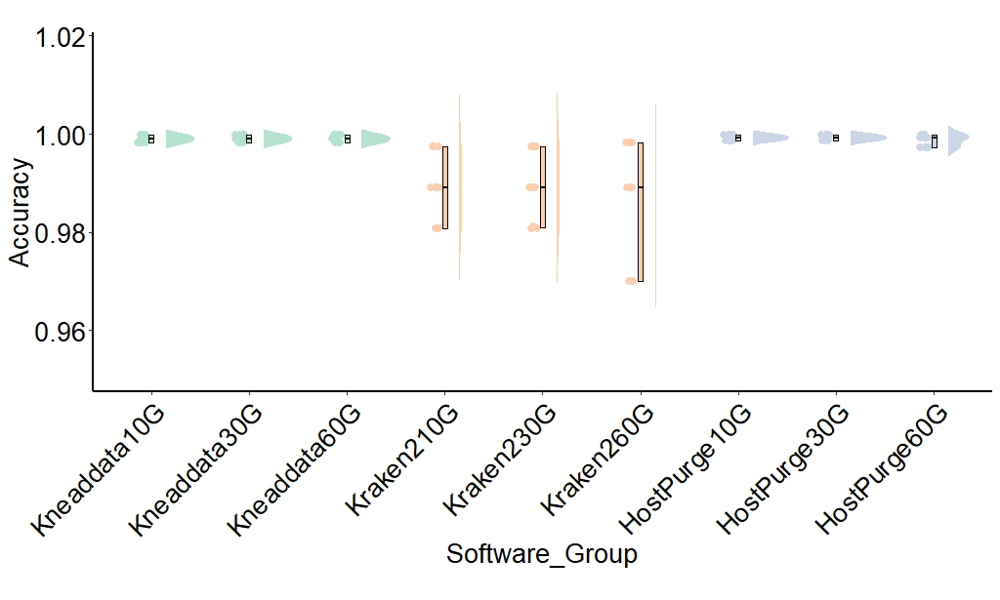

```{r setup, include = FALSE}
knitr::opts_chunk$set(
  collapse  =  T, echo = T, comment = "#>", message = F, warning = F,
	fig.align  =  "center", fig.width  =  5, fig.height = 3, dpi = 150)
```

If you use this script, please cited 如果你使用本代码，请引用：

 Yunyun Gao, Hao Luo, Yong-Xin Liu,et al, Benchmarking metagenomics tools for purging host contamination. 

# Plot



Example-Figure4d-Accuracy


# Read data from the text file
```{r}
data <- read.table("data.txt", header=TRUE)
```

# R Package Loading
```{r}
library(ggplot2)
library(dplyr)
library(tidyverse)
library(gghalves)
library(dunn.test)
library(car)
```

# Reorder the factor levels for the Software column
```{r}
data$Software <- factor(data$Software, levels = c("Kneaddata", "Kraken2", "HostPurge"))
data$Group <- factor(data$Group, levels = c("10G", "30G", "60G"))
data$GenomeProportion <- factor(data$GenomeProportion, levels = c("90%", "50%", "10%"))
```

# Define the color palette for Software
```{r}
software_color <- c("Kneaddata" = "#b3e2cd",  "Kraken2" = "#fdcdac",  "HostPurge" = "#cbd5e8")
```

# Create the plot

```{r}
ggplot(data, aes(x = Software_Group, y = Accuracy, fill = Software, color = Software)) +
  geom_half_violin(aes(fill = Software),
                   position = position_nudge(x = .15, y = 0),
                   adjust = 1.5, trim = FALSE, colour = NA, side = 'r') +
  geom_point(aes(x = as.numeric(as.factor(Software_Group)) - 0.1,
                 y = Accuracy),
             position = position_jitter(width = .05), size = 4, shape = 20) +
  geom_boxplot(aes(x = Software_Group, y = Accuracy, fill = Software),
               outlier.shape = NA,
               width = .05,
               color = "black")  + 
  theme_minimal() + theme_classic() + theme(
    panel.background = element_rect(fill="white", color="white", size=0.25),
    axis.line = element_line(color="black", size=1),
    axis.title = element_text(size=20, color="black"),
    axis.text = element_text(size=20, color="black"),
    axis.text.x = element_text(angle = 45, hjust = 1), 
    legend.position = c(1.2, 0.7),
    legend.text = element_text(size = 20),
    legend.title = element_text(size=20, color="black"),
    aspect.ratio = 0.4,  
    plot.title = element_text(size = 20, face = "bold", hjust = 0.5, vjust = 0.5)
  ) +
  scale_fill_manual(values = software_color) +  
  scale_color_manual(values = software_color)  
```

# 1) Check Accuracy of Kneaddata
```{r}
data2<- subset(data, Software == "Kneaddata")

levene_test_result <- leveneTest(Accuracy ~ Software_Group, data = data2)
levene_test_result

if (levene_test_result$`Pr(>F)`[1] > 0.05) {
  anova_result <- aov(Accuracy ~ Software_Group, data = data2)
  print(summary(anova_result))
} else {
  kruskal_result <- kruskal.test(Accuracy ~ Software_Group, data = data2)
  print(kruskal_result)
  posthoc_result <- dunn.test(data2$Accuracy, data2$Software_Group, method = "bonferroni")
  print(posthoc_result)
}

```

# 2) Check Accuracy of Kraken2
```{r}
data2<- subset(data, Software == "Kraken2")

levene_test_result <- leveneTest(Accuracy ~ Software_Group, data = data2)
levene_test_result

if (levene_test_result$`Pr(>F)`[1] > 0.05) {
  anova_result <- aov(Accuracy ~ Software_Group, data = data2)
  print(summary(anova_result))
} else {
  kruskal_result <- kruskal.test(Accuracy ~ Software_Group, data = data2)
  print(kruskal_result)
  posthoc_result <- dunn.test(data2$Accuracy, data2$Software_Group, method = "bonferroni")
  print(posthoc_result)
}
```

# 3) Check Accuracy of HostPurge
```{r}
data2<- subset(data, Software == "HostPurge")
levene_test_result <- leveneTest(Accuracy ~ Software_Group, data = data2)
levene_test_result

if (levene_test_result$`Pr(>F)`[1] > 0.05) {
  anova_result <- aov(Accuracy ~ Software_Group, data = data2)
  print(summary(anova_result))
} else {
  kruskal_result <- kruskal.test(Accuracy ~ Software_Group, data = data2)
  print(kruskal_result)
  posthoc_result <- dunn.test(data2$Accuracy, data2$Software_Group, method = "bonferroni")
  print(posthoc_result)
}

```

# 4) Check Precision of Kneaddata
```{r}
data2<- subset(data, Software == "Kneaddata")

levene_test_result <- leveneTest(Precision ~ Software_Group, data = data2)
levene_test_result

if (levene_test_result$`Pr(>F)`[1] > 0.05) {
  anova_result <- aov(Precision ~ Software_Group, data = data2)
  print(summary(anova_result))
} else {
  kruskal_result <- kruskal.test(Precision ~ Software_Group, data = data2)
  print(kruskal_result)
  posthoc_result <- dunn.test(data2$Precision, data2$Software_Group, method = "bonferroni")
  print(posthoc_result)
}

```

# 5) Check Precision of Kraken2
```{r}
data2<- subset(data, Software == "Kraken2")

levene_test_result <- leveneTest(Precision ~ Software_Group, data = data2)
levene_test_result

if (levene_test_result$`Pr(>F)`[1] > 0.05) {
  anova_result <- aov(Precision ~ Software_Group, data = data2)
  print(summary(anova_result))
} else {
  kruskal_result <- kruskal.test(Precision ~ Software_Group, data = data2)
  print(kruskal_result)
  posthoc_result <- dunn.test(data2$Precision, data2$Software_Group, method = "bonferroni")
  print(posthoc_result)
}
```

# 6) Check Precision of HostPurge
```{r}
data2<- subset(data, Software == "HostPurge")
levene_test_result <- leveneTest(Precision ~ Software_Group, data = data2)
levene_test_result

if (levene_test_result$`Pr(>F)`[1] > 0.05) {
  anova_result <- aov(Precision ~ Software_Group, data = data2)
  print(summary(anova_result))
} else {
  kruskal_result <- kruskal.test(Precision ~ Software_Group, data = data2)
  print(kruskal_result)
  posthoc_result <- dunn.test(data2$Precision, data2$Software_Group, method = "bonferroni")
  print(posthoc_result)
}

```

# 7) Check Recall of Kneaddata
```{r}
data2<- subset(data, Software == "Kneaddata")

levene_test_result <- leveneTest(Recall ~ Software_Group, data = data2)
levene_test_result

#if (levene_test_result$`Pr(>F)`[1] > 0.05) {
#  anova_result <- aov(Recall ~ Software_Group, data = data2)
#  print(summary(anova_result))
#} else {
#  kruskal_result <- kruskal.test(Recall ~ Software_Group, data = data2)
#  print(kruskal_result)
#  posthoc_result <- dunn.test(data2$Recall, data2$Software_Group, method = "bonferroni")
#  print(posthoc_result)
#}

```

# 8) Check Recall of Kraken2
```{r}
data2<- subset(data, Software == "Kraken2")

levene_test_result <- leveneTest(Recall ~ Software_Group, data = data2)
levene_test_result

if (levene_test_result$`Pr(>F)`[1] > 0.05) {
  anova_result <- aov(Recall ~ Software_Group, data = data2)
  print(summary(anova_result))
} else {
  kruskal_result <- kruskal.test(Recall ~ Software_Group, data = data2)
  print(kruskal_result)
  posthoc_result <- dunn.test(data2$Recall, data2$Software_Group, method = "bonferroni")
  print(posthoc_result)
}
```

# 9) Check Recall of HostPurge
```{r}
data2<- subset(data, Software == "HostPurge")
levene_test_result <- leveneTest(Recall ~ Software_Group, data = data2)
levene_test_result

#if (levene_test_result$`Pr(>F)`[1] > 0.05) {
#  anova_result <- aov(Recall ~ Software_Group, data = data2)
#  print(summary(anova_result))
#} else {
#  kruskal_result <- kruskal.test(Recall ~ Software_Group, data = data2)
#  print(kruskal_result)
#  posthoc_result <- dunn.test(data2$Recall, data2$Software_Group, method = "bonferroni")
#  print(posthoc_result)
#}

```
# 10) Check F1 of Kneaddata
```{r}
data2<- subset(data, Software == "Kneaddata")

levene_test_result <- leveneTest(F1 ~ Software_Group, data = data2)
levene_test_result

if (levene_test_result$`Pr(>F)`[1] > 0.05) {
  anova_result <- aov(F1 ~ Software_Group, data = data2)
  print(summary(anova_result))
} else {
  kruskal_result <- kruskal.test(F1 ~ Software_Group, data = data2)
  print(kruskal_result)
  posthoc_result <- dunn.test(data2$F1, data2$Software_Group, method = "bonferroni")
  print(posthoc_result)
}

```

# 11) Check F1 of Kraken2
```{r}
data2<- subset(data, Software == "Kraken2")

levene_test_result <- leveneTest(F1 ~ Software_Group, data = data2)
levene_test_result

if (levene_test_result$`Pr(>F)`[1] > 0.05) {
  anova_result <- aov(F1 ~ Software_Group, data = data2)
  print(summary(anova_result))
} else {
  kruskal_result <- kruskal.test(F1 ~ Software_Group, data = data2)
  print(kruskal_result)
  posthoc_result <- dunn.test(data2$F1, data2$Software_Group, method = "bonferroni")
  print(posthoc_result)
}
```

# 12) Check F1 of HostPurge
```{r}
data2<- subset(data, Software == "HostPurge")
levene_test_result <- leveneTest(F1 ~ Software_Group, data = data2)
levene_test_result

if (levene_test_result$`Pr(>F)`[1] > 0.05) {
  anova_result <- aov(F1 ~ Software_Group, data = data2)
  print(summary(anova_result))
} else {
  kruskal_result <- kruskal.test(F1 ~ Software_Group, data = data2)
  print(kruskal_result)
  posthoc_result <- dunn.test(data2$F1, data2$Software_Group, method = "bonferroni")
  print(posthoc_result)
}

```

If you use this script, please cited 如果你使用本代码，请引用：

 Yunyun Gao, Hao Luo, Yong-Xin Liu,et al, Benchmarking metagenomics tools for purging host contamination. 

Copyright 2016-2023 Yunyun Gao(高云云), Yong-Xin Liu(刘永鑫) <liuyongxin@caas.cn>, Agricultural Genomics Institute at Shenzhen, Chinese Academy of Agricultural Sciences
