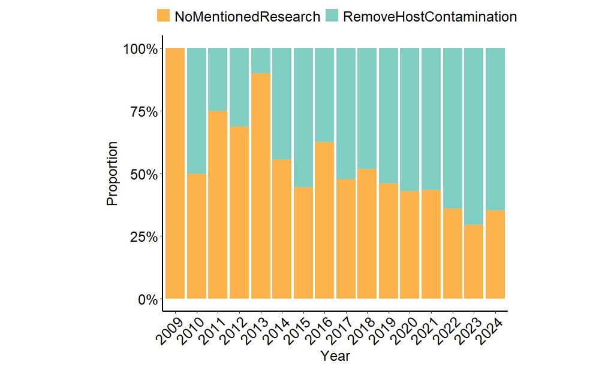

```{r setup, include = FALSE}
knitr::opts_chunk$set(
  collapse  =  T, echo = T, comment = "#>", message = F, warning = F,
	fig.align  =  "center", fig.width  =  5, fig.height = 3, dpi = 150)
```

If you use this script, please cited 如果你使用本代码，请引用：

 Yunyun Gao, Hao Luo, Yong-Xin Liu,et al, Benchmarking metagenomics tools for purging host contamination. 

# Plot



Example-FigureS1b-StackBarPlot


# Read data from the text file
```{r}
data <- read.table("data.txt", header = TRUE)
```

# R Package Loading
```{r}
library(ggplot2)
library(tidyr)
```

# Calculate proportions
```{r}
data$NoMentionedResearch_prop <- data$NoMentionedResearch / (data$NoMentionedResearch + data$RemoveHostContamination)
data$RemoveHostContamination_prop <- data$RemoveHostContamination / (data$NoMentionedResearch + data$RemoveHostContamination)
```

# Create the plot

```{r}
ggplot(data = data, aes(x = factor(Year), y = NoMentionedResearch_prop + RemoveHostContamination_prop, fill = "RemoveHostContamination")) +
  geom_bar(stat = "identity") +
  geom_bar(aes(y = RemoveHostContamination_prop, fill = "RemoveHostContamination"), stat = "identity") +
  geom_bar(aes(y = NoMentionedResearch_prop, fill = "NoMentionedResearch"), stat = "identity") +
  scale_fill_manual(values = c(NoMentionedResearch = "#feb24c", RemoveHostContamination = "#80cdc1")) +
  labs(x = "Year",
       y = "Proportion",
       fill = "") +
  scale_y_continuous(labels = scales::percent_format(scale = 100), breaks = seq(0, 1, 0.25)) +
  theme_classic() +
  theme(
    panel.background = element_rect(fill = "white", colour = "white", size = 1),
    axis.line = element_line(colour = "black", size = 1),
    axis.title = element_text(size = 18, color = "black"),
    axis.text = element_text(size = 18, color = "black"),
    axis.text.x = element_text(angle = 45, hjust = 1), # Rotating x-axis labels by 45°
    legend.position = "top",
    legend.text = element_text(size = 18),
    aspect.ratio = 0.8,  
    plot.title = element_text(size = 18)
  ) 

```


If you use this script, please cited 如果你使用本代码，请引用：

 Yunyun Gao, Hao Luo, Yong-Xin Liu,et al, Benchmarking metagenomics tools for purging host contamination. 

Copyright 2016-2023 Yunyun Gao(高云云), Yong-Xin Liu(刘永鑫) <liuyongxin@caas.cn>, Agricultural Genomics Institute at Shenzhen, Chinese Academy of Agricultural Sciences
