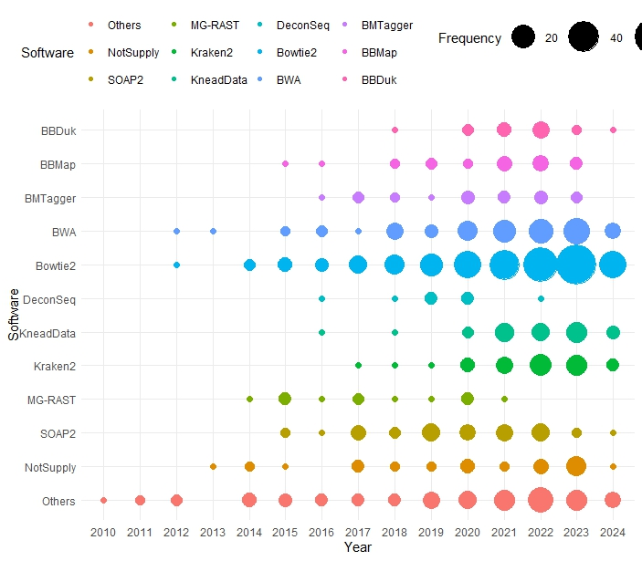

```{r setup, include = FALSE}
knitr::opts_chunk$set(
  collapse  =  T, echo = T, comment = "#>", message = F, warning = F,
	fig.align  =  "center", fig.width  =  5, fig.height = 3, dpi = 150)
```

If you use this script, please cited 如果你使用本代码，请引用：

 Yunyun Gao, Hao Luo, Yong-Xin Liu,et al, Benchmarking metagenomics tools for purging host contamination. 

# Plot



Example-FigureS1c-FrequencyPlot


# Read data from the text file
```{r}
data <- read.table("data.txt", header = TRUE)
data2 <- table(data$Year, data$Software)

```

# R Package Loading
```{r}
library(ggplot2)
library(tidyr)
```

# Calculate proportions
```{r}
data2_long <- as.data.frame(as.table(data2))
names(data2_long) <- c("Year", "Software", "Frequency")
desired_order <- c('Others','NotSupply','SOAP2','MG-RAST','Kraken2','KneadData','DeconSeq','Bowtie2','BWA','BMTagger','BBMap','BBDuk')
data2_long$Software <- factor(data2_long$Software, levels = desired_order)
```

# Create the plot

```{r}
data2_long <- data2_long[data2_long$Frequency > 0, ]

ggplot(data2_long, aes(x = as.factor(Year), y = Software, size = Frequency, color = Software)) +
  geom_point() +
  scale_size_continuous(range = c(2,15)) + 
  theme_minimal() +
  labs(x = "Year", y = "Software", size = "Frequency", color = "Software") +
  theme(legend.position = "top")  
  theme(
    panel.background = element_rect(fill="white", colour="white", size=1),
    axis.line = element_line(colour="black", size=1),
    axis.title = element_text(size=18, color="black"),
    axis.text = element_text(size=18, color="black"),
    legend.text = element_text(size =18),
    aspect.ratio = 0.9,  
    plot.title = element_text(size = 18)
  ) 


```


If you use this script, please cited 如果你使用本代码，请引用：

 Yunyun Gao, Hao Luo, Yong-Xin Liu,et al, Benchmarking metagenomics tools for purging host contamination. 

Copyright 2016-2023 Yunyun Gao(高云云), Yong-Xin Liu(刘永鑫) <liuyongxin@caas.cn>, Agricultural Genomics Institute at Shenzhen, Chinese Academy of Agricultural Sciences
