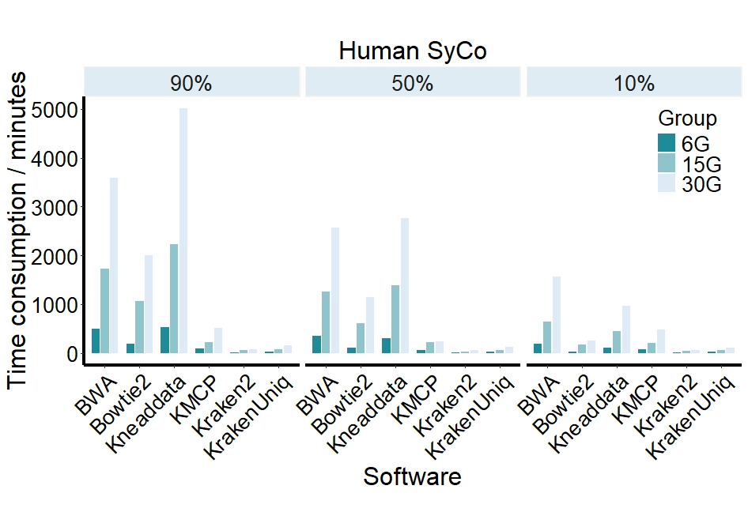

```{r setup, include = FALSE}
knitr::opts_chunk$set(
  collapse  =  T, echo = T, comment = "#>", message = F, warning = F,
	fig.align  =  "center", fig.width  =  5, fig.height = 3, dpi = 150)
```

If you use this script, please cited 如果你使用本代码，请引用：

 Yunyun Gao, Hao Luo, Yong-Xin Liu,et al, Benchmarking metagenomics tools for purging host contamination. 

# Plot


Example-FigureS3-Time-RiceSiBa



Example-FigureS3-Time-HumanSiBa

# R Package Loading
```{r}
library(ggplot2)
library(ggbreak)
```

# 1) Read data
```{r}
data <- read.table("data.txt", header = TRUE)
data$Software <- factor(data$Software, levels = c("BWA", "Bowtie2", "Kneaddata","KMCP","Kraken2","KrakenUniq"))
data$Size <- factor(data$DataSize, levels = c("10G", "30G", "60G"))
data$HostGenomeProportion <- factor(data$HostGenomeProportion, levels = c("90%", "50%", "10%"))
```

# 1) Rice-SiBa
```{r}
data2 <- subset(data, Hosttype == "Rice" & Microbiometype == "Single")
colors <- c("#a63606", "#ff8c3e", "#fec79e")
# Create a grouped bar plot
ggplot(data2, aes(x = Software, y = Times, fill = factor(Size))) +
  geom_bar(stat = "identity", position = position_dodge(width = 0.5), width = 0.5) +
  facet_grid(. ~ `HostGenomeProportion`) +  # Separate by HostGenomeProportion
  labs(
    x ="Software", y = "Time consumption / minutes", title = "Rice SiBa",
    fill = "Group"
  ) +
  scale_fill_manual(values = colors) +
  theme_classic()+
  theme(
    legend.position = c(0.08,0.8),
    panel.background = element_rect(fill = "white", colour = "white", linewidth = 0.25),  # Use linewidth instead of size
    axis.text.x = element_text(angle = 45, hjust = 1),
    axis.line = element_line(colour = "black", size = 1.5),
    axis.title = element_text(size = 24, color = "black"),
    axis.text = element_text(size = 20, color = "black"),
    strip.background = element_rect(fill = "#fee8c8", colour = "grey95", size = 1),  # Change the facet background color and border
    strip.text = element_text(size = 20),  # Change the facet label text size
    legend.text = element_text(size = 20),
    legend.title = element_text(size = 20),
    aspect.ratio = 1.25,
    plot.title = element_text(size = 24, hjust = 0.5, vjust = 0.5), # optional, add a title
  )

```


# 2) Rice-SyCo
```{r}
data2 <- subset(data, Hosttype == "Rice" & Microbiometype == "Multiple")
colors <- c("#a63606", "#ff8c3e", "#fec79e")
# Create a grouped bar plot
ggplot(data2, aes(x = Software, y = Times, fill = factor(Size))) +
  geom_bar(stat = "identity", position = position_dodge(width = 0.5), width = 0.5) +
  facet_grid(. ~ `HostGenomeProportion`) +  # Separate by HostGenomeProportion
  labs(
    x ="Software", y = "Time consumption / minutes", title = "Rice SyCo",
    fill = "Group"
  ) +
  scale_fill_manual(values = colors) +
  theme_classic()+
  theme(
    legend.position = c(0.08,0.8),
    panel.background = element_rect(fill = "white", colour = "white", linewidth = 0.25),  # Use linewidth instead of size
    axis.text.x = element_text(angle = 45, hjust = 1),
    axis.line = element_line(colour = "black", size = 1.5),
    axis.title = element_text(size = 24, color = "black"),
    axis.text = element_text(size = 20, color = "black"),
    strip.background = element_rect(fill = "#fee8c8", colour = "grey95", size = 1),  # Change the facet background color and border
    strip.text = element_text(size = 20),  # Change the facet label text size
    legend.text = element_text(size = 20),
    legend.title = element_text(size = 20),
    aspect.ratio = 1.25,
    plot.title = element_text(size = 24, hjust = 0.5, vjust = 0.5), # optional, add a title
  )

```

# 3) Human-SiBa
```{r}
data2 <- subset(data, Hosttype == "Human" & Microbiometype == "Single")

colors <- c("#1e8b9b", "#8ec4cb", "#deebf7")

ggplot(data2, aes(x = Software, y = Times, fill = factor(Size))) +
  geom_bar(stat = "identity", position = position_dodge(width = 0.5), width = 0.5) +
  facet_grid(. ~ `HostGenomeProportion`) +  # Separate by HostGenomeProportion
  labs( 
    x ="Software", y = "Time consumption / minutes", title = "Human SiBa",
    fill = "Group"
  ) +
  scale_fill_manual(values = colors) +
  theme_classic()+
  theme(
  legend.position = c(0.08,0.8),
  panel.background = element_rect(fill = "white", colour = "white", linewidth = 0.25),  # Use linewidth instead of size
  axis.text.x = element_text(angle = 45, hjust = 1),
  axis.line = element_line(colour = "black", size = 1.5),
  axis.title = element_text(size = 24, color = "black"),
  axis.text = element_text(size = 20, color = "black"),
  strip.background = element_rect(fill = "#e0ecf4", colour = "grey95", size = 1),  # Change the facet background color and border
  strip.text = element_text(size = 20),  # Change the facet label text size
  legend.text = element_text(size = 20),
  legend.title = element_text(size = 20),
  aspect.ratio = 1.25,
  plot.title = element_text(size = 24, hjust = 0.5, vjust = 0.5), # optional, add a title
)
```

# 4) Human-SyCo
```{r}
data2 <- subset(data, Hosttype == "Human" & Microbiometype == "Multiple")

colors <- c("#1e8b9b", "#8ec4cb", "#deebf7")

ggplot(data2, aes(x = Software, y = Times, fill = factor(Size))) +
  geom_bar(stat = "identity", position = position_dodge(width = 0.5), width = 0.5) +
  facet_grid(. ~ `HostGenomeProportion`) +  # Separate by HostGenomeProportion
  labs( 
    x ="Software", y = "Time consumption / minutes", title = "Human SyCo",
    fill = "Group"
  ) +
  scale_fill_manual(values = colors) +
  theme_classic()+
  theme(
  legend.position = c(0.08,0.8),
  panel.background = element_rect(fill = "white", colour = "white", linewidth = 0.25),  # Use linewidth instead of size
  axis.text.x = element_text(angle = 45, hjust = 1),
  axis.line = element_line(colour = "black", size = 1.5),
  axis.title = element_text(size = 24, color = "black"),
  axis.text = element_text(size = 20, color = "black"),
  strip.background = element_rect(fill = "#e0ecf4", colour = "grey95", size = 1),  # Change the facet background color and border
  strip.text = element_text(size = 20),  # Change the facet label text size
  legend.text = element_text(size = 20),
  legend.title = element_text(size = 20),
  aspect.ratio = 1.25,
  plot.title = element_text(size = 24, hjust = 0.5, vjust = 0.5), # optional, add a title
)
```

If you use this script, please cited 如果你使用本代码，请引用：

 Yunyun Gao, Hao Luo, Yong-Xin Liu,et al, Benchmarking metagenomics tools for purging host contamination. 

Copyright 2016-2023 Yunyun Gao(高云云), Yong-Xin Liu(刘永鑫) <liuyongxin@caas.cn>, Agricultural Genomics Institute at Shenzhen, Chinese Academy of Agricultural Sciences
